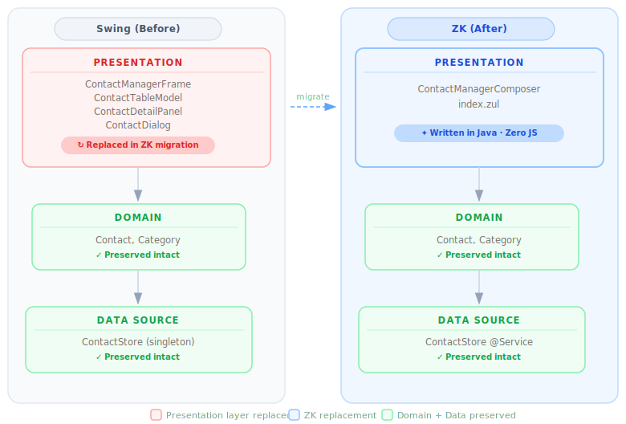

# Part 5-3: Modernizing Legacy Java Desktop Applications: A Complete Guide to Migrating from Swing to ZK

## I. Introduction: The Compounding Cost of Staying on Swing

Many enterprise Java teams maintain Swing desktop applications that have been running since the early 2000s. The apps work. The domain logic is solid. But every year the gap between "what the app does" and "how it needs to be delivered" widens.

### The Talent Gap

Java Swing has seen relatively limited evolution since Oracle shifted primary UI investment toward JavaFX around 2010. Today's graduates learn Spring Boot, React, and cloud platforms — not AWT layout managers and Swing Event Dispatch Thread rules. As the engineers who built and maintained these applications retire, per-hour maintenance costs rise and the pool of qualified replacements shrinks. Surveys from enterprise tooling vendors consistently show Swing and AWT expertise declining by roughly 15 % per year in new job postings.

### Shifted User Expectations

Internal users spend their working day in Microsoft 365, Salesforce, Slack, and Figma — polished, responsive, collaborative. When they switch to a desktop application built for an earlier era, cognitive friction spikes, adoption falters, and data quality silently degrades. Even well-maintained Swing applications can struggle to match the responsiveness, accessibility, and collaboration expectations shaped by modern web software.

### Security and Compliance

A Swing application typically distributes application runtime and business logic to every endpoint it touches, increasing patching and deployment complexity across the organization. EAA / Section 508 accessibility requirements (WCAG 2.1 AA) are difficult or impossible to satisfy with stock Swing components. Moving the UI to the server centralizes patching, keeps credentials server-side, and makes accessibility achievable through the browser's native accessibility tree.

### Deployment in a Remote-Work World

VPN-first or cloud-first organizations cannot easily deliver Swing applications to remote employees without virtualization overhead. Version skew — where different users run different app versions because workstation updates are slow — is a perpetual support burden. A centrally deployed web application dramatically reduces this class of version-skew and deployment problem.

The conclusion is not that Swing was the wrong choice at the time — it was the right choice for its era. For many organizations, the accumulated operational and maintenance cost now justifies seriously evaluating modernization options — especially as those costs continue to compound over time.


## II. Choosing Your Migration Strategy

When executives see "modernize the desktop app" on a roadmap, the first question is always: how do we do this without stopping feature work for 18 months?

### The Three Strategies

**Lift-and-shift (browser projection):** Tools like Webswing stream a running Swing JVM to the browser as pixels. The app looks exactly the same; no code changes are required. This buys time and immediately addresses deployment, but it does not modernize the UX, it does not reduce maintenance complexity, and it does not eliminate the Swing talent dependency.

**Full rewrite:** Start from scratch with a modern framework. High risk (the "second system effect" is real), long time-to-value, and the business logic embedded in existing Swing controllers may be poorly documented. Most large rewrites are cancelled or delayed.

**Incremental migration (Strangler Fig pattern):** Replace one screen at a time. The old application and the new web UI coexist during transition. Each completed screen delivers user value immediately and reduces the footprint of the legacy system. This is the strategy that consistently succeeds for enterprise-scale migrations.

### Why ZK Specifically

ZK stands out among web frameworks as a migration target for Swing developers for three reasons.

**Mental-model match.** Both Swing and ZK are *server-driven, component-based, event-driven, object-oriented* frameworks. The developer's mental model translates directly: you have a component tree, you attach data and events to it, and the framework handles rendering. Swing developers are not learning a new paradigm; they are remapping familiar concepts to a new API.

**Component parallels are direct.** A ZK `Listbox` with `ListModelList` parallels a Swing `JList` with `ListModel` — both interfaces share the same design intent and the same name. A ZK `Window` parallels a Swing `JFrame`. A ZK `Toolbar` parallels a Swing `JToolBar`. The cheat sheet in Section IV.0 maps every component the Contact Manager uses.

**Talent preservation.** Swing developers already know Java. ZK applications are written entirely in Java on the server — no JavaScript, no REST API, no parallel front-end build pipeline. The team that built the Swing app can migrate it. No hiring, no retraining for a different language.

**Areas requiring special attention.** Keyboard-heavy workflows that rely on global shortcut bindings need explicit re-implementation; ZK's [Keystroke Handling](https://docs.zkoss.org/zk_dev_ref/ui_patterns/keystroke_handling) documentation covers `setCtrlKeys()` and the `onCtrlKey` event. Custom `CellRenderer` logic maps to ZK's `ListitemRenderer` (programmatic) or `<template>` tags (declarative), but the mapping requires thought for complex rendering. Printing and reporting move to a browser-print strategy or a reporting-service integration. And ZK requires a live server connection — offline operation is not supported.


## III. Applying Enterprise Architecture Patterns

A successful migration replaces *only the presentation layer*. The business logic, domain model, and data access layer should survive unchanged. Martin Fowler's *Patterns of Enterprise Application Architecture* describes this as the fundamental layering contract: **Presentation / Domain / Data Source**. When the layers are properly separated before migration, a Swing → ZK migration touches only the Presentation layer.



### What Survives

In a well-structured Swing application:

- **Domain model** (POJOs, value objects, enums) — survives intact
- **Service layer** (business rules, validation logic, calculations) — survives intact
- **Repository / data access** (JPA, JDBC, file I/O) — survives intact

In the Contact Manager example, `Contact.java`, `Category.java`, and `ContactStore.java` are copied without modification. The ZK app uses the same POJO and the same in-memory store. No logic was rewritten.

### What Changes

Only the **Presentation layer** changes:

- `ContactManagerFrame` (JFrame subclass) → `ContactManagerComposer` (SelectorComposer subclass)
- `ContactTableModel` (AbstractTableModel) → `ListModelList` (one line)
- `ContactDetailPanel` (JPanel subclass) → `buildDetailPanel()` method inside the Composer
- `ContactDialog` (JDialog subclass) → `onNew()` method inside the Composer

The surface area of change is deliberately small — all UI construction code, no business logic.

### ZK's MVC Pattern

In ZK MVC, the three layers map directly to the pattern every Swing developer already uses:

| Swing | ZK MVC | Role |
|---|---|---|
| `JFrame` subclass + `JPanel` subclasses | [`SelectorComposer<Window>`](https://docs.zkoss.org/zk_dev_ref/mvc/composer) | Controller |
| `JLabel`, `JTextField`, `JTable`, etc. | `Label`, `Textbox`, `Listbox`, etc. (programmatic) | View |
| Domain POJOs + service layer | Same domain POJOs + Spring `@Service` | Model |

The ZUL file (which can be as minimal as `<window apply="...Composer"/>`) bootstraps the ZK page. The Composer's `doAfterCompose` constructs the component tree. Event handlers on those components call service methods. This is structurally identical to a Swing frame whose constructor builds the UI and whose listeners call business methods.

### Data Transfer Objects

Because ZK runs on the server and calls services in-process (no HTTP boundary between UI and service layer), Swing's DTOs survive migration with minimal changes. The `Contact` POJO flows from `ContactStore.save(contact)` to `model.set(i, contact)` exactly as it would between a Swing `ActionListener` and a service call. The web tier does not introduce a serialization boundary.


## IV. Migrating from Swing to ZK: Step-by-Step

To make this walkthrough concrete, we built and migrated a complete Contact Manager application. The app follows a classic master-detail pattern: a searchable contact list on the left, a detail form on the right, with toolbar actions for add, delete, and refresh. The Swing version is a standalone desktop application running on Java 17. The migrated version runs in a browser, built with Spring Boot 2.7.7 + ZK 10.3.0.1 (javax, war packaging), using the ZK MVC pattern with a `SelectorComposer` as the controller. Every idiom covered in this guide comes from code that compiles and runs.

### IV.0 Component & Pattern Mapping Cheat Sheet

Before looking at code, use this table as a reference. Every row maps a Swing concept to its ZK MVC equivalent.

| Swing | ZK MVC equivalent | Notes |
|---|---|---|
| `JFrame` (top-level window) | `<window>` root (in ZUL) | ZK page IS the frame |
| `JDialog` (modal) | `Window#doModal()` or `<window mode="modal">` | Same blocking semantics |
| `JPanel` (generic container) | `Vlayout` / `Hlayout` / `Div` / `Groupbox` | Pick by orientation / styling need |
| `BorderLayout` (5 regions) | `Borderlayout` + `North`/`South`/`East`/`West`/`Center` | 1:1 |
| `BoxLayout` | `Hlayout` / `Vlayout` | 1:1 |
| `GridBagLayout` | `Grid` + `Rows` + `Row`, or CSS grid | ZK side is shorter |
| `JSplitPane` (movable divider) | `Splitlayout` (set `orient="horizontal"` or `"vertical"`) | Two children only; built-in draggable divider |
| `JTabbedPane` | `Tabbox` + `Tabs` + `Tabpanels` | Accordion mold available |
| `JScrollPane` | Built-in: `Window` / `Groupbox` with `style="overflow:auto"` | Often deletable |
| `JMenuBar` / `JMenu` / `JMenuItem` | `Menubar` / `Menu` + `Menupopup` / `Menuitem` | Names match |
| `JToolBar` | `Toolbar` | 1:1 |
| `JButton` | `Button` | `Events.ON_CLICK` |
| `JLabel` | `Label` | |
| `JTextField` | `Textbox` | |
| `JPasswordField` | `Textbox` with `type="password"` | |
| `JTextArea` | `Textbox` with `setMultiline(true)` | |
| `JComboBox` | `Combobox` (editable) or `Selectbox` (lighter) | |
| `JCheckBox` | `Checkbox` | |
| `JRadioButton` + `ButtonGroup` | `Radiogroup` + `Radio` | |
| `JSpinner` | `Spinner` / `Intbox` / `Doublebox` / `Datebox` | Type-specific in ZK |
| `JList` + `ListModel` | `Listbox` + `ListModelList` | *"A Listbox with ListModel in ZK parallels a JList with ListModel in Swing"* (ZK eval-guide) |
| `JTable` + `AbstractTableModel` | `Listbox` (display) or `Grid` (editable rows) + `ListModelList` | **Kills 80+ LOC of boilerplate** |
| `TableCellRenderer` | `ListitemRenderer` (programmatic) or `<template name="model">` | Direct port |
| `JTree` + `TreeModel` | `Tree` + ZK `TreeModel` | Direct port |
| `JFileChooser` | `<button upload="true">` / `Fileupload` | Browser file picker |
| `JProgressBar` | `Progressmeter` | |
| **Event Listeners** | | |
| `btn.addActionListener(e -> save())` | `btn.addEventListener(Events.ON_CLICK, e -> save())` | Same shape |
| `table.getSelectionModel().addListSelectionListener(e -> onSelect())` | `listbox.addEventListener(Events.ON_SELECT, e -> onSelect())` | |
| `field.getDocument().addDocumentListener(...)` (3 methods) | `textbox.addEventListener(Events.ON_CHANGING, e -> onSearch(e))` | One callback instead of three |
| `comp.addFocusListener(...)` | `addEventListener(Events.ON_FOCUS, ...)` / `Events.ON_BLUR` | |
| `frame.addWindowListener(...) windowClosing` | `window.addEventListener(Events.ON_CLOSE, ...)` | |
| `KeyListener` / `KeyStroke` bindings | `setCtrlKeys(...)` + `addEventListener(Events.ON_CTRL_KEY, ...)` | Manual re-implementation |
| **Wiring (programmatic on both sides)** | | |
| `JPanel p = new JPanel(); p.add(btn);` | `Vlayout p = new Vlayout(); p.appendChild(btn);` | Same idiom |
| `frame.setLayout(new BorderLayout()); frame.add(comp, BorderLayout.NORTH)` | `Borderlayout l = new Borderlayout(); root.appendChild(l); North n = new North(); l.appendChild(n); n.appendChild(comp);` | One extra wrapper element |
| `tableModel.fireTableDataChanged()` | `model.add(...)` / `model.remove(...)` — `ListModelList` notifies automatically | Repaint calls disappear |
| `EventQueue.invokeLater(...)` / `SwingWorker` | `Events.echoEvent("onLater", comp, data)` | Server-driven, no EDT |


### IV.1 Project Setup

**Swing `pom.xml`** has no framework dependencies — just the JDK and the exec plugin to launch the main class:

```xml
<build>
  <plugins>
    <plugin>
      <groupId>org.codehaus.mojo</groupId>
      <artifactId>exec-maven-plugin</artifactId>
      <version>3.1.0</version>
      <configuration>
        <mainClass>com.example.contacts.swing.ContactManagerFrame</mainClass>
      </configuration>
    </plugin>
  </plugins>
</build>
```

**ZK `pom.xml`** adds Spring Boot as the servlet container runtime in `war` packaging, and ZK as the UI framework. Spring Boot is not the migration target — it is simply the replacement for Swing's `main()` launcher. Three dependencies cover everything:

```xml
<!-- ZK Spring Boot integration -->
<dependency>
  <groupId>org.zkoss.zkspringboot</groupId>
  <artifactId>zkspringboot-autoconfig</artifactId>
</dependency>
<!-- ZK EE components (Listbox, Toolbar, Window, …) -->
<dependency>
  <groupId>org.zkoss.zk</groupId>
  <artifactId>zkmax</artifactId>
</dependency>
<!-- ZK utilities -->
<dependency>
  <groupId>org.zkoss.zk</groupId>
  <artifactId>zkplus</artifactId>
</dependency>
```

**Service layer migration.** In the Contact Manager, `ContactStore` moves from a Singleton pattern (Swing has no dependency injection) to a Spring `@Service` with `@PostConstruct` seeding:

```java
// Swing — singleton, seeded in constructor
public class ContactStore {
    private static final ContactStore INSTANCE = new ContactStore();
    public static ContactStore getInstance() { return INSTANCE; }
    private ContactStore() { seed(); }
    ...
}

// ZK — Spring-managed, seeded on startup
@Service
public class ContactStore {
    @PostConstruct
    void seed() { ... }
    ...
}
```


### IV.2 Why Minimal ZUL + Java-Built UI

[ZUL](https://docs.zkoss.org/zk_dev_ref/ui_composing/zuml) is ZK's declarative markup language — similar in intent to JSX or Thymeleaf templates. For production applications, writing ZUL gives you designer-developer separation, IDE autocompletion, and a clear view of the component hierarchy without reading Java.

For a migration tutorial, however, a fully-declared ZUL introduces a paradigm shift precisely when the reader is trying to see the Swing parallel. So the Contact Manager uses an intentionally minimal ZUL file — four lines — that does only one thing: bootstraps the page and applies the Composer:

```xml
<?page title="Contact Manager"?>
<zk>
  <window apply="com.example.contacts.zk.controller.ContactManagerComposer"
          hflex="1" vflex="1" border="normal"/>
</zk>
```

The Composer's `doAfterCompose` then constructs the entire component tree in Java using `new Component()` + `appendChild()` + `addEventListener()`. Every line of that construction code maps directly to a line in the Swing constructor — which is the article's main point.

A footnote for production teams: once the migration is done with this approach, it is a complete, production-ready result. If the team later wants to go further, ZK's declarative ZUL markup and MVVM pattern are there as options — they can make the UI code more concise and unlock additional IDE tooling support. But that is a separate decision to make when and if it feels useful, not a requirement of the migration.


### IV.3 Map the JFrame and Layout Panels

In Swing, `ContactManagerFrame` extends `JFrame`, sets its layout to `BorderLayout`, and adds child panels to the named regions. In ZK, the root `Window` is provided by the ZUL file. `doAfterCompose` receives it as the `root` parameter and builds the layout tree:

```java
// ── Swing ─────────────────────────────────────────────────
public class ContactManagerFrame extends JFrame {
    ContactManagerFrame() {
        super("Contact Manager");
        setLayout(new BorderLayout());           // not explicit — JFrame default
        add(buildNorthPanel(), BorderLayout.NORTH);
        add(buildCenterPanel(), BorderLayout.CENTER);
    }
}

// ── ZK ────────────────────────────────────────────────────
public class ContactManagerComposer extends SelectorComposer<Window> {
    @Override
    public void doAfterCompose(Window root) throws Exception {
        super.doAfterCompose(root);
        root.setTitle("Contact Manager");

        Borderlayout layout = new Borderlayout();     // new BorderLayout()
        layout.setHflex("1"); layout.setVflex("1");
        root.appendChild(layout);                     // add(layout)

        North north = new North();                    // BorderLayout.NORTH region
        layout.appendChild(north);

        Center center = new Center();                 // BorderLayout.CENTER region
        layout.appendChild(center);
    }
}
```

The `Borderlayout` component has explicit region wrapper objects (`North`, `South`, `East`, `West`, `Center`) as children. This is one extra level of wrapping compared to Swing's `add(comp, BorderLayout.NORTH)`, but the semantics are identical.

For `JSplitPane`, use `Splitlayout` from the ZK EE library:

```java
// Swing
JSplitPane split = new JSplitPane(JSplitPane.HORIZONTAL_SPLIT, tableScroll, detailScroll);
split.setDividerLocation(400);

// ZK
Splitlayout split = new Splitlayout();
split.setOrient("horizontal");
split.setHflex("1"); split.setVflex("1");
split.appendChild(leftPanel);
split.appendChild(rightPanel);
```

`Splitlayout` takes exactly two children and renders a draggable divider between them.


### IV.4 Migrate the MenuBar and ToolBar

Both apps share the same method decomposition: `buildMenuBar()` delegates to `buildFileMenu()`, `buildEditMenu()`, and `buildHelpMenu()`. The resulting structure is a direct find-and-replace of class names.

**Menu building — the only structural difference** is that ZK's `Menu` requires an explicit `Menupopup` child to hold its items, whereas Swing's `JMenu` is its own container:

```java
// Swing                                    // ZK
JMenu menu = new JMenu("File");             Menu menu = new Menu("File");
                                            Menupopup popup = new Menupopup(); // extra level
                                            menu.appendChild(popup);
JMenuItem item = new JMenuItem("New");      Menuitem item = new Menuitem("New");
item.addActionListener(e -> onNew());       item.addEventListener(Events.ON_CLICK, e -> onNew());
menu.add(item);                             popup.appendChild(item);
mb.add(menu);                               mb.appendChild(menu);
```

**Toolbar and search — a near-identical rewrite.** After refactoring both apps to share the same method names, `buildNorthPanel()` is the clearest side-by-side demonstration of the migration pattern. Place the two files open in a diff viewer and the similarity is immediate:

```java
// ── Swing: ContactManagerFrame ────────────────────────────────────────────
private JPanel buildNorthPanel() {
    JPanel topBar = new JPanel(new BorderLayout());

    JToolBar toolbar = new JToolBar();
    toolbar.setFloatable(false);
    newBtn     = new JButton("+ New");    newBtn.addActionListener(e -> onNew());
    deleteBtn  = new JButton("Delete");   deleteBtn.addActionListener(e -> onDelete());
    refreshBtn = new JButton("Refresh");  refreshBtn.addActionListener(e -> onRefresh());
    toolbar.add(newBtn); toolbar.add(deleteBtn); toolbar.add(refreshBtn);
    topBar.add(toolbar, BorderLayout.NORTH);

    JPanel searchRow = new JPanel(new FlowLayout(FlowLayout.LEFT));
    searchRow.add(new JLabel("Search:"));
    searchRow.add(searchField);
    topBar.add(searchRow, BorderLayout.SOUTH);

    return topBar;
}

// ── ZK: ContactManagerComposer ────────────────────────────────────────────
private Vlayout buildNorthPanel() {
    Vlayout topBar = new Vlayout();

    Toolbar toolbar = new Toolbar();
    newBtn     = new Button("+ New");    newBtn.addEventListener(Events.ON_CLICK, e -> onNew());
    deleteBtn  = new Button("Delete");   deleteBtn.addEventListener(Events.ON_CLICK, e -> onDelete());
    refreshBtn = new Button("Refresh");  refreshBtn.addEventListener(Events.ON_CLICK, e -> onRefresh());
    toolbar.appendChild(newBtn); toolbar.appendChild(deleteBtn); toolbar.appendChild(refreshBtn);
    topBar.appendChild(toolbar);

    Hlayout searchRow = new Hlayout();
    searchRow.appendChild(new Label("Search:"));
    searchRow.appendChild(searchBox);
    topBar.appendChild(searchRow);

    return topBar;
}
```

The four substitutions that account for every difference in the toolbar block:

| Swing | ZK | Note |
|---|---|---|
| `JPanel(BorderLayout)` | `Vlayout` | layout container |
| `JToolBar` | `Toolbar` | same concept, same name minus "J" |
| `JButton("+ New")` | `Button("+ New")` | same constructor signature |
| `addActionListener(e -> ...)` | `addEventListener(Events.ON_CLICK, e -> ...)` | event hook |
| `toolbar.add(x)` | `toolbar.appendChild(x)` | tree mutation |
| `JLabel("Search:")` | `Label("Search:")` | label widget |
| `JPanel(FlowLayout)` | `Hlayout` | horizontal row container |

A Swing developer reading the ZK version for the first time should need no more than thirty seconds to parse it.


### IV.5 Replace AbstractTableModel with ListModelList

This is the single largest code reduction in the migration. The Swing `ContactTableModel` is 39 lines of boilerplate — column definitions, bounds checks, value dispatch, type declarations, and `fireTableDataChanged()` calls scattered through the codebase:

```java
// Swing — 39 lines that exist purely to satisfy AbstractTableModel's contract
public class ContactTableModel extends AbstractTableModel {
    private static final String[] COLUMNS = {"Name", "Email", "Company"};
    private List<Contact> contacts = new ArrayList<>();

    public void setContacts(List<Contact> contacts) {
        this.contacts = new ArrayList<>(contacts);
        fireTableDataChanged();    // manual repaint trigger
    }

    public Contact getContactAt(int row) { return contacts.get(row); }

    @Override public int      getRowCount()           { return contacts.size(); }
    @Override public int      getColumnCount()         { return COLUMNS.length; }
    @Override public String   getColumnName(int col)   { return COLUMNS[col]; }
    @Override public Class<?> getColumnClass(int col)  { return String.class; }

    @Override
    public Object getValueAt(int row, int col) {
        Contact c = contacts.get(row);
        return switch (col) {
            case 0 -> c.getFirstName() + " " + c.getLastName();
            case 1 -> c.getEmail();
            case 2 -> c.getCompany();
            default -> "";
        };
    }
}
```

In ZK, a `Listbox` accepts a [`ListModelList`](https://docs.zkoss.org/zk_dev_ref/mvc/list_model) directly. The model handles its own change notification — no `fireTableDataChanged()`, no override, no class to write:

```java
// ZK — three lines replace the entire class
Listbox contactList = new Listbox();
contactList.setItemRenderer(new ContactRenderer());  // separate class for column rendering
model = new ListModelList<>(store.findAll());
contactList.setModel(model);
```

The `ContactRenderer` implements `ListitemRenderer<Contact>` and replaces Swing's column dispatch logic — but it is also much simpler:

```java
// Swing column dispatch inside AbstractTableModel
case 0 -> c.getFirstName() + " " + c.getLastName();
case 1 -> c.getEmail();
case 2 -> c.getCompany();

// ZK ListitemRenderer — explicit cells, no switch
public void render(Listitem item, Contact contact, int index) {
    item.setValue(contact);                              // attach domain object
    item.appendChild(new Listcell(contact.getFullName()));
    item.appendChild(new Listcell(contact.getEmail()));
    item.appendChild(new Listcell(contact.getCompany()));
}
```

Every mutation to the model is automatically reflected in the listbox. Delete `fireTableDataChanged()` calls everywhere:

```java
// Swing — must call fireTableDataChanged() after every mutation
tableModel.setContacts(store.findAll());   // internally calls fireTableDataChanged()

// ZK — ListModelList notifies the listbox on every mutation
model.clear();
model.addAll(store.findAll());    // no notification call needed

model.remove(current);            // listbox updates automatically

int i = model.indexOf(current);
model.set(i, current);            // listbox updates automatically
```


### IV.6 Replace ActionListeners with addEventListener

Every Swing `addActionListener` becomes a ZK `addEventListener(Events.ON_CLICK, ...)`. The lambda body is unchanged. The Contact Manager has seven such listeners; each converts with a pure search-and-replace:

```java
// ── Swing ─────────────────────────────────────────────────
newBtn.addActionListener(e -> onNew());
deleteBtn.addActionListener(e -> onDelete());
refreshBtn.addActionListener(e -> onRefresh());
saveBtn.addActionListener(e -> onSave());
revertBtn.addActionListener(e -> onRevert());
newItem.addActionListener(e -> onNew());
deleteItem.addActionListener(e -> onDelete());

// ── ZK ────────────────────────────────────────────────────
newBtn.addEventListener(Events.ON_CLICK,     e -> onNew());
deleteBtn.addEventListener(Events.ON_CLICK,  e -> onDelete());
refreshBtn.addEventListener(Events.ON_CLICK, e -> onRefresh());
saveBtn.addEventListener(Events.ON_CLICK,    e -> onSave());
revertBtn.addEventListener(Events.ON_CLICK,  e -> onRevert());
newItem.addEventListener(Events.ON_CLICK,    e -> onNew());
deleteItem.addEventListener(Events.ON_CLICK, e -> onDelete());
```

The handler methods (`onNew`, `onDelete`, etc.) are class instance methods on both the JFrame subclass and the SelectorComposer subclass — same structure, different base class.


### IV.7 Replace ListSelectionListener with ON_SELECT

The master-detail wiring is the most important behavioral piece of the application. In Swing, it is implemented with a `ListSelectionListener` on the table's selection model:

```java
// Swing
contactTable.getSelectionModel().addListSelectionListener(e -> {
    if (e.getValueIsAdjusting()) return;    // skip intermediate events
    int row = contactTable.getSelectedRow();
    if (row >= 0) {
        current = tableModel.getContactAt(row);
        detailPanel.bindFrom(current);
    }
});
```

In ZK, the `ON_SELECT` event fires once per selection change (no intermediate events to filter):

```java
// ZK
contactList.addEventListener(Events.ON_SELECT, e -> {
    Listitem sel = contactList.getSelectedItem();
    if (sel == null) return;
    current = (Contact) sel.getValue();    // domain object was stored in item.setValue()
    bindFromContact(current);
});
```

The domain object retrieval differs: Swing uses a row index into the model; ZK stores the domain object directly on the `Listitem` via `item.setValue(contact)` in the renderer. This is simpler and avoids off-by-one bugs during filtered views.


### IV.8 Replace DocumentListener with ON_CHANGING

Live search filtering in Swing requires a `DocumentListener` with three callback methods. Swing's `Document` fires three distinct events (insert, remove, changed attribute), so the API forces all three to be implemented even when all three do the same thing:

```java
// Swing — three methods because the API requires it
searchField.getDocument().addDocumentListener(new DocumentListener() {
    public void insertUpdate(DocumentEvent e)  { onSearch(); }
    public void removeUpdate(DocumentEvent e)  { onSearch(); }
    public void changedUpdate(DocumentEvent e) { onSearch(); }
});

private void onSearch() {
    String q = searchField.getText().toLowerCase();
    List<Contact> all = store.findAll();
    tableModel.setContacts(
        q.isEmpty() ? all : all.stream().filter(c -> c.matches(q)).toList()
    );
}
```

ZK fires a single `ON_CHANGING` event as the user types. The `InputEvent` carries the current value directly:

```java
// ZK — one method
searchBox.addEventListener(Events.ON_CHANGING, e -> onSearch((InputEvent) e));

private void onSearch(InputEvent e) {
    String q = e.getValue().toLowerCase();
    model.clear();
    store.findAll().stream()
         .filter(c -> q.isEmpty() || c.matches(q))
         .forEach(model::add);    // ListModelList notifies listbox on each add
}
```

`ON_CHANGING` fires on each keystroke (equivalent to `DocumentListener`). `ON_CHANGE` fires on commit (focus loss or Enter) — use `ON_CHANGE` when you want debounced server-side processing.


### IV.9 Replace JDialog with Window.doModal()

Swing's modal dialog pattern involves creating a `JDialog`, populating it with a panel, and calling `setVisible(true)`, which blocks the calling thread until the dialog is dismissed:

```java
// Swing
private void onNew() {
    ContactDialog dlg = new ContactDialog(this);   // extends JDialog
    dlg.setVisible(true);                          // blocks here (EDT modal)
    if (dlg.isConfirmed()) {
        Contact c = dlg.getContact();
        store.save(c);
        tableModel.setContacts(store.findAll());
    }
}
```

ZK's `Window` supports [modal mode with `doModal()`](https://docs.zkoss.org/zk_dev_ref/ui_patterns/modal_windows). Because ZK runs server-side, "blocking" means blocking the server-side event processing thread — the browser keeps responding via the ZK AJAX layer. The pattern is identical in structure:

```java
// ZK
private void onNew() {
    Window dlg = new Window("Add Contact", "normal", true);  // closable=true
    dlg.setMode(Window.Mode.MODAL);
    dlg.setWidth("400px");

    // Build dialog content (programmatic, same as building any panel)
    Vlayout form = new Vlayout();
    Textbox fn = new Textbox(); fn.setHflex("1"); fn.setPlaceholder("First name");
    // ... more fields ...
    form.appendChild(fn);

    Button addBtn = new Button("Add");
    addBtn.addEventListener(Events.ON_CLICK, ev -> {
        Contact c = new Contact();
        c.setFirstName(fn.getValue().trim());
        // ... more fields ...
        store.save(c);
        model.add(c);      // ListModelList notifies listbox
        dlg.detach();      // close dialog
    });
    // ... cancel button ...

    dlg.appendChild(form);
    dlg.setPage(getSelf().getPage());    // attach to current page
    dlg.doModal();                       // same semantics as setVisible(true)
}
```

`dlg.detach()` closes the dialog. There is no `isConfirmed()` flag needed — the action happens inside the button listener and the dialog is dismissed directly.


### IV.10 Replace SwingWorker with Echo Events

Swing's Event Dispatch Thread (EDT) cannot be blocked. Any long-running operation (database query, API call, file I/O) must run on a background thread. `SwingWorker` is the canonical mechanism:

```java
// Swing
private void onRefresh() {
    refreshBtn.setEnabled(false);
    new SwingWorker<List<Contact>, Void>() {
        @Override
        protected List<Contact> doInBackground() throws Exception {
            Thread.sleep(1000);    // simulated work off EDT
            return store.findAll();
        }
        @Override
        protected void done() {
            try {
                tableModel.setContacts(get());
            } catch (Exception ex) {
                JOptionPane.showMessageDialog(ContactManagerFrame.this, ex.getMessage());
            } finally {
                refreshBtn.setEnabled(true);
            }
        }
    }.execute();
}
```

ZK does not have an EDT. The server processes one request at a time per desktop. For a simulated "slow load" that shows a busy indicator, the [`Events.echoEvent`](https://docs.zkoss.org/zk_dev_ref/ui_patterns/use_echo_events) pattern achieves the equivalent:

```java
// ZK — register the work handler once in doAfterCompose
getSelf().addEventListener("onDoRefresh", e -> {
    try { Thread.sleep(1000); } catch (InterruptedException ex) { Thread.currentThread().interrupt(); }
    model.clear();
    model.addAll(store.findAll());
    Clients.clearBusy();
    refreshBtn.setDisabled(false);
});

// Button handler — fires echo event and returns immediately
private void onRefresh() {
    refreshBtn.setDisabled(true);
    Clients.showBusy("Loading...");
    Events.echoEvent("onDoRefresh", getSelf(), null);  // ZK calls back after response flush
}
```

`Events.echoEvent` tells ZK to flush the current response to the browser (showing the busy indicator), then immediately fire the named event on the target component. The work runs in the follow-up round-trip. This gives the same visible behavior as `SwingWorker` — the UI shows a busy state while work proceeds — without needing a background thread.

For genuinely long operations in production ZK applications, the `Executions.activate()` / `deactivate()` pattern allows work on a separate thread with controlled UI updates, analogous to `SwingWorker`'s `publish()` / `process()` mechanism.


### IV.11 Areas Requiring Extra Care

Four areas in a Swing-to-ZK migration require deliberate re-implementation rather than a mechanical port. All four apply to the Contact Manager and to larger enterprise applications.

**Keyboard shortcuts.** Swing's `KeyStroke.getKeyStroke(KeyEvent.VK_N, InputEvent.CTRL_DOWN_MASK)` + `registerKeyboardAction(...)` maps to ZK's `comp.setCtrlKeys("^n")` + `addEventListener(Events.ON_CTRL_KEY, e -> { ... })`. The semantics are similar but the scope is different: Swing shortcuts are registered on a component and apply when that component has focus; ZK ctrl-key events are dispatched from the focused component up the component tree.

**Custom rendering.** Swing's `TableCellRenderer` rendered arbitrary Swing components into table cells. ZK's `ListitemRenderer` is the programmatic equivalent — it constructs ZK components into `Listitem` / `Listcell` pairs. For complex renderers with sub-components (progress bars, icons, hyperlinks), the migration is straightforward: construct the ZK sub-components inside `render()` exactly as you would have constructed Swing sub-components inside `getTableCellRendererComponent()`.

**Printing and reporting.** Swing's `PrinterJob` API has no browser equivalent. ZK provides `Clients.print()` which invokes the browser's native print dialog (printing the current page). For reports with precise layout, a server-side reporting library (JasperReports, BIRT, iText) rendering to PDF and then serving the PDF is the production pattern.

**Offline operation.** ZK requires a live WebSocket or HTTP connection to the server. If the Swing application was used in environments with intermittent or no connectivity (field work, factory floor, air-gapped networks), this architectural constraint requires explicit discussion and planning before migration.


### IV.12 CSS and Theming

Swing Look-and-Feel JARs, `UIManager.setLookAndFeel(...)`, and `JComponent.setBackground(Color.RED)` style calls all disappear in a ZK migration. ZK applies CSS like any web application.

**Choose a ZK theme.** ZK ships with several themes: Iceblue (default), Iceblue Compact (tighter density), and other themes in theme pack. Add the theme dependency to `pom.xml` or configure it in `zk.xml`. The `contacts-zk` app uses the default Iceblue theme with no additional configuration.

**Component-level styling.** Use the `style` attribute (inline CSS) or `sclass` (CSS class name) on any ZK component:

```java
Vlayout panel = new Vlayout();
panel.setStyle("padding: 8px; background-color: #f5f5f5;");
// or
panel.setSclass("contact-detail-panel");   // matches a .contact-detail-panel rule in style.css
```

**The `style.css` file** in `src/main/webapp/style.css` is referenced automatically by ZK Spring Boot. For the Contact Manager, it is minimal:

```css
html, body { margin: 0; padding: 0; height: 100%; }
.z-window-content { height: calc(100vh - 32px); }
```

Swing's per-component color and font settings that encode business meaning (red text for overdue, bold for flagged items) translate to CSS class toggles: `item.setSclass(contact.isFavorite() ? "favorite-row" : "");`.


## VI. Conclusion and LOC Scoreboard

### LOC Comparison

LOC counts below exclude blank lines and comments (measured with `grep -v '^\s*//'`):

| File | Swing | ZK |
|---|---|---|
| Frame / Composer | `ContactManagerFrame.java` — 162 LOC | `ContactManagerComposer.java` — 270 LOC (absorbs rows 2–4) |
| Table model | `ContactTableModel.java` — 30 LOC | Eliminated — `ListModelList` (1 line) |
| Detail panel | `ContactDetailPanel.java` — 83 LOC | Folded into `buildDetailPanel()` method |
| Modal dialog class | `ContactDialog.java` — 29 LOC | Folded into `onNew()` method |
| Markup | None | `index.zul` — 5 lines |
| **Total** | **304 LOC across 4 classes** | **275 LOC in 1 class + 5-line ZUL** |

* The Composer absorbs `ContactDetailPanel` (83 LOC), `ContactDialog` (29 LOC), and `ContactTableModel` (30 LOC) — work that in Swing required three separate classes. The fair comparison is the **UI/Controller total** row: 4 Swing classes (304 LOC) vs 1 ZK Composer + ZUL (275 LOC). Comparing `ContactManagerFrame` (162) to `ContactManagerComposer` (270) in isolation is apples-to-oranges.

### The Real Wins

**Structural simplification.** Four Swing UI classes (304 LOC) become one Composer + a 5-line ZUL file (275 LOC). `ContactTableModel` (30 LOC of pure boilerplate) disappears entirely. `ContactDetailPanel` (83 LOC) and `ContactDialog` (29 LOC) become methods, not classes.

**Eliminated bookkeeping.** `fireTableDataChanged()` calls disappear. EDT scheduling (`SwingUtilities.invokeLater`, `SwingWorker`) disappears. The developer writes business logic; ZK and the browser handle rendering and threading.

**Optional declarative upgrade path.** Applications migrated to ZK MVC are already fully functional and production-ready. For teams that want to further simplify UI development, programmatic UI construction in `doAfterCompose` can later be refactored into declarative ZUL markup, resulting in shorter and more maintainable code. The MVVM pattern (with `@bind` / `@command`) can reduce boilerplate further still. These enhancements are entirely optional and can be adopted gradually, one screen at a time.

**Technology preservation.** The migration was written in Java 17 by developers who already knew Java. No JavaScript was written. No REST API was added. The domain model, service layer, and business rules were not touched. The investment in the existing backend is fully preserved.

### The Migration Template

This guide used a 25-contact, in-memory demo to isolate the migration patterns. In a production migration, the steps are the same:

1. Copy the domain model and service layer unchanged.
2. Create a Spring Boot + ZK pom.xml and application class.
3. Write one `SelectorComposer` per major Swing frame (or JPanel screen).
4. In `doAfterCompose`, construct the ZK component tree with `new Component()` + `appendChild()` — port the Swing constructor line-by-line using the mapping table in Section IV.0.
5. Convert each `addXxxListener` to `addEventListener(Events.ON_xxx, ...)`.
6. Replace `AbstractTableModel` with `ListModelList` + `ListitemRenderer`.
7. Replace `JDialog` with `Window.doModal()`.
8. Delete `fireTableDataChanged()` and `SwingWorker` scaffolding.
9. Verify parity against a checklist.
