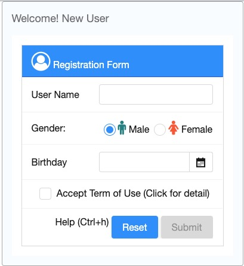
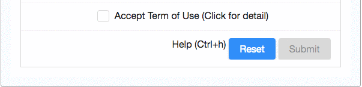
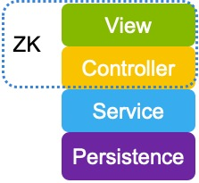

# What is ZK

ZK is a UI framework that enables you to build amazing web and mobile
applications without having to write JavaScript or AJAX.

# Fast UI Composition

Building UI with ZK is easy; simply combine and mix with the hundreds of
components readily at hand. You can rapidly create your own user
interface with various ZK components. Each component's style, behavior,
and function can be configured upon your desire.



**ZUL**, an XML-formatted and easy-to-read language, is used to describe
the above registration form


<window border="normal" hflex="min" style="margin:0px auto;" title="Welcome! New User">
    <grid id="formGrid" hflex="min" ctrlKeys="^h">
        <auxhead>
            <auxheader colspan="2" label="Registration Form" iconSclass="z-icon-user-circle-o"/>
        </auxhead>
        <columns visible="false">
            <column/>
            <column/>
        </columns>
        <rows>
            <row id="nameRow">
                <!-- constraint="no empty" -->
                User Name
                <textbox id="nameBox" hflex="1" constraint="no empty"/>
            </row>
            <row>
                Gender:
                <radiogroup id="genderRadio">
                    <radio label="Male" value="male" iconSclass="z-icon-male" checked="true"/>
                    <radio label="Female" value="female" iconSclass="z-icon-female"/>
                </radiogroup>
            </row>
            <row>
                Birthday
                <datebox id="birthdayBox" hflex="1" constraint="no empty, no today, no future"/>
            </row>
            <row spans="2" align="center">
                <hlayout>
                    <checkbox id="acceptTermBox"/>
                    <label value=" Accept Term of Use (Click for detail)" popup="termDetail, position=end_after"
                            style="cursor: pointer"/>
                </hlayout>
            </row>
            <row spans="2" align="right">
                <hlayout>
                    <label value="Help (Ctrl+h)"/>
                    <button id="resetButton" label="Reset"/>
                    <button id="submitButton" label="Submit" disabled="true"/>
                </hlayout>
            </row>
        </rows>
    </grid>
...
</window>


- Line 1: One tag represents one component. Some components can have
  child components. In this example, a *window* contains a *grid*.
- Line 2: CSS flexible width, please see [Hflex and Vflex]({{site.baseurl}}/zk_dev_ref/ui_patterns/hflex_and_vflex)
- Line 4: ZK contains [Font Awesome icons]({{site.baseurl}}/zk_dev_ref/integration/presentation_layer/font_awesome) by default, you can
  specify icon CSS class at `iconSclass`.
- Line 18: You may give "id" attribute to a component, so you can
  control them in a Java controller.

ZK also allows you to create UI programmatically like how you use Java
Swing within a [Richlet]({{site.baseurl}}/zk_dev_ref/ui_composing/richlet).

ZK UI components are like building blocks; you can combine, mix-match,
or inherit and make them into a new component to fulfill diverse
requirements. This versatility increases reusability and modularity. See
[ shadow elements]({{site.baseurl}}/zk_dev_ref/ui_composing/shadow_for_mvc),
[Macro]({{site.baseurl}}/zk_dev_ref/ui_composing/macro_component).

# Intuitive UI Controlling

ZK is a component-based framework with event-driven programming model,
therefore, developers add functions to respond to events of components
that are triggered by users interaction.

## UI Controller

To control the UI, firstly, you need to implement a controller class
which inherits ZK's
[**SelectorComposer**](https://www.zkoss.org/javadoc/latest/zk/org/zkoss/zk/ui/select/SelectorComposer.html)
for a ZUL. Then, you can retrieve the UI component's Java object by
annotating [ **@Wire** on the controller's member variables]({{site.baseurl}}/zk_dev_ref/mvc/controller/wire_components).
After this has been done, you can then control and manipulate UI by
accessing those annotated member variables.


package org.zkoss.simple;

// some import statements are omitted for brevity.

public class RegistrationComposer extends SelectorComposer<Component> {

    @Wire
    private Button submitButton;    

    @Wire
    private Checkbox acceptTermBox;
}


- **line 7,10**: Variable names "submitButton" and "acceptTermBox"
  corresponds to components' id attributes which are specified at
  mentioned ZUL in the previous section.

We can then use the controller above to control our UI components by
specifying attribute "apply" in the ZUL.

```xml
    <window border="normal" width="400px" title="Welcome! New User"
    apply="org.zkoss.simple.RegistrationComposer">
    <!-- omit other components for brevity -->
    </window>
```

- **Line 2:** By applying the controller to the root component, you can
  control all child components inside the root component.

## Handle User Action

In the registration form above, the "Submit button" is disabled at the
beginning, and it is only enabled (clickable) when a user checks the
"Term of use" checkbox.



As ZK is an event-driven framework, a user action is therefore handled
by an event listener. ZK provides an annotation [ **@Listen** to register an event listener by selector syntax]({{site.baseurl}}/zk_dev_ref/mvc/controller/wire_event_listeners).
To achieve the above feature, you can annotate a method to listen to an
"onCheck" event of "Accept Term of Use" checkbox. Whenever a user
checks/unchecks the checkbox to trigger the "onCheck" event, ZK invokes
the annotated method. We implement the above UI effect by changing the
properties of a component (Java object) in the annotated method.


import org.zkoss.zk.ui.Component;
import org.zkoss.zk.ui.select.SelectorComposer;
import org.zkoss.zk.ui.select.annotation.Listen;
import org.zkoss.zk.ui.select.annotation.Wire;
import org.zkoss.zul.Button;
import org.zkoss.zul.Checkbox;

public class RegistrationComposer extends SelectorComposer<Component> {
    @Wire
    private Button submitButton;
    @Wire
    private Checkbox acceptTermBox;

    @Listen("onCheck = #acceptTermBox")
    public void changeSubmitStatus(){
        if (acceptTermBox.isChecked()){
            submitButton.setDisabled(false);
            submitButton.setImage("/images/submit.png");
        }else{
            submitButton.setDisabled(true);
            submitButton.setImage("");
        }
    }

}


- **line 14**: Use @Listen to declare a method to handle the *onCheck*
  event of "acceptTermBox".
- **line 17,18**: Enable "Submit" button and display a checked icon when
  "Accept Term of Use" checkbox is checked.
- **line 20,21**: Disable "Submit" button and clear the checked icon.

With ZK's help, you can easily add fancy UI effects such as tooltip,
drag & drop, and hotkey, etc. to your application.

## MVVM Pattern

What we have introduced so far is MVC pattern, which controls UI by
components API. Another way is data binding, please see [ Get ZK Up and Running with MVVM]({{site.baseurl}}/get_started/get_zk_up_and_running_with_mvvm).

# Support Responsive Design

ZK provides various features for you to apply responsive design, please
read [ Responsive Design]({{site.baseurl}}/zk_dev_ref/ui_patterns/responsive_design).

# Easy Backend Integration



As ZK allows you to control UI via a controller on the server-side, the
controller is, therefore, the main extension point to integrate any Java
library or framework. To integrate ZK with other frameworks, write your
controller code to use classes of back-end systems that construct your
business or persistence layer.

## Integrate Third-Party Library

With the help of ZK's UI controller - **SelectorComposer**, it is easy
to integrate your legacy system service class, domain object, and any
third-party library such as Log4j.


public class RegistrationIntegrateComposer extends SelectorComposer<Component> {

    //omit other variables for brevity
    private static Logger logger = Logger.getLogger(RegistrationIntegrateComposer.class.getName());
    private RegisterService registerService = new RegisterService();
    private User newUser = new User();

    @Listen("onClick = #submitButton")
    public void register(){
        //save user input into newUser object
        registerService.add(newUser);
        logger.debug("a user was added.");
        //...
    }
}


- **Line 4,12:** Call Log4j to log error.
- **Line 5,11:** Use your service object in the controller.
- **Line 6,11:** Use your own domain object.

## Integrate Business and Persistence Layer Framework

It is very important that a UI framework can cooperate with other
business or persistence layer frameworks when building a multi-tier web
application. ZK is easily integratable with business layer frameworks
like Spring.

Assume you have implemented some classes according to *Data Access
Object* (DAO) pattern as your application's persistence layer with
Hibernate, JPA or other persistence framework. It is in your controller
that you should use these classes to implement your application's
feature.

```java

@VariableResolver(org.zkoss.zkplus.spring.DelegatingVariableResolver.class)
public class RegistrationSpringComposer extends SelectorComposer<Component> {

    @WireVariable
    private RegistrationDao registrationDao;

    @Listen("onClick = #submitButton")
    public void submit(){
        // omit irrelevant code for brevity
        registrationDao.add(newUser);
    }
}
```

- **Line 1:** To use CDI, simply use another resolver:
  `org.zkoss.zkplus.cdi.DelegatingVariableResolver.class`.
- **Line 4:** For those variables with `@WireVariable`, ZK will inject
  qualified Spring beans by retrieving them from Spring context with
  variable resolver.

# Work with Spring-boot

ZK provides a zkspringboot-starter addon to help you work with
Springboot easily, please refer to [ Create and Run Your First ZK Application with Spring Boot]({{site.baseurl}}/zk_installation_guide/quick_start/create_and_run_your_first_zk_application_with_spring_boot).

# Source Code

You can get the complete source code mentioned in this page at [github](https://github.com/zkoss-demo/gettingStarted/tree/master)


# What's Next

- [ Quick Start]({{site.baseurl}}/zk_installation_guide/quick_start)
  - Start to develop with ZK with your familiar tools including Eclipse,
    IntelliJ, Maven, Gradle, or Spring Boot.
- [ Start in MVC pattern]({{site.baseurl}}/get_started/get_zk_up_and_running_with_mvc)
- [ Start in MVVM pattern]({{site.baseurl}}/get_started/get_zk_up_and_running_with_mvvm)
- [ZK Demo](http://www.zkoss.org/zkdemo/)
