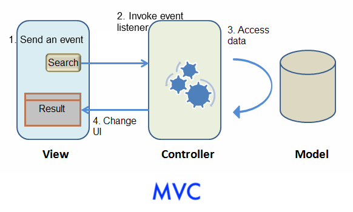

# Introduction

This tutorial is intended for software developers who have experience in
writing Java programs. You will learn basic concepts by building a
modern web application with ZK. The target application we are going to
build is a simple car catalog application. We will use the **MVC**
approach to build the application here. This approach is very intuitive
and flexible and gives you full control of components. In addition, you
can also choose to go with the **MVVM** approach that is covered in [Get ZK Up and Running with MVVM]({{site.baseurl}}/get_started/get_zk_up_and_running_with_mvvm).

You can download the complete source code under the [ Start from Example Project](#start_from_example_project) section.



# Handling UI Logic

The next step after building the UI is to make it respond to user
interaction. The pattern we introduce here is to **control ZK components
directly by their API**. We call this [**Model-View-Controller** (**MVC**) design pattern]({{site.baseurl}}/zk_dev_ref/mvc/mvc). This
pattern divides an application into 3 parts.

The **Model** consists of application data and business rules.
`CarService` and other classes used by it represent this part in our
example application.

The **View** indicates the user interface. The zul page which contains
ZK components represents this part. A user's interaction with components
triggers events to be sent to controllers.

The **Controller** plays the role of a coordinator between View and
Model. It receives events from View to update Model and retrieves data
from Model to change View's presentation.

## The Flow to Handle a User Action



1.  When a user interacts with a component (e.g. click a button) on a
    ZUL, the user action triggers an event.
2.  This event is sent to the controller and invokes the corresponding
    event listener method.
3.  The event listener method usually contains business logic, accesses
    data, and the logic to manipulate ZK components.
4.  A component's state change is responded to a browser, and ZK client
    updates the corresponding UI.

## Creating UI Controllers

### Extending SelectorComposer

In ZK, the controller is responsible for controlling ZK components and
listening to events triggered by user interaction. We can create such a
controller class by simply extending
[SelectorComposer](https://www.zkoss.org/javadoc/latest/zk/org/zkoss/zk/ui/select/SelectorComposer.html)
:

```java
package tutorial;

// omit import for brevity

public class SearchController extends SelectorComposer<Component> {

}
```

### Apply a Controller to a UI Component

After a controller is created, we associate it with its corresponding UI
component. Associating a controller with a component is just specifying
a fully-qualified class name for the target component's `apply`
attribute. The following code shows how to associate a controller with a `<window>`.

**Extracted from [searchMvc.zul](https://github.com/zkoss-demo/gettingStarted/blob/master/src/main/webapp/searchMvc.zul)**

```xml
    <window title="Search" width="600px" border="normal"
    apply="tutorial.SearchController">
    <!-- omit other components for brevity -->
    </window>
```


After associating the controller with the *window* component, the
controller can listen to events sent from UI and retrieve components
which allows us to implement the application's feature. Let's start from
the "search car": a user enters a keyword, clicks the "Search" button to
trigger the search.

Steps to implement an application feature:

1.  Declare a method that listens to a component's event
2.  Control UI components to implement presentation and business logic
    in the listener method

## Listening to User Actions

When we apply a controller to a component, every event triggered by this
component (and its child components) is sent to the controller. If we
register an event listener for the triggered event, ZK will invoke the
listener.

Since a user clicks "Search" button to trigger the search function, we
have to register a listener method, `search()`, to "Search" button's
`onClick` event with the following annotation:

`@Listen("[EVENT_NAME] = #[COMPONENT_ID]")`

For complete selector syntax, please refer to [SelectorComposer javadoc](http://www.zkoss.org/javadoc/latest/zk/org/zkoss/zk/ui/select/SelectorComposer.html).

The final code looks like:

```java
public class SearchController extends SelectorComposer<Component> {

    @Listen("onClick = #searchButton")
    public void search(){

    }
}
```

- Line 3: `searchButton` is the button's id specified in the zul, and
  you can find it in the previous zul. For complete selector syntax,
  please refer to [SelectorComposer javadoc](http://www.zkoss.org/javadoc/latest/zk/org/zkoss/zk/ui/select/SelectorComposer.html).
- Line 4: Event listener must be a public method.

## Controlling UI Components

After establishing the relationship between an event and an event
listener method, we can start to implement application logic with
components. But firstly we need to retrieve/wire the UI component's
object by annotating **`@Wire`** on controller's member variables.
Because ZK instantiates a page's components object according to the zul,
you should get ZK-created component objects instead of calling
`new Window()` manually.

Steps to retrieve components:

1.  Declare a variable with target component type (e.g. `Listbox`, `Label`...)
2.  Name the variable as component's ID.
      
    Matching ID is the default rule to match a component for `@Wire`,
    and please refer to [Wire Components in Developer's Reference]({{site.baseurl}}/zk_dev_ref/mvc/wire_components)
    to know other ways.
3.  Annotate the variable with `@Wire`.

Then ZK will "wire" a corresponding ZK component object to the variable
we declared. After this has been done, we can then control and
manipulate UI by accessing those annotated member variables.

```java

public class SearchController extends SelectorComposer<Component> {

    @Wire
    private Textbox keywordBox;
    @Wire
    private Listbox carListbox;

    //other codes...
}
```

- Line 5-6: In searchMvc.zul, there is a *listbox* whose id is
  carListbox. ZK will make the variable `carListbox` reference to the
  *listbox* object after components are created.

The search method performs the logic: call `CarService` to search with a
keyword and set result list to `Listbox`.

You can get a component's state in a browser with its getter methods,
`getValue()`, or change a component's state like making a `Label`
invisible with setter, `setVisible(false)`, to achieve some dynamic UI
effect.

```java
public class SearchController extends SelectorComposer<Component> {
    //omit codes to get components

    @Listen("onClick = #searchButton")
    public void search(){
        String keyword = keywordBox.getValue();
        List<Car> result = carService.search(keyword);
        carListbox.setModel(new ListModelList<Car>(result));
    }
}
```

- Line 6: We can easily get what keyword a user inputs by
  `keywordBox.getValue()`
- Line 8: Notice that `setModel()` only accepts a `ListModel` object, so
  we can use `org.zkoss.zul.ListModelList` to wrap search result list.
  There are other `ListModel` objects for different collection types,
  please refer to [ List Model in Developer's Reference]({{site.baseurl}}/zk_dev_ref/mvc/list_model).
  To change data item displayed in a `Listbox`, call
  `carListbox.setModel()`. The model of a component is the data the
  component holds and we can change the model to change the data
  rendering on the screen, please refer to [Model-Driven Rendering]({{site.baseurl}}/zk_dev_ref/mvc/model#Model-Driven_Rendering)

## Displaying a Data Collection

We have successfully made clicking "Search" button to invoke its
corresponding event listener, but we would still find that content of
*listbox* doesn't show the search result correctly. That is because we
haven't specified how to render data model on the *listbox*. Now, we
will use a special tag,
[<template>]({{site.baseurl}}/zk_dev_ref/mvc/template), to
control the rendering of each car. ZK will render each object in the
data model according to components inside <template/>.

Steps to use <template>:

1.  Use <template> to enclose components that we want to create
    repeatedly.
2.  Set template's `name` attribute with `model`.
3.  Use implicit variable, `each`, to assign domain object's properties
    to component's attributes.

Please refer to [ZK Developer's Reference/mvc/View/Template/Listbox Template]({{site.baseurl}}/zk_dev_ref/mvc/listbox_template)
for more details.

**Extracted from
[searchMvc.zul](https://github.com/zkoss/zkbooks/blob/master/gettingStarted/getZkUp/src/main/webapp/searchMvc.zul)**

```xml
<listbox id="carListbox" rows="3" emptyMessage="No car found in the result">
    <listhead>
        <listheader label="Model" />
        <listheader label="Make" />
        <listheader label="Price" width="20%"/>
    </listhead>
    <template name="model">
        <listitem>
            <listcell label="${each.model}"/>
            <listcell label="${each.make}"/>
            <listcell label="${('$'+=each.price)}"/>
        </listitem>
    </template>
</listbox>
```

- Line 1: Specify `rows` to limit how many rows to display for the
  Listbox, so that you don't have to measure its height in pixel.
- Line 7: The template tag should be put inside the listbox.
- Line 8: The <listitem> in previous section is for static data, we
  should replace it with current code.
- Line 9: The "each" is a variable that references to a domain object in
  the model list which is `Car` in our example application. We can use
  it to access domain object's property with EL, e.g. `${each.price}`.
- Line 11: Concatenate 2 strings with [ EL 3 syntax]({{site.baseurl}}/zk_dev_ref/ui_composing/el_expressions#EL_3.0_Support):
  `(+=)`

## Implementing "View Car Details"

The previous sections describe the basic steps to implement a feature.
Let's recap them by implementing "view car details":

First, declare a method to listen to `onSelect` event of `Listbox` with
`@Listen`.

Second, use `@Wire` to get UI components like previewImage, modelLabel,
priceLabel, and descriptionLabel and assign value to them with setter.

[SearchController.java](https://github.com/zkoss-demo/gettingStarted/blob/master/src/main/java/tutorial/SearchController.java)

```java

public class SearchController extends SelectorComposer<Component> {

    @Wire
    private Listbox carListbox;
    @Wire
    private Label modelLabel;
    @Wire
    private Label makeLabel;
    @Wire
    private Label priceLabel;
    @Wire
    private Label descriptionLabel;
    @Wire
    private Image previewImage;

    @Listen("onSelect = #carListbox")
    public void showDetail(){
        Car selected = carListbox.getSelectedItem().getValue();
        previewImage.setSrc(selected.getPreview());
        modelLabel.setValue(selected.getModel());
        makeLabel.setValue(selected.getMake());
        priceLabel.setValue(selected.getPrice().toString());
        descriptionLabel.setValue(selected.getDescription());
    }
    //omit other codes for brevity
}
```

- Line 16: register an `onSelect` event listner on the `Listbox`
- Line 18: get user-selected item.
- Line 19~23: publish the selected car detail to the browser by setter
  methods.
