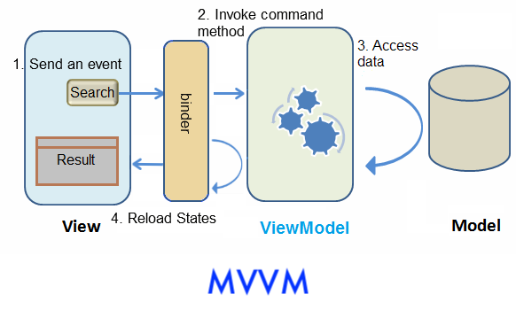

# Introduction

This tutorial is intended for software developers who have experience in
writing Java EE programs. We will guide you on how to build a modern web
application with ZK. The target application we are going to build is a
simple car catalog application. In this article, we will present an
approach that is classified as the **Model-View-ViewModel (MVVM)**
design pattern. Using this approach, ZK can control components for you
automatically and it separates the UI from its controller clearly. In
addition, you can also choose to go with the <b>MVC</b> approach that is
covered in [another tutorial]({{site.baseurl}}/get_started/get_zk_up_and_running_with_mvc).



# Automatic UI Controlling

The approach we introduce here to control user interaction is to **let
ZK control UI components for you**. This approach is classified to
**Model-View-ViewModel** (**MVVM**) design pattern. For complete information, please see [MVVM in Developer's Reference]({{site.baseurl}}/zk_mvvm_ref/intro/introduction_of_mvvm). This pattern
divides an application into three parts.

The **Model** consists of application data and business rules.
`CarService` and other classes used by it represent this part in our
example application.

The **View** means user interface. The zul page which contains ZK
components represents this part. A user's interaction with components
triggers events to be sent to controllers.

The **ViewModel** is responsible for exposing data from the Model to the
View and providing required action requested from the View. The
ViewModel is type of **View abstraction** which contains a View's state
and behavior. But **ViewModel should contain no reference to UI
components**. ZK framework handles communication and state
synchronization between View and ViewModel.

Under this approach, we just **prepare a ViewModel class** with proper
setter, getter and application logic methods, then **assign data-binding
expression to a component's attributes** in a ZUL. There is a binder in
ZK which will synchronize data between ViewModel and components and
handle events automatically according to binding expressions. We don't
need to control components by ourselves.

Here we use the search function to explain how MVVM works in ZK. Assume
that a user click "Search" button then *listbox* updates its content.
The flow is as follows:



1.  A user clicks "Search" button and a corresponding event is sent.
2.  ZK's binder invokes the corresponding command method in the
    ViewModel.
3.  The method accesses data from Model and updates some ViewModel's
    properties.
4.  ZK's binder reloads changed properties from the ViewModel to update
    component's states.

## Abstracting the View

ViewModel is an abstraction of View. Therefore when we design a
ViewModel, we should analyze UI's functions for what **state** it
contains and what **behavior** it has.

The state:

1.  keyword from user input
2.  car list of search result
3.  selected car

The operation:

1.  search

According to the above analysis, the ViewModel should have 3 variables
for the above states and one method for the behavior. In ZK, creating a
ViewModel is like creating a POJO, and it exposes its states like
JavaBean's properties through setter and getter methods. The search
method implements search logic with service class and updates the
property "carList".

For `carList` we use
[ListModelList]({{site.baseurl}}/zk_dev_ref/mvc/list_model), ZK's own list
implementation, instead of a plain `ArrayList`. A `ListModelList` reports its own changes to
whichever component is displaying it, so the *listbox* refreshes itself whenever we add or
remove cars. The next section shows what that saves us.

**SearchViewModel.java**

```java
package tutorial;

import java.util.List;
import org.zkoss.bind.annotation.*;
import org.zkoss.zul.ListModelList;

public class SearchViewModel {

    private String keyword;
    private List<Car> carList = new ListModelList<Car>();
    private Car selectedCar;

    private CarService carService = new CarServiceImpl();

    //omit getter and setter

    public void search(){
        carList.clear();
        carList.addAll(carService.search(keyword));
    }
}
```

- We **mutate** the existing list rather than replacing it with
  `carList = carService.search(keyword)`. Assigning a new list would throw away the
  `ListModelList` that the *listbox* is watching.

**Annotation**

In ZK MVVM, any behavior that a View can request is a **command** in a
ViewModel. We can bind a component's event to the command and ZK will
invoke the method when a bound event is triggered. In order to let ZK
know which behavior (method) can be requested, you should apply an
annotation `@Command` on a method. We mark `search()` as a "command"
with **default command name**, search, which is the same as method name.
The command name is used in the data-binding expression we'll talk about
in the next section.

For the "search" command, it looks like this:

**SearchViewModel.java**

```java
package tutorial;

import java.util.List;
import org.zkoss.bind.annotation.*;
import org.zkoss.zul.ListModelList;

public class SearchViewModel {

    //omit other codes

    @Command
    public void search(){
        carList.clear();
        carList.addAll(carService.search(keyword));
    }
}
```

- The `@Command` for MVVM is **`org.zkoss.bind.annotation.Command`**. ZK has an unrelated
  annotation with the same simple name, `org.zkoss.zk.ui.annotation.Command`, that belongs to
  the MVC composer, so pick the `org.zkoss.bind` one when your IDE offers the import.
- There is **no `@NotifyChange` here**, and that is the point of using a `ListModelList`: the
  list tells the *listbox* about its own changes, so nothing has to tell the binder to reload
  it.

For a plain property — one that is not a ZK model — the ViewModel does have to announce a
change, and it does so with `@NotifyChange`:

```java
    @Command
    @NotifyChange("keyword")
    public void clear(){
        keyword = "";
    }
```

`@NotifyChange` is the general mechanism and you will use it constantly in real ViewModels;
see [Notification]({{site.baseurl}}/zk_mvvm_ref/viewmodel/notification) for the full
picture. Our search function simply does not need it.

For complete source code, please refer to
[Github](https://github.com/zkoss-demo/gettingStarted/blob/master/src/main/java/tutorial/SearchViewModel.java)

## Binding UI to ViewModel

Under MVVM, we build our UI as same as we would with the MVC approach,
then we specify the relationship between a ZUL and a ViewModel by
writing data binding expression in component's attribute and let ZK
handle components for us.

### Bind a ViewModel

To bind a component to a ViewModel, we should apply a composer called
**org.zkoss.bind.BindComposer**. This composer processes data binding
expressions and initializes the ViewModel class. We then bind this
component to a ViewModel by setting its **viewModel** attribute with
following syntax:

**`@id('ID') @init('FULL.QUALIFIED.CLASSNAME')`**

- `@id()` is used to set ViewModel's id to whatever we want like a
  variable name. We will use this id to reference ViewModel's properties
  (e.g. vm.carList) in a data binding expression.
- We should provide full-qualified class name for `@init()` to
  initialize the ViewModel object.

**Extracted from searchMvvm.zul**

```xml
    <window title="Search" width="600px" border="normal" 
            viewModel="@id('vm') @init('tutorial.SearchViewModel')">
    ...
    </window>
```

After binding the ViewModel to the component, all its child components
can access the same ViewModel and its properties.

We can bind View to both ViewModel's properties and behavior with data
binding expression. Let's see how to use data binding to achieve the
search function.

### Load Data From a ViewModel

Since we have declared variables in ViewModel class for a component's
states in the previous section, we can bind the component's attributes
to them. After binding a component's attribute to ViewModel, ZK will
synchronize data between the attribute's value and a ViewModel's
property for us automatically. We can specify **which attribute is
loaded from which property** by writing data binding expression as a
component attribute's value with the syntax:

**`@load(vm.aProperty)`**

- Remember that `vm` is the id we have given it in `@id()` previously
  and now we use it to reference ViewModel object.

### Save Data to a ViewModel

There are 2 states which relate to search function in the ViewModel upon
the previous analysis. First, we want to store value of *textbox* in
ViewModel's `keyword`. We can then bind "value" of *textbox* to
`vm.keyword` with `@save(vm.keyword)`. So that ZK will save the user
input into the ViewModel at the proper moment. Second, we want to assign
the *Listbox* 's data with ViewModel's `carList`, so we should bind its
"model" attribute to `vm.carList`.

**Extracted from [searchMvvm.zul](https://github.com/zkoss-demo/gettingStarted/blob/master/src/main/webapp/searchMvvm.zul)**

```xml
    Keyword:
    <textbox value="@save(vm.keyword)" />
    <button label="Search" iconSclass="z-icon-search" style="margin: 0 0 5px 5px"/>
    <listbox model="@init(vm.carList)" rows="5" emptyMessage="No car found in the result">
    <!-- omit other tags -->
```

- The *listbox* uses **`@init`**, not `@load`. `@init` evaluates the expression once, when the
  page is created, and hands the *listbox* the `ListModelList` object itself. From then on the
  model keeps the *listbox* up to date directly, so there is nothing for the binder to reload.
  Use `@load` when the property is a plain value that the ViewModel replaces — see
  [Property Binding]({{site.baseurl}}/zk_mvvm_ref/data_binding/property_binding).
- `iconSclass="z-icon-search"` uses ZK's built-in Font Awesome icons, so the button needs no
  image file of its own.

### Invoke a Method of a ViewModel

We can only bind a component's event attribute (e.g. onClick) to
ViewModel's behavior. After we bind an event to a ViewModel, each time a
user triggers the event, ZK finds the bound command method and invokes
it. In order to handle clicking on "Search" button, we have to bind the
button's onClick attribute to a command method with the following
syntax:

**`@command('COMMAND_NAME')`**

- We should look for command name specified in our ViewModel's command
  method.

**Extracted from [searchMvvm.zul](https://github.com/zkoss-demo/gettingStarted/blob/master/src/main/webapp/searchMvvm.zul)**

```xml
    Keyword:
    <textbox value="@save(vm.keyword)" />
    <button label="Search" iconSclass="z-icon-search" onClick="@command('search')"
            style="margin: 0 0 5px 5px"/>
    <listbox model="@init(vm.carList)" rows="5" emptyMessage="No car found in the result">
    <!-- omit other tags -->
```

After binding this "onClick" event, when a user clicks "Search" button, ZK saves the *textbox*
value into `vm.keyword` and invokes `search()`. That method refills the `ListModelList`, and
the *listbox* redraws itself.

## Displaying Data Collection

The way to display a collection of data with data binding is very
similar to the way in the MVC approach. we will use a special tag,
[`<template>`]({{site.baseurl}}/zk_dev_ref/mvc/template), to control the rendering of each item. The only
difference is we should use data binding expression instead of EL.

Steps to use `<template>`:

1.  Use **<template>** to enclose components that we want to create
    iteratively.
2.  Set template's "name" attribute to "model".(See [ZK Developer's Reference/mvc/View/Template/Listbox Template]({{site.baseurl}}/zk_dev_ref/mvc/listbox_template))
3.  Use implicit variable, **each**, to assign domain object's
    properties to component's attributes.

**Extracted from [searchMvvm.zul](https://github.com/zkoss-demo/gettingStarted/blob/master/src/main/webapp/searchMvvm.zul)**

```xml
    <listbox model="@init(vm.carList)" rows="5" emptyMessage="No car found in the result">
        <listhead sizable="true">
            <listheader label="Model" />
            <listheader label="Make" />
            <listheader label="Price" width="20%"/>
        </listhead>
        <template name="model">
            <listitem>
                <listcell label="@init(each.model)"></listcell>
                <listcell label="@init(each.make)"></listcell>
                <listcell label="@init(('$'+=each.price))" />
            </listitem>
        </template>
    </listbox>
```

- `('$'+=each.price)` concatenates two strings with
  [EL 3 syntax]({{site.baseurl}}/zk_dev_ref/ui_composing/el_expressions#el-30-support), the
  same expression the MVC version uses.

## Implementing View Details Functionality

The steps to implement the view details functionality are similar to
previous sections.

1.  We bind attribute `selectedItem` of *listbox* to the property
    `vm.selectedCar` to save selected domain object.
2.  Because we want to show selected car's details, we bind value of
    *label* and src of *image* to selected car's properties which can be
    access by chaining dot notation like `vm.selectedCar.price`.
3.  Each time a user selects a *listitem*, ZK saves selected car to the
    ViewModel. Then ZK reloads `selectedCar`'s properties to those bound
    attributes.

```xml
    <listbox model="@init(vm.carList)" rows="5" emptyMessage="No car found in the result"
             selectedItem="@save(vm.selectedCar)">
    <!-- omit child components -->
    </listbox>
    <hlayout style="margin-top:20px" width="100%">
        <image width="250px" src="@load(vm.selectedCar.preview)" />
        <vlayout hflex="1">
            <label value="@load(vm.selectedCar.model)" />
            <label value="@load(vm.selectedCar.make)" />
            <label value="@load(vm.selectedCar.price)" />
            <label value="@load(vm.selectedCar.description)" />
        </vlayout>
    </hlayout>
```

- Saving `vm.selectedCar` is enough on its own: the binder knows the four labels and the image
  depend on that property, so it reloads them right after the save. This is the same
  dependency tracking that `@NotifyChange` triggers manually.
- `hlayout` and `vlayout` arrange their children horizontally and vertically — the same
  components the MVC version of this page uses.

You can view complete zul at [Github](https://github.com/zkoss-demo/gettingStarted/blob/master/src/main/webapp/searchMvvm.zul)

