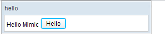

# Simple Application Under Test

We are going to introduce some basic concepts of ZATS Mimic using a
simple application. This application only has one label and a button
with no other content at first. It has only one function: when a user
clicks the button, the label shows "Hello Mimic" as shown in the image
below.



**ZUL of our simple application**

```xml

<zk>
    <window title="hello" border="normal" width="300px" apply="org.zkoss.zats.example.hello.HelloComposer">
        <label />
        <button label="Hello" />
    </window>
</zk>
```

**Composer of our simple application**

```java

public class HelloComposer extends SelectorComposer {
    
    @Wire("label")
    Label label;
    
    @Listen("onClick = button")
    public void hello(){
        label.setValue("Hello Mimic");
    }
}
```

# Write a Test Case

Steps to write a test case are as follows:

1.  Setup web application content path
2.  Create a client to connect to a ZUL
3.  Query a component
4.  Perform an operation on a component
5.  Verify result by checking a component’s property
6.  Tear down, stop server emulator

# Fundamental Classes

Before diving into the source code of a test case, let me introduce some
basic classes used in a test case.

<javadoc directory="zats">org.zkoss.zats.mimic.Zats</javadoc>  
It contains several utility methods to initialize and clean testing
environment. By default, it starts server emulator **with built-in
web.xml and zk.xml** bundled in ZATS Mimic's jar.

<javadoc directory="zats"> org.zkoss.zats.mimic.Client</javadoc>  
Acts like a browser to the server emulator and we use it to connect to a
ZUL. One client keeps its session even connecting to different ZUL
pages. If you want to create different sessions, you have to create
another client object.

<javadoc directory="zats">org.zkoss.zats.mimic.DesktopAgent </javadoc>  
Wraps ZK Desktop object, we usually call its `query()` or `queryAll()`
to retrieve `ComponentAgent` with selector syntax.

For available selector syntax, please refer to <javadoc>org.zkoss.zk.ui.select.SelectorComposer </javadoc> or [Small Talks/2011/January/Envisage ZK 6: An Annotation Based Composer For MVC](https://www.zkoss.org/wiki/Small_Talks/2011/January/Envisage_ZK_6:_An_Annotation_Based_Composer_For_MVC)

<javadoc directory="zats">org.zkoss.zats.mimic.ComponentAgent </javadoc>  
Mimics a ZK component and determines which operation you can perform on
it. We can also get ZK component property's value from it.

It also has `query()` which means to find targets among its child
components.

<javadoc directory="zats">org.zkoss.zats.mimic.operation.OperationAgent</javadoc> `(ClickAgent, TypeAgent, SelectAgent...)`  
To mimic a user operation to a ZK component.

We name it "Agent" as it's not really the user operation itself, it's an
agent to mimic user operation to a component.

  
