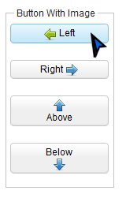
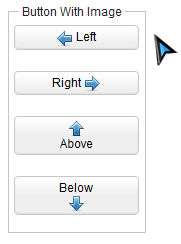

# Mouse Over & Mouse Out

`HoverAgent` mimics a mouse pointer move over or move out a component.
You have to query the target component agent first, then call
`moveOver()` or `moveOut()`




```java

desktopAgent.query("button").as(HoverAgent.class).moveOver();

desktopAgent.query("button").as(HoverAgent.class).moveOut();
```

# Supported Components

<table>
<thead>
<tr class="header">
<th><center>
<p>Components</p>
</center></th>
<th><center>
<p>Version</p>
</center></th>
<th><center>
<p>Note</p>
</center></th>
</tr>
</thead>
<tbody>
<tr class="odd">
<td><p>Sub-class of <javadoc>org.zkoss.zk.ui.HtmlBasedComponent
</javadoc></p></td>
<td><p>5, 6</p></td>
<td></td>
</tr>
</tbody>
</table>

 
