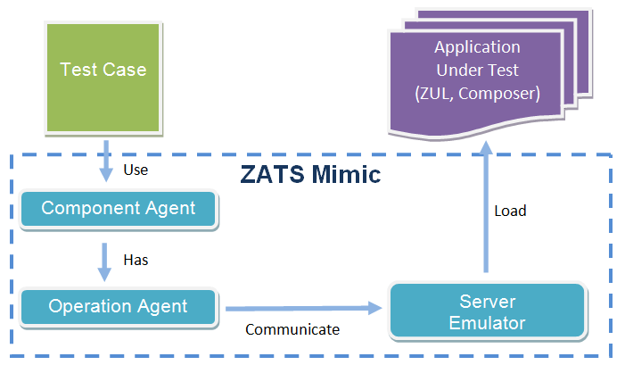

# Background

In agile software development, developers modify their codes frequently
for requirement change or refactoring, they therefore also perform unit
tests frequently to ensure software quality. In ZK-based applications,
it is hard to execute an unit test on the composer which is
tightly-coupled to ZUL because it is instantiated when a ZUL is
requested by a browser. The same problem arises if you want to verify a
ZUL's zkbind expression with ViewModel. Hence **TDD** (Test-Driven
Development) cannot proceed under this situation.

In some cases, agile developers may deploy their web applications to a
server and test it within a browser. However, writing an automation test
to control a browser is an issue, and testing for different browsers is
also a trouble. Not to mention that running a test in an application
server is time-consuming and can be an agile developer's darkest moment.

**ZATS (ZK Application Test Suite) Mimic** is designed to solve this
kind of problem.

# No Server Test

ZATS Mimic enables developers to test their composer **without an
application server** and of course **without a browser** either. Through
this library, testers can mimic user interactions to applications such
as clicking or typing to verify composer's (controller layer) data and
logic. All they have to do is to **write a regular unit test case** and
use Mimic's utility class to interact components on ZUL and then, run
the test case.

No deploying to server, no rendering on browser, the unit test case can
be executed in a very short period of time - this is very helpful for
frequent unit testing during a agile development process.

The concept is as follows:

<figure>

<figcaption>Smalltalk-ZatsMimicConcept.png</figcaption>
</figure>

Testers write test cases to simulate user action such as clicking or
typing with operation agents. Operation agent communicates with server
emulator and triggers the composer's event handlers to change the
component's status. Testers are able to check component's properties
from the component agent to verify the result of user action. It might
be a *label* changing its value or a *listbox* increased by one item.
**All behaviors that reflect on the component's properties can be
verified.**

## Limitation

As this library focuses on testing the composer's logic on the server
side, there are some limitations you should know:

- **Functions dependent on the application server won't work.**
    
  Test cases run in simulated environment; all functions that require an
  application server do not work (e.g. JNDI, or JTA). If an AUT
  (Application Under Test) project adopts such container-provided
  services, it needs extra work to make them work normally out of a
  container, e.g. use Test Double like a fake object.

<!-- -->

- **Cannot test browser’s behavior.**
    
  In a ZK-based application, some behaviors are handled by a browser
  (JavaScript), e.g. popup menu or message dialog created at the client
  side. As server side is not aware of these behaviors, it cannot be
  verified.

<!-- -->

- **Cannot test visual effects.**
    
  It cannot verify any behaviors that doesn't reflect upon component's
  properties such as animations, or a component's visual effect.

In following sections, we will cover usage of operation agents and how
to customize your test environment.

  
