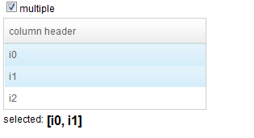

# Multiple Select

The reason that ZATS Mimic provides a `MultipleSelectAgent` instead of
combining it with the `SelectAgent` is to avoid confusion making it
clearer to distinguish each action. As it is possible for an user to
perform **single selection** in a *listbox* with attribute
"multiple=true", If we only have one agent to select, it is hard to tell
which kind of selecting a tester is referring to. Therefore, we designed
two separate agents to reflect a tester's intention more precisely. With
`MultipleSelectAgent`, you can `select()` and `deselect()`. This
operation can only be used on <b>*listitem* and *treeitem*</b>.

The application we use to demonstrate this usage contains a *listbox*
with attribute "multiple=true" at first and there is also a *checkbox*
that can switch the *listbox* between single and multiple selection
mode. When we select one or more items, the label at the bottom will
display all selected item's label.



In the test case below, we perform three different tests;

- **multiple** select in **multiple** selection mode
- **single** select in **multiple** selection mode
- **multiple** select in **single** selection mode

**MultipleSelectTest**

``` java

    @Test
    public void testAgent() {
        DesktopAgent desktopAgent = Zats.newClient().connect("/multiple-select.zul");

        Label msg = desktopAgent.query("#msg").as(Label.class);
        Assert.assertEquals("", msg.getValue());

        ComponentAgent listbox = desktopAgent.query("#lb");
        Assert.assertEquals(4, listbox.as(Listbox.class).getChildren().size()); // include header
        List<ComponentAgent> items = listbox.queryAll("listitem");

        // listbox multiple selection
        items.get(0).as(MultipleSelectAgent.class).select();
        items.get(1).as(MultipleSelectAgent.class).select();
        items.get(2).as(MultipleSelectAgent.class).select();
        Assert.assertEquals("[i0, i1, i2]", msg.getValue());
        Assert.assertEquals(3, listbox.as(Listbox.class).getSelectedCount());

        items.get(1).as(MultipleSelectAgent.class).deselect();
        Assert.assertEquals("[i0, i2]", msg.getValue());
        Assert.assertEquals(2, listbox.as(Listbox.class).getSelectedCount());
        items.get(0).as(MultipleSelectAgent.class).deselect();
        Assert.assertEquals("[i2]", msg.getValue());
        Assert.assertEquals(1, listbox.as(Listbox.class).getSelectedCount());

        items.get(0).as(MultipleSelectAgent.class).deselect(); // should happen nothing
        Assert.assertEquals("[i2]", msg.getValue());
        Assert.assertEquals(1, listbox.as(Listbox.class).getSelectedCount());

        //single select in multiple selection mode
        String[] values = { "[i0]", "[i1]", "[i2]" };
        for (int i = 0; i < 3; ++i) {
            items.get(i).as(SelectAgent.class).select();
            Assert.assertEquals(values[i], msg.getValue());
        }
        
        //multiple select in single selection mode, throw an exception
        desktopAgent.query("#multipleMode").as(CheckAgent.class).check(false);
        try {
            items.get(0).as(MultipleSelectAgent.class).select();
            Assert.fail();
        }catch(RuntimeException e){
            System.out.println(e.getMessage());
        }
    }
```

- With `MultipleSelectAgent`, we can mimic multiple selecting behavior.
  (line 13, 19)

<!-- -->

- Deselect a non-selected item won't cause any error. (line 26)

<!-- -->

- Under multiple selection mode, you can still use `SelectAgent` to
  perform single selecting. (line 33)

<!-- -->

- But if you want to do multiple selecting under single selecting mode,
  you'll get a run-time exception. (line 40)

# Supported Components

<table>
<thead>
<tr class="header">
<th><center>
<p>Components</p>
</center></th>
<th><center>
<p>Version</p>
</center></th>
<th><center>
<p>Note</p>
</center></th>
</tr>
</thead>
<tbody>
<tr class="odd">
<td><p>Listitem, Treeitem</p></td>
<td><p>5, 6</p></td>
<td></td>
</tr>
</tbody>
</table>

 
