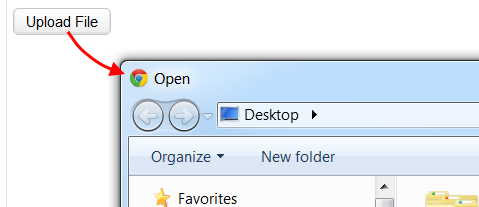
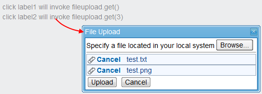

 

`Since 1.1.0`

ZATS Mimic introduces the `UploadAgent` to simulate file uploading
operation and `UploadAgent` supports single or multiple file uploading.
The following are the usage steps:

1.  Obtain a `UploadAgent` object.
      
    Depending on your case, you could get it from a *Button* or from
    desktop. **Note that you should use the same object before calling
    `finish()`.**
2.  Upload a file by invoking `upload()` method.
3.  Invoke `finish()` when there is no more file to upload.

# Uploading Files for Components with `upload` attribute

To implement an uploading feature, you can simply use the
<javadoc>org.zkoss.zul.Fileupload</javadoc> component. Alternatively,
you can choose to use a button components such as
<javadoc>org.zkoss.zul.Button</javadoc>,
<javadoc>org.zkoss.zul.Menuitem</javadoc>,
<javadoc>org.zkoss.zul.Toolbarbutton</javadoc> and so on.[^1] then set
`true` to `upload` attribute of these components; users can then click
and select a file to upload through a browser dialog, as illustrated
below:



**Notes**

<references/>

## Upload a Single File

We can cast these components described above as `UploadAgent` and
perform file uploading. Following is a typical example of a single file
uploading:

``` java
@Test
public void test() throws Exception {
    File file = getFile();
    DesktopAgent desktop = Zats.newClient().connect("/upload.zul");
    UploadAgent agent = desktop.query("#btn").as(UploadAgent.class);
    agent.upload(file, "text/plain");
    agent.finish();
}
```

- **Line 14**: Cast component to `UploadAgent` and keep its reference.
- **Line 15**: Invoke `upload()` method to upload a file.
- **Line 16**: Don't forget to invoke `finish()`method.

## Uploading Multiple Files

Since **ZK 6.0.0**, components now also support mutiple uploads at once
if they have `multiple=true` flag and users using web browsers
supporting HTML5.[^2] `UploadAgent` also supports multiple files
uploading at once. Following is a typical example of uploading multiple
files:

``` java
@Test
public void test() throws Exception {
    File[] files = getFiles();
    DesktopAgent desktop = Zats.newClient().connect("/upload.zul");
    UploadAgent agent = desktop.query("#btn").as(UploadAgent.class);
    agent.upload(files[0], "text/plain");
    agent.upload(files[1], "image/png");
    agent.finish();
}
```

- **Line 14**: Cast component to UploadAgent and keep its reference.
- **Line 15-16**: We can upload multiple files at once with ZK version
  greater than 6.0.0 and components that have `multiple=true` flag.
- **Line 17**: Don't forget to invoke `finish()`method.

**Notes**

<references/>

# Uploading Files with `Fileupload.get()`

Another way to implement upload feature is to use the static method
<javadoc method="get()">org.zkoss.zul.Fileupload</javadoc> as an event
handler.[^3] This static method will open up an uploading dialog and
allow users to upload single or multiple files (if configured), as shown
in the image below:



``` xml
            <label id="label1" value="click label1 will invoke fileupload.get()" onClick="Fileupload.get();" />
            <label id="label2" value="click label2 will invoke fileupload.get(3)" onClick="Fileupload.get(3);" />
```

In this case, we can retrieve `UploadAgent` from
<javadoc>org.zkoss.zk.ui.DesktopAgent</javadoc>. Following is a typical
example of file uploading with
<javadoc method="get()">org.zkoss.zul.Fileupload</javadoc>:

``` java
@Test
public void test() throws Exception {
    File[] files = getFiles();
    DesktopAgent desktop = Zats.newClient().connect("/upload.zul");
    desktop.query("#label2").click();
    UploadAgent agent = desktop.as(UploadAgent.class);
    agent.upload(files[0], "text/plain");
    agent.upload(files[1], "image/png");
    agent.finish();
}
```

- **Line 14-15**: After triggering an event leading to an uploading
  operation, we can cast <javadoc>org.zkoss.zk.ui.DesktopAgent</javadoc>
  as a `UploadAgent` for uploading.
- **Line 16-17**: We can also upload multiple files at once using
  <javadoc method="get()">org.zkoss.zul.Fileupload</javadoc>.
- **Line 18**: Don't forget to invoke `finish()`method.

**Notes**

<references/>

# Supported Components

<table>
<thead>
<tr class="header">
<th><center>
<p>Components</p>
</center></th>
<th><center>
<p>Version</p>
</center></th>
<th><center>
<p>Note</p>
</center></th>
</tr>
</thead>
<tbody>
<tr class="odd">
<td><p>DesktopAgent</p></td>
<td><p>5, 6</p></td>
<td></td>
</tr>
<tr class="even">
<td><p>Fileupload</p></td>
<td><p>5, 6</p></td>
<td></td>
</tr>
<tr class="odd">
<td><p>Button, Menuitem, Toolbarbutton</p></td>
<td><p>5, 6</p></td>
<td></td>
</tr>
</tbody>
</table>

 

[^1]: For more details, please refer to [ZK Developer's Reference/UI
    Patterns/File Upload and
    Download]({{site.baseurl}}/zk_dev_ref/UI_Patterns/File_Upload_and_Download)
    and [ZK Component Reference/Essential
    Components/Fileupload](ZK_Component_Reference/Essential_Components/Fileupload)

[^2]: For more detail, please refer to
    [ZK_Component_Reference/Essential_Components/Button#Upload](ZK_Component_Reference/Essential_Components/Button#Upload)

[^3]: For more detail, please refer to [ZK Component Reference/Essential
    Components/Fileupload#Invoke the Static Method:
    get](ZK_Component_Reference/Essential_Components/Fileupload#Invoke_the_Static_Method:_get)
