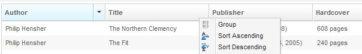

# Group

`GroupAgent` is only supported on a *column* of *grid*. It mimics the
action to "group by a column's data".



The following code presents how to make a column to group its data.

```java

        ComponentAgent groupingColumn = desktop.query("column[label='Author']");
        groupingColumn.as(GroupAgent.class).group();
```

# Supported Components

<table>
<thead>
<tr class="header">
<th><center>
<p>Components</p>
</center></th>
<th><center>
<p>Version</p>
</center></th>
<th><center>
<p>Note</p>
</center></th>
</tr>
</thead>
<tbody>
<tr class="odd">
<td><p>Column</p></td>
<td><p>5, 6</p></td>
<td></td>
</tr>
</tbody>
</table>

 
