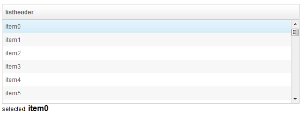

# Render

When a <b>*listbox* </b> (or <b> *grid* </b>) uses a live data and is
not in paging mold, it **does not load all items at first**, it
pre-loads first few items. Until a user scrolls the scroll bar down, it
loads and renders subsequent items. If we retrieve those un-rendered
*listitems* in a test case, we will find its *listcell* containing no
child components. This is one of ZK's optimizing behavior; to avoid
loading large amount of data which might have not been viewed by users.

Hence, before we retrieve components inside a *listcell*, we should use
Render operation to force *listbox* to load all of its content.

We use a simple case to demonstrate how to use this agent. This
application contains a *lisbox* with 1000 *listitems* and has a simple
logic: when a user selects an item, the label at the bottom will display
the item's content. Each *listcell* has one child component *label*.



**RenderTest.java**

```java

    @Test
    public void testRendererAgent() {
        DesktopAgent desktop = Zats.newClient().connect("/render.zul");

        ComponentAgent listbox = desktop.query("#listbox");
        Label itemData = desktop.query("#itemData").as(Label.class);

        //selecting first item works correctly 
        listbox.getChild(1).as(SelectAgent.class).select();
        Assert.assertEquals("item0", itemData.getValue());
        
        //select a non-rendered item
        listbox.getChild(1000).as(SelectAgent.class).select();
        Assert.assertEquals("", itemData.getValue());
        //get a non-rendered listcell, check it has no child.
        Listcell listcell = listbox.getChild(1000).getChild(0).as(Listcell.class);
        Assert.assertTrue(listcell.getChildren().size()==0);

        listbox.as(RenderAgent.class).render(999, 999);

        listbox.getChild(1000).as(SelectAgent.class).select();
        Assert.assertTrue("item999".equals(itemData.getValue()));
        listcell = listbox.getChild(1000).getChild(0).as(Listcell.class);
        Assert.assertTrue(listcell.getChildren().size()>0);
    }
```

- Selecting the first item, item data label displays correctly. (line
  9,10)

<!-- -->

- Before using `RenderAgent` to render, label displays nothing when
  selecting the last item. (line 13,14)
- We can also find that *listcell* has no children. (line 16,17)
- `render()` could accept a range of items as parameters, and the index
  starts from zero. The last index of 1000 *listitem* is 999 but the
  last listitem's index of the *listbox* is 1000, index zero is
  *listhead*. (line 19)
- After rendering the last item, selecting it now works properly as
  expected while *listcell* now contains child components. Remember that
  **you should retrieve the *listcell* again after rendering** because
  original *listitem* component is already detached and replaced with a
  new *listitem*. (line 21-24)

# Supported Components

<table>
<thead>
<tr class="header">
<th><center>
<p>Components</p>
</center></th>
<th><center>
<p>Version</p>
</center></th>
<th><center>
<p>Note</p>
</center></th>
</tr>
</thead>
<tbody>
<tr class="odd">
<td><p>Grid, Listbox</p></td>
<td><p>5, 6</p></td>
<td></td>
</tr>
</tbody>
</table>

 
