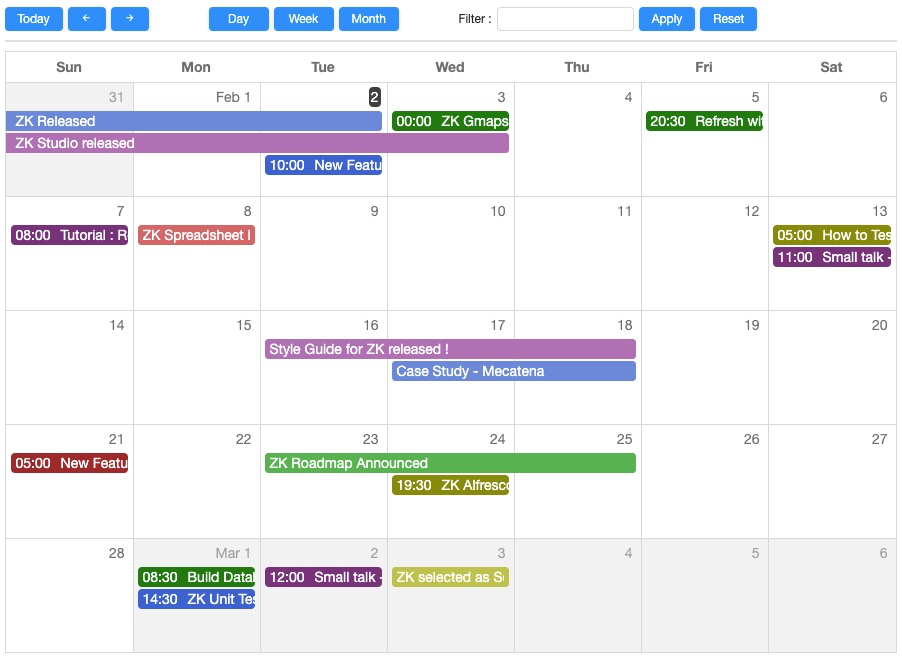

ZK Calendar is a Google-Calendar-like Ajax component providing rich and
intuitive scheduling functionality. One of the main benefits of ZK
Calendar is it can be embedded into existing Java EE applications with
minimal effort. The calendar can work seamlessly with other ZK
components and support function and style customization.

ZK Calendar boasts all the advanced features of a modern-day calendar
such as daily, weekly, and monthly views, drag-n-drop, multiple time
zones, and permission control.

Go to see [Online
Demo](https://www.zkoss.org/zkdemo/zk_calendar/zk_calendar)

# Important Change

- [New look and feel](ZK%20Calendar%20Essentials/Themes)
- [ Some event name and class name
  renaming](ZK_Calendar_Essentials/Displaying_Calendar_Items)
- Support java 8 new date API
  ([`java.time.*`](https://docs.oracle.com/javase/8/docs/api/java/time/package-summary.html))
- Require Java 8 or above
