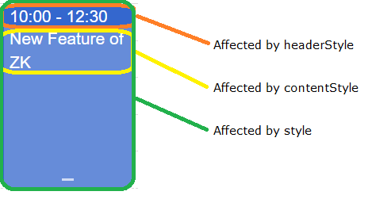

# Component in MVC Pattern

From the component perspective, Calendars is designed in the MVC pattern:

- [`Calendars`](https://www.zkoss.org/javadoc/latest/zkcal/org/zkoss/calendar/Calendars.html)
  (Controller): call `ContentRenderer` to render a calendar to the
  client-side, dispatch UI events to the corresponding event listeners,
  receives events from `CalendarModel` then render a calendar upon
  changed
  [`CalendarItem`](https://www.zkoss.org/javadoc/latest/zkcal/org/zkoss/calendar/api/CalendarItem.html)
- [`CalendarModel`](http://www.zkoss.org/javadoc/latest/zkcal/org/zkoss/calendar/impl/SimpleCalendarModel.html)
  (Model): stores `CalendarItem`
- `ContentRenderer` (View): renders a calender-related data to the
  client-side upon `CalendarModel`

Based on the above architecture, if you want to show some items on a
Calendar, you need to create some `CalendarItem` objects, put them into
a `CalendarModel`, and assign the model to `Calendars`. The default
implementation,
[`DefaultCalendarItem`](https://www.zkoss.org/javadoc/latest/zkcal/org/zkoss/calendar/impl/DefaultCalendarItem.html)
and
[`SimpleCalendarModel`](https://www.zkoss.org/javadoc/latest/zkcal/org/zkoss/calendar/impl/SimpleCalendarModel.html),
are sufficient for most requirements.

# Create a CalendarItem

Starting from version 3.0.0, we have renamed the `CalendarEvent` class
to `CalendarItem`. This change was made to reduce potential confusion
between events on the calendar and events fired by the ZK framework."

You can simply create a `CalendarItem` with the default builder:

```java
 DefaultCalendarItem calendarItem = new DefaultCalendarItem.Builder()
                .withTitle("my title")
                .withContent("my content")
                .withBegin(LocalDateTime.now().truncatedTo(ChronoUnit.HOURS))
                .withEnd(LocalDateTime.now().truncatedTo(ChronoUnit.HOURS).plusHours(2))
                .withZoneId(calendars.getDefaultTimeZone().toZoneId())
                .build();
```

If you don't specify the title, it displays **begin time - end
time** at an item's header: 

If an item is shorter than half an hour, it appends the content in the
header:


# Create a CalendarModel

You can instantiate a `SimpleCalendarModel` with a collection of
`DefaultCalendarItem` or add a `DefaultCalendarItem` after
instantiation.

```java
private SimpleCalendarModel model;
...
    model = new SimpleCalendarModel(CalendarItemGenerator.generateList());
    DefaultCalendarItem calendarItem = new DefaultCalendarItem("my title",
                "my content",
                null,
                null,
                false,
                LocalDateTime.now().truncatedTo(ChronoUnit.HOURS),
                LocalDateTime.now().truncatedTo(ChronoUnit.HOURS).plusHours(2)
    model.add(calendarItem);
```

# Assign the Model to Calendars

After creating a `SimpleCalendarModel`, we need to associate a component
with the model, so that Calendar will render items to a browser.

```java
public class DisplayComposer extends SelectorComposer {

    @Wire("calendars")
    private Calendars calendars;
    private SimpleCalendarModel model;

    @Override
    public void doAfterCompose(Component comp) throws Exception {
        super.doAfterCompose(comp);
        initModel();
        calendars.setModel(model);
    }
```

# Display a Tooltip

To show a tooltip when an end-user hover this mouse on an calendar item,
you need to:

1.  create a popup
2.  link the popup with your calendars with [ tooltip]({{site.baseurl}}/zk_dev_ref/ui_patterns/tooltips,_context_menus_and_popups#Tooltips)
    attribute.
3.  implement the logic to show a tooltip in an [ onItemTooltip listener]({{site.baseurl}}/zk_calendar_essentials/implementing_event_listeners#CalendarsEvent.ON_ITEM_TOOLTIP).

```xml
    <calendars height="100%"  beginTime="8"
     apply="org.zkoss.calendar.essentials.DisplayTooltipComposer"
     tooltip="tooltipPopup, position=after_pointer"/>
    <popup id="tooltipPopup">
        <label id="tooltipText"/>
    </popup>
```

# Customizing Calendar Item Appearance

From calendar 3.1.0 and onward,
[SimpleCalendarItem](https://www.zkoss.org/javadoc/latest/zkcal/org/zkoss/calendar/impl/SimpleCalendarItem.html) supports `sclass`, `style`, `contentStyle` and `headerStyle` attributes.

The `sclass` attribute will add the specified CSS class at DOM node of the
calendar item (`.z-calitem`), which allow the whole element to be used in a css
selector.

```java
    calendarItem.setSclass("myClass");
```

```css
    .myClass{ /* selector for the whole node */
        ...
    }
    .myClass .z-calitem-body{ /* selector for a sub-node */
        ...
    }
```

This is a good way to assign styles to categories of items.

If you need to assign styles to individual items, you can use the style,
contentStyle and headerStyle properties instead: 

```java
    calendarItem.setStyle("background-color: #0093f9"); //affects the whole item
    calendarItem.setHeaderStyle("background-color: red; color: white;"); //affects the header node, may override setStyle for this node
    calendarItem.setContentStyle("background-color: rgb(255, 255, 0); color: white;"); //affects the content node, may override setStyle for this node
```

`before 3.1.0`

Before calendar 3.1.0, only the background color can be customized for
the calendar item's main Node with the contentColor attribute, and the
header's node with the headerColor attribute. These are deprecated after
3.1.0, and should be replaced by style attributes.


# Customizing Calendar Item Rendering Logic
 
This section covers how to programmatically customize the rendering logic of calendar items, which is different from the CSS styling approach covered in the previous section. While CSS styling changes the appearance through stylesheets, rendering logic customization allows you to modify the actual content and structure of calendar items at the JavaScript widget level.

Use rendering logic customization when you need to:
- Change the text content displayed in calendar items
- Modify the HTML structure of calendar items
- Implement custom time formatting
- Add dynamic content based on item properties

## Understanding Calendar Item Widget Types by Mold
The ZK Calendar uses different JavaScript widget types depending on the mold and item duration:

### Default Mold:
- **DayItem**: Items shorter than one day
- **DaylongItem**: Multi-day items

### Month Mold:
- **DayOfMonthItem**: Items shorter than one day
- **DaylongOfMonthItem**: Multi-day items with clone node handling for items spanning multiple weeks

Each widget type has different rendering behavior and templates optimized for their specific display context.

## Key Rendering Methods to Override

The main methods you can override to customize rendering are:

- `getHeader()`: Controls the header text content displayed at the top of calendar items
  - `DayItem`: Shows "title time" or "title time-range" format
  - `DayOfMonthItem`: Shows "startTime title" format
  - `DaylongItem`: Shows "title startTime" format
  - `DaylongOfMonthItem`: Shows "startTime title" format
- **TEMPLATE objects**: Control the HTML structure and layout of calendar items
- `format()`: Controls time formatting (inherited from base Item class)

## Implementation Pattern with ZK Override

To safely override calendar widget behavior, use this pattern:

1. Use `zk.afterLoad('calendar', function() {...})` to ensure calendar widgets are loaded before modification
2. Use `zk.override(calendar.WidgetType.prototype, exWidget, {...})` to properly extend widget functionality
3. Store the original widget reference in `exWidget` for potential future restoration

## Common Customization Examples

### Custom Header Content for Day Items

```javascript
zk.afterLoad('calendar', function() {
    var exWidget = {};
    zk.override(calendar.DayItem.prototype, exWidget, {
        getHeader: function () {
            var beginDate = this.item.zoneBd,
                endDate = this.item.zoneEd;
            let timeText = (endDate - beginDate < (7200000 / this.parent._timeslots)) ?
                this.format(beginDate) :
                this.format(beginDate) + ' - ' + this.format(endDate);
            return `📅 ${this.item.title} ${timeText}`;
        }
    });
});
```

### Custom Content Rendering

```javascript
zk.afterLoad('calendar', function() {
    var exWidget = {};
    zk.override(calendar.DayItem.prototype, exWidget, {
        redraw: function (out) {
            this.defineClassName_();
            out.push(this.$class.TEMPLATE.main(
                this.item.id,
                this.domAttrs_(),
                this.params,
                this.getContent(), // Custom content method
                this.getHeader(),
                this.item.isLocked));
        },
        getContent: function() {
            return `📝 ${this.item.content}`;
        }
    });
});
```

### Custom Time Formatting

```javascript
zk.afterLoad('calendar', function() {
    var exWidget = {};
    zk.override(calendar.Item.prototype, exWidget, {
        format: function (date) {
            // Custom 12-hour format instead of default 24-hour
            return zk.fmt.Date.formatDate(date, 'hh:mm a');
        }
    });
});
```

Note: The `format()` method override affects all calendar item types since they inherit from the base `calendar.Item` class.