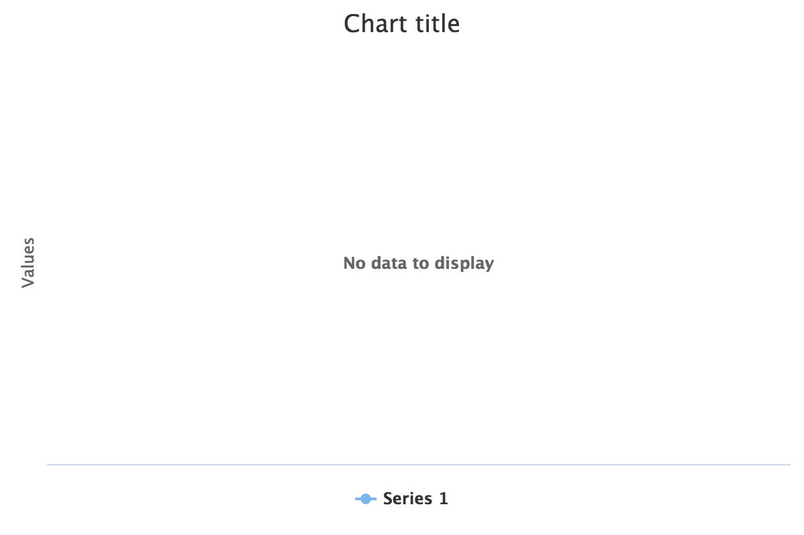

If the data points
([org.zkoss.chart.Point](https://www.zkoss.org/javadoc/latest/zkcharts/org/zkoss/chart/Point.html)) of a
series are not Number and neither array, there is a 1000-points
limitation for rendering a series. If a series contains more than 1000
points, ZK Charts won't render that series.

Please run **turboThreshold.zul** in the example project, and you will
see no series rendered after you click "add 1000 non-number points"
button.  If
you open chrome developer tool / console tab, you will see the error
message below:

`Highcharts error #12: https://www.highcharts.com/errors/12`

# Solution

- Put numeric data in `Point`.

`series.add(Number)` or `addPoint(double)`

- Increase turbo threshold

`chart.getPlotOptions().getSeries().setTurboThreshold(aLargerValue)`

- disable threhshold

`chart.getPlotOptions().getSeries().setTurboThreshold(0)`
