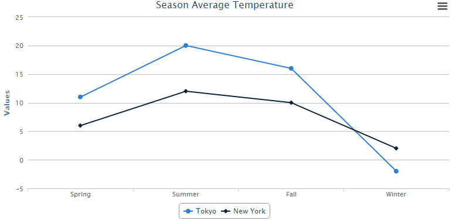
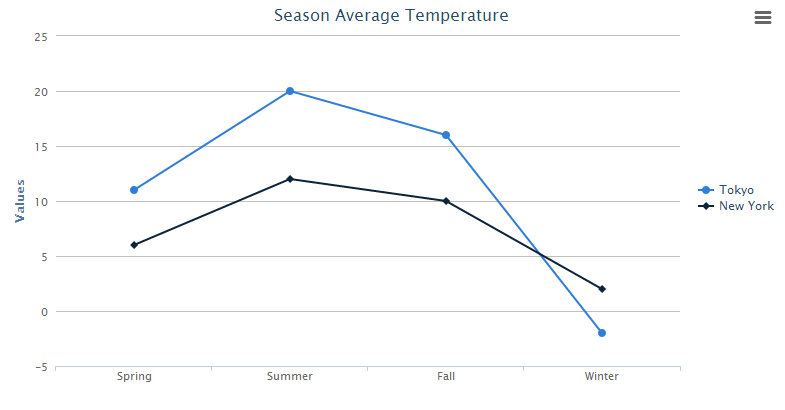

In this section, we will show how to create your first ZK Charts
component step by step.

# A Very Basic Chart

First, declare a chart component in a ZUML document. Specify `type` and
`title` properties.

## chart.zul

```xml
<charts id="chart" type="line" title="Season Average Temperature" 
    apply="org.zkoss.zkcharts.essentials.FirstChartComposer"/>
```

Use model to handle chart data, and set model to chart in a Controller
which extends <javadoc>org.zkoss.zk.ui.select.SelectorComposer</javadoc>

## First ChartComposer.java

```java
public class FirstChartComposer extends SelectorComposer<Component> {
    @Wire
    Charts chart;

    public void doAfterCompose(Component comp) throws Exception {
        super.doAfterCompose(comp);
        // Create a predefined implementation category model
        CategoryModel model = new DefaultCategoryModel();

        // Set value to the model
        model.setValue("Tokyo", "Spring", new Integer(11));
        model.setValue("Tokyo", "Summer", new Integer(20));
        model.setValue("Tokyo", "Fall", new Integer(16));
        model.setValue("Tokyo", "Winter", new Integer(-2));
        model.setValue("New York", "Spring", new Integer(6));
        model.setValue("New York", "Summer", new Integer(12));
        model.setValue("New York", "Fall", new Integer(10));
        model.setValue("New York", "Winter", new Integer(2));

        // Set model to the chart
        chart.setModel(model);
    }
}
```

After that, you can easily obtain an amazing chart to visualize your
data.



## Change Configuration

Moreover, if you want to change the configuration, you can add
additional declarations in the composer:

```java
    // Get the legend option in chart
    Legend legend = chart.getLegend();

    // Chage lengend's layout to vertical
    legend.setLayout("vertical");

    // Change lengend's alignment
    legend.setAlign("right");
    legend.setVerticalAlign("middle");

    // Remove lenged's border
    legend.setBorderWidth(0);
```

The <javadoc directory="zkcharts">org.zkoss.chart.Legend</javadoc> of
chart will be moved to the right of the chart without border.


