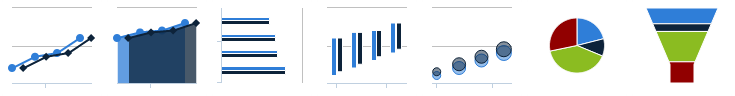
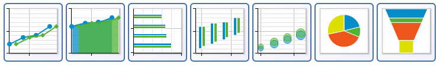
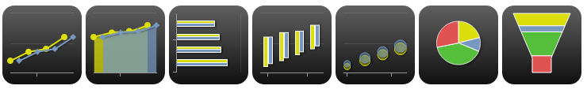
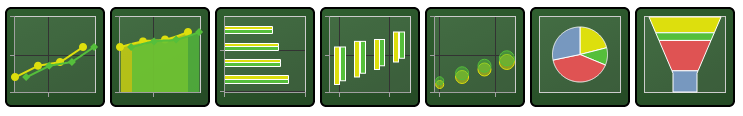

## Switching in Between Themes

ZK Charts provides many predefined color themes for you to use.

Here's a list of the themes in which you can choose from:

- Default Theme

``` java
    chart.setTheme(Theme.DEFAULT);
```



- Grid Theme

``` java
    chart.setTheme(Theme.GRID);
```



- Skies Theme

``` java
    chart.setTheme(Theme.SKIES);
```


- Gray Theme

``` java
    chart.setTheme(Theme.GRAY);
```



- Dark Blue Theme

``` java
    chart.setTheme(Theme.DARK_BLUE);
```


- Dark Green Theme

``` java
    chart.setTheme(Theme.DARK_GREEN);
```



See all themes at
[Theme](https://www.zkoss.org/javadoc/latest/zkcharts/org/zkoss/chart/Theme.html)

# Change Color

## Change Default Color

The component defines 10 default colors, you can provide a different set
of colors:

``` java
    String[] colors = {
            "red",
            "blue",
            "green",
            "yellow",
            "purple",
            "orange",
            "pink",
            "brown",
            "gray",
            "teal",
            "black"
    };
    @Override
    public void doAfterCompose(Component comp) throws Exception {
...
        charts.setColors(colors); //provide a list of default colors 
    }
```

## Change a Series Color

``` java
charts.getSeries().setColor("#aabbcc"); //change a specific series
```

## Customizing Colors

ZK Charts uses
<javadoc directory="zkcharts">org.zkoss.chart.Color</javadoc> class to
apply the color to the color-changing method in the option, such as
`setBackgroundColor()` or `setFillColor()`. `Color` supports solid color
and gradient color.

ZK Charts use the `Color` class to represent web color including solid
or gradient. It can be applied to the configuration so that we can
obtain a customized style.

### Solid Color

Solid color can be specified as an RGB triplet, in hexadecimal format or
any valid color format in browsers:

- RGB triplet - `new Color("rgb(186,86,150)")`
- Hexadecimal format - `new Color("#58BA7A")`

### Gradient Color

A gradient is a smooth color transition from one color to another. In ZK
Charts, a gradient is defined by
<javadoc directory="zkcharts">org.zkoss.chart.LinearGradient</javadoc>
or
<javadoc directory="zkcharts">org.zkoss.chart.RadialGradient</javadoc>,
they have similar attributes to [SVG
Gradients](http://www.w3.org/TR/SVG11/pservers.html#Gradients).

#### Linear Gradient

Linear gradient contains attributes `x1`, `y2`, `x2` and `y2` to define
the start and end position of the gradient. It can be assigned like
below:

``` java
    // Create a linear gradient which x1=0, y1=0, x2 = 0, y2=1 with percentages represent values
    LinearGradient linearGradient2 = new LinearGradient(0, 0, 0, 1);

    // Create a linear gradient which x1=0, y1=0, x2 = 0, y2=300 with coordinate
    LinearGradient linearGradient2 = new LinearGradient(0, 0, 0, 300);
```

The stop attributes can be assigned as below:

``` java
   // Same as lineraGradient.addStop(0, "#EEEEEE"); lineraGradient.addStop(1, "#CCCCCC");
    lineraGradient.setsStop("#EEEEEE", "#CCCCCC");
```

For example, we can apply the linear gradient color to the series as
below:

``` xml
<div apply="ColorfulColumnChartComposer">
    <charts id="chart" type="column" width="480" 
        height="300" title="Colorful Column Chart"/>
</div>
```

``` java
public class ColorfulColumnChartComposer extends SelectorComposer<Div> {
    @Wire
    Charts chart;

    public void doAfterCompose(Div comp) throws Exception {
        super.doAfterCompose(comp);
        
        CategoryModel model = new DefaultCategoryModel();
        model.setValue("1900", "Q1", new Integer(20));
        model.setValue("1900", "Q2", new Integer(55));
        model.setValue("1900", "Q3", new Integer(40));
        model.setValue("1900", "Q4", new Integer(75));

        chart.setModel(model);
        
        // remove grid line
        chart.getYAxis().setGridLineWidth(0);
        // remove y axis title
        chart.getYAxis().setTitle("");
        
        useGradientColor(); 
    }
    
    private void useGradientColor() {
                // Create a linear gradient which x1=0.5, y1=0, x2 = 0.5, y2=1 with percentages represent values
        LinearGradient gradient = new LinearGradient(0.5, 0, 0.5, 1);
        gradient.addStop(0, "#F39C12");
        gradient.addStop(0.4, "#F1C40F");
        gradient.addStop(1, "#8E44AD");
        chart.getSeries().setColor(new Color(gradient));
    }
}
```

<figure>

<figcaption>ColorfulColumnChartDemo.png</figcaption>
</figure>

#### Radial Gradient

Radial gradient is similar to linear gradient, but it specifies the
attributes to define the outermost circle instead of line position:

``` java
  // cx=0.4, cy=0.3, cr=0.6
  RadialGradient radialGradient = new RadialGradient(0.4, 0.3, 0.6);
  radialGradient.setStops("#EEEEEE", "#CCCCCC");
```

For example, here is pacman chart with radial gradient fill:

``` java
<div apply="demo.PacmanChartComposer">
    <charts id="chart" type="pie" width="480" 
        height="300" title="Pacman Chart"/>
</div>
```

``` java
public class PacmanChartComposer extends SelectorComposer<Div> {
    @Wire
    Charts chart;
    
    public void doAfterCompose(Div comp) throws Exception {
        super.doAfterCompose(comp);
        
        PiePlotOptions plotOptions = chart.getPlotOptions().getPie();
        plotOptions.setStartAngle(70);
        plotOptions.getDataLabels().setEnabled(false);
        
        Series series = chart.getSeries();
        Point ghost = new Point("Ghost", 40);
        ghost.setColor("#FFFFFF");
        series.addPoint(ghost);
        Point pacman = new Point("Pacman", 320);
        pacman.setColor(getPacmanColor());
        series.addPoint(pacman);
    }
    
    private Color getPacmanColor() {
        // cx=0.4, cy=0.3, cr=0.9
        RadialGradient radialGradient = new RadialGradient(0.4, 0.3, 0.9);
        radialGradient.addStop(0, "#F1C40F");
        radialGradient.addStop(1, "#F39C12");
        return new Color(radialGradient);
    }
}
```

<figure>

<figcaption>PacmanChartDemo.png</figcaption>
</figure>

# Customize Axis Label with HTML

Sometimes you want special axis label e.g. a hyperlink on an axis label,
you can enable this feature by
`chart.getXAxis().getLabels().setUseHTML(true)`. Please refer to the
example code below for details:

``` java
public class HtmlLabelComposer extends SelectorComposer<Component> {

    @Wire
    Charts chart;
    
    private static CategoryModel model;
    
    public void doAfterCompose(Component comp) throws Exception {
        super.doAfterCompose(comp);
        
        model = new DefaultCategoryModel();
    model.setValue("John", "<a title='great!!' href='http://www.zkoss.org' class='hastip'>Apples</a>", new Integer(5));
    ...
        
        // enable html usage 
        chart.getXAxis().getLabels().setUseHTML(true);
    }
}
```

Then, the axis label will become a hyperlink. (see the image below)

<figure>

<figcaption>zkcharts-essentials-htmlLabel.png</figcaption>
</figure>

# Change Decimal Point or Thousands Separator

``` java
public class DrilldownOnDemandComposer implements Composer<Charts> {
...
        Lang lang = new Lang();
        lang.setDecimalPoint(",");
        lang.setThousandsSep(".");
        Options options = new Options();
        options.setLang(lang);
        chart.setOptions(options);
```

- Reference [Highcharts
  Configuration](https://api.highcharts.com/highcharts/lang.decimalPoint)

# Data Label

Show x / y values in a custom format, e.g. 2000 -\> 2K.

**org.zkoss.zkcharts.essentials.customizing.HtmlLabelComposer**

``` java
    private void setDatalabelFormatter() {
        JavaScriptValue js = new JavaScriptValue("function(){if ( this.y > 1000 ) return Highcharts.numberFormat( this.y/1000, 1) + \"K\"; \n" +
                "else \n" +
                "          return this.y;}");
        chart.getSeries().getDataLabels().setEnabled(true);
        chart.getSeries().getDataLabels().setFormatter(js);
    }
```
