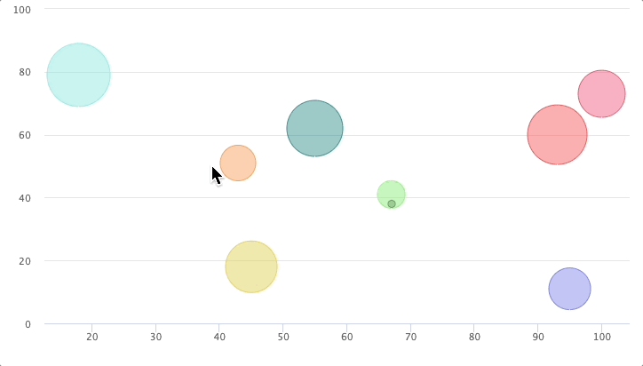

ZK Charts fire events when a user is interacting with the chart, we can,
therefore, declare a method to listen to the event and handle the event
data.

# ChartsEvent

[org.zkoss.chart.ChartsEvent](https://www.zkoss.org/javadoc/latest/zkcharts/org/zkoss/chart/ChartsEvent.html)
represents an event triggered by user's interaction. Please check out
`event.zul` in the example project to see events firing.

## Shifting Points Example

If we want to shift the point's position when user clicks the bubble, we
can listen the `onPlotClick` event and retrieve the point being clicked.
Then update the point's position like below:

### shift.zul

```xml
<charts id="chart" type="bubble" apply="org.zkoss.zkcharts.essentials.ShiftComposer"/>
```

### ShiftComposer.java

```java
public class ShiftComposer extends SelectorComposer<Window> {
    @Wire
    Charts chart;
    
    public void doAfterCompose(Window comp) throws Exception {
        super.doAfterCompose(comp);
        // initial series data
        initPoints();
        // hide some unnecessary options
        hideOptions();
    }
     
    @Listen("onPlotClick = #chart")
    public void shiftPoint(ChartsEvent event) {
        // retrieve the point object.
        Point point = event.getPoint();
        // shift the point by updating its x value.
        point.setX(point.getX().intValue() + random() / 10);
    }

...
}
```

Congratulations! Now you can interact with the chart. Here is what it shows: 

# ClickEvent Usage

What if we want to select the bubble and move it to the location where
the mouse was clicked? It can be done by modifying the previous sample
code as below:

```java
    ...

    public void doAfterCompose(Window comp) throws Exception {
        super.doAfterCompose(comp);
        
        // initial series data
        initPoints();
        // hide some unnecessary options
        hideOptions();
        // allow point select
        chart.getPlotOptions().getBubble().setAllowPointSelect(true);
    }
     
    @Listen("onClick = #chart")
    public void movePoint(ChartsClickEvent event) {
        for (Point point: chart.getSelectedPoints()) {
            point.update(event.getXAxis(), event.getYAxis(), point.getHigh());
            point.setSelected(false);
        }
    }

    ...
```

- Line 17: you can get the x and y axis values of where the mouse was
  clicked from
  [org.zkoss.chart.ChartsClickEvent](https://www.zkoss.org/javadoc/latest/zkcharts/org/zkoss/chart/ChartsClickEvent.html)
  which extends
  [org.zkoss.zk.ui.event.MouseEvent](https://www.zkoss.org/javadoc/latest/zk/org/zkoss/zk/ui/event/MouseEvent.html)

# Supported ChartsEvent

| EventName | Description |
|-----------|-------------|
| onPlotClick | Fires when the series is clicked, and it will pass the nearest point as a parameter. |
| onPlotCheckboxClick | Fires when the checkbox next to the series' name in the legend is clicked. |
| onPlotLegendItemClick | Fires when the legend item belonging to the series is clicked. (**Not applicable to pies**). |
| onPlotShow | Fires when the series is shown after chart generation time, by clicking the legend item. (**Not applicable to pies**). |
| onPlotHide | Fires when the series is hidden after chart generation time, by clicking the legend item.<br/>(**Not applicable to pies**). |
| onPlotMouseOver | Fires when the mouse enters the graph. |
| onPlotMouseOut | Fires when the mouse leaves the graph. |
| onPlotSelect | Fires when selecting a point from a series.<br/><br/>The zkcharts doesn't send this event before you enable "point select" by `Charts.getPlotOptions().getSeries().setAllowPointSelect(true);`<br/>Reference: [http://api.highcharts.com/highcharts#plotOptions.series.point.events](http://api.highcharts.com/highcharts#plotOptions.series.point.events) |
| onPlotUnselect | Fires when unselecting a point from a series. |
| onPlotDrillUp | Fires when drilling up from a drilldown series. |
| onPlotDrillDown | Fires when a drilldown point is clicked, before the new series is added. |
| onSelection | When you allow zooming by Charts.setZoomType(), it's fired when you drag your pointer within the chart. ZK will pass a `ChartsSelectionEvent` into an event listener. |
| onClick | Fires when you click within a chart, ZK will pass `ChartsClickEvent`. |

**Note:**

- see
  [org.zkoss.chart.ChartsEvents](https://www.zkoss.org/javadoc/latest/zkcharts/org/zkoss/chart/ChartsEvents.html)
  for more details.
- `onPlotShow`, `onPlotHide`, and `onPlotLegendItemClick` are not
  applicable on a pie chart because they are fired when a legend
  represents represents **a series**. But a legend in a pie chart
  represents **a point**, so ZKCharts doesn't fire those events for a
  pie chart.
