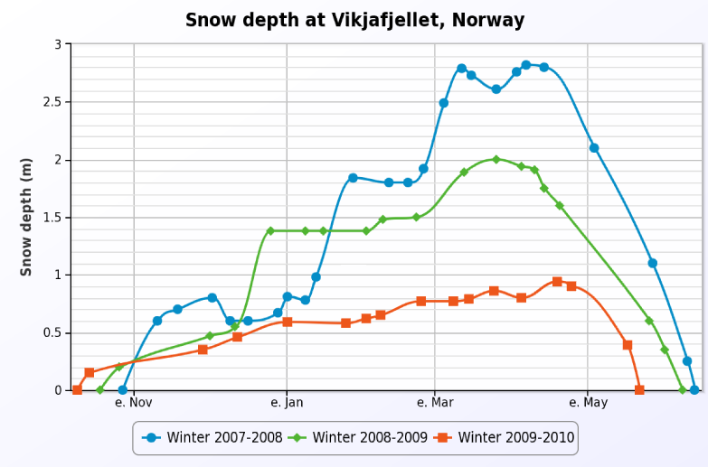

## What is ZK Charts

ZK Charts is a component which makes visualization of data exceptionally
easy, containing various chart types including line, area, bar, pie,
scatter and more. It is compatible with all modern browsers including
tablet devices. ZK Charts is based on
[Highcharts.js](http://www.highcharts.com/), it can therefore utilize
all the features included in Highchart.js

Since [Highcharts](https://www.highcharts.com/docs/index) (and the
[Highcharts API](https://api.highcharts.com/highcharts/)) are well
documented, we don't replicate this information in this guide. If you
are searching for a specific Highcharts feature or configuration
property, please refer to the Highcharts documentation first. In order
to implement the chart configuration with ZK Charts refer to [ Changing Chart Configuration]({{site.baseurl}}/zk_charts_essentials/changing_chart_configuration)

## Why ZK Charts

ZK Charts has the following advantages:

- Control charts on server-side in pure Java
- Fully integrated with ZK
- Support chart model
