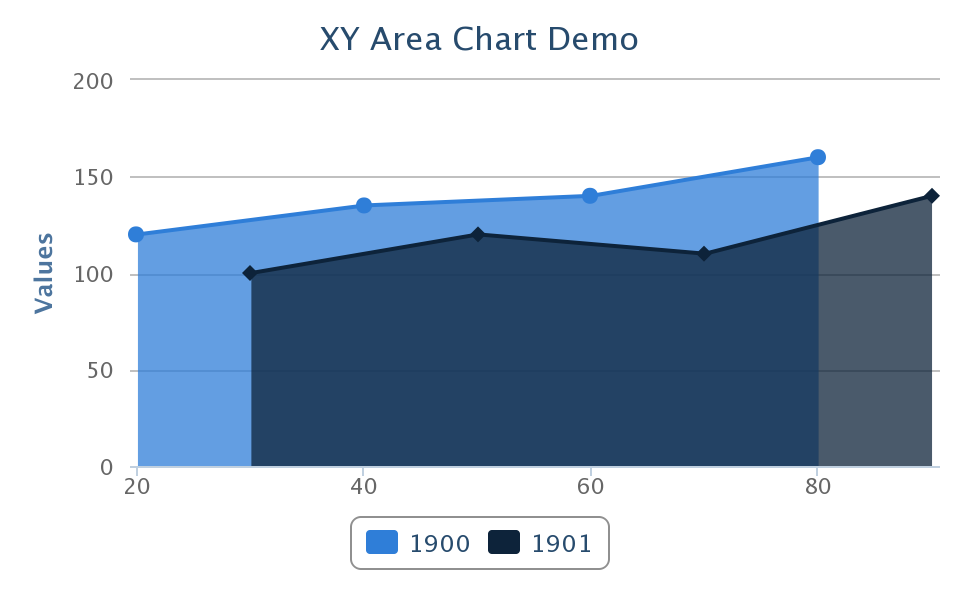

# Manipulating Model

Models are the perfect way for developers to interact with the charts as
they shield developers from complexities that they need not know or
interact with. In addition to this ZK model supports many design
patterns including [ MVC]({{site.baseurl}}/zk_dev_ref/mvc/mvc)
and [ MVVM]({{site.baseurl}}/zk_mvvm_ref/intro/mvvm_&_zk_bind), which are both
fully supported patterns.

ZK provides [ chart models]({{site.baseurl}}/zk_dev_ref/mvc/chart_model) to
handle data in the chart. Manipulating chart model with charts is the
same as other ZK components handling their supporting models. We've used
MVC approach to create the chart in the previous section - [ Create your first ZK Charts]({{site.baseurl}}/zk_charts_essentials/getting_started_with_zk_charts/create_your_first_zk_charts).
In this section, we will create another example of manipulating the
chart model in the MVVM approach.

We get started by creating an
[org.zkoss.chart.model.XYModel](https://www.zkoss.org/javadoc/latest/zkcharts/org/zkoss/chart/model/XYModel.html)
and put the data we want to handle:

#### ChartData.java

```java
public class ChartData {

    static public XYModel getXYModel() {
        // Use the predefined implementation DefaultXYModel to create a model.
        XYModel model = new DefaultXYModel();

        model.addValue("2001", new Integer(20), new Integer(120));
        model.addValue("2001", new Integer(40), new Integer(135));
        model.addValue("2001", new Integer(60), new Integer(140));
        model.addValue("2001", new Integer(80), new Integer(160));
         
        model.addValue("2002", new Integer(30), new Integer(120));
        model.addValue("2002", new Integer(50), new Integer(135));
        model.addValue("2002", new Integer(70), new Integer(140));
        model.addValue("2002", new Integer(90), new Integer(160));

        return model;
    }
}
```

Declare a POJO VM as well as the property's getter method.

#### ChartVM.java

```java
public class ChartVM {

    public XYModel getModel() {
        return ChartData.getXYModel();
    }
}
```

Reference the ViewModel in ZUL:

#### chart.zul

```xml
<window apply="org.zkoss.bind.BindComposer" viewModel="@id('vm') @init('ChartVM')">
    <charts type="bar" model="@bind(vm.model)" />
</window>
```

Enjoy the graphical presentation of data!


# Supported Model

<table>
<thead>
<tr class="header">
<th><center>
<p>Type</p>
</center></th>
<th><center>
<p>Model</p>
</center></th>
</tr>
</thead>
<tbody>
<tr class="odd">
<td><p><code>line</code></p></td>
<td><p><code>CategoryModel</code> or <code>XYModel</code></p></td>
</tr>
<tr class="even">
<td><p><code>spline</code></p></td>
<td><p><code>CategoryModel</code> or <code>XYModel</code></p></td>
</tr>
<tr class="odd">
<td><p><code>area</code></p></td>
<td><p><code>CategoryModel</code> or <code>XYModel</code></p></td>
</tr>
<tr class="even">
<td><p><code>areaspline</code></p></td>
<td><p><code>CategoryModel</code> or <code>XYModel</code></p></td>
</tr>
<tr class="odd">
<td><p><code>arearange</code></p></td>
<td><p><code>XYZModel</code></p></td>
</tr>
<tr class="even">
<td><p><code>areasplinerange</code></p></td>
<td><p><code>XYZModel</code></p></td>
</tr>
<tr class="odd">
<td><p><code>bar</code></p></td>
<td><p><code>CategoryModel</code> or <code>XYModel</code></p></td>
</tr>
<tr class="even">
<td><p><code>column</code></p></td>
<td><p><code>CategoryModel</code> or <code>XYModel</code></p></td>
</tr>
<tr class="odd">
<td><p><code>columnrange</code></p></td>
<td><p><code>XYModel</code></p></td>
</tr>
<tr class="even">
<td><p><code>pie</code></p></td>
<td><p><code>PieModel</code></p></td>
</tr>
<tr class="odd">
<td><p><code>scatter</code></p></td>
<td><p><code>XYModel</code></p></td>
</tr>
<tr class="even">
<td><p><code>bubble</code></p></td>
<td><p><code>XYModel</code> or <code>XYZModel</code></p></td>
</tr>
<tr class="odd">
<td><p><code>gauge</code></p></td>
<td><p><code>DialModel</code></p></td>
</tr>
<tr class="even">
<td><p><code>polar</code></p></td>
<td><p><code>CategoryModel</code> or <code>XYModel</code></p></td>
</tr>
<tr class="odd">
<td><p><code>errorbar</code></p></td>
<td><p><code>XYModel</code></p></td>
</tr>
<tr class="even">
<td><p><code>waterfall</code></p></td>
<td><p><code>CategoryModel</code> or <code>XYModel</code></p></td>
</tr>
<tr class="odd">
<td><p><code>funnel</code></p></td>
<td><p><code>SingleValueCategoryModel</code></p></td>
</tr>
<tr class="even">
<td><p><code>errorbox</code></p></td>
<td><p><code>XYModel</code></p></td>
</tr>
</tbody>
</table>

**Note:** Since ZK 7.0.1,
[org.zkoss.zul.ChartModel](https://www.zkoss.org/javadoc/latest/zk/org/zkoss/zul/ChartModel.html) also supports
ZK Charts as well, however, it is recommended to use the new ZK
[org.zkoss.chart.model.ChartsModel](https://www.zkoss.org/javadoc/latest/zkcharts/org/zkoss/chart/model/ChartsModel.html)
instead.

# Examples

## Pie Chart


```xml
<div apply="demo.PieChartComposer">
    <charts id="chart" type="pie" width="480" 
        height="300" title="Pie Chart Demo"/>
</div>
```

```java
public class PieChartComposer extends SelectorComposer<Div> {
    @Wire
    Charts chart;

    public void doAfterCompose(Div comp) throws Exception {
        super.doAfterCompose(comp);
        
        PieModel model = new DefaultPieModel();
        model.setValue("C/C++", new Double(12.5));
        model.setValue("Java", new Double(50.2));
        model.setValue("VB", new Double(20.5));
        model.setValue("PHP", new Double(15.5));
        
        chart.setModel(model);
    }
}
```

## Funnel Chart


```xml
<div apply="demo.FunnelChartComposer">
    <charts id="chart" type="funnel" width="480" height="300" 
        title="Funnel Chart Demo"/>
</div>
```

```java
public class FunnelChartComposer extends SelectorComposer<Div> {
    @Wire
    Charts chart;

    public void doAfterCompose(Div comp) throws Exception {
        super.doAfterCompose(comp);
        
        SingleValueCategoryModel model = new DefaultSingleValueCategoryModel();
        model.setValue("Step 1", new Double(142.2));
        model.setValue("Step 2", new Double(30.2));
        model.setValue("Step 3", new Double(40.4));
        model.setValue("Step 4", new Double(28.2));
        model.setValue("Step 5", new Double(10.2));
        
        chart.setModel(model);
        
    }
}
```

## Line Chart

### Basic Line Chart


```xml
<div apply="demo.LineChartComposer">
    <charts id="chart" type="line" width="480" 
        height="300" title="Line Chart Demo"/>
</div>
```

```java
public class LineChartComposer extends SelectorComposer<Div> {
    @Wire
    Charts chart;

    public void doAfterCompose(Div comp) throws Exception {
        super.doAfterCompose(comp);
        
        CategoryModel model = new DefaultCategoryModel();
        model.setValue("1900", "Q1", new Integer(20));
        model.setValue("1900", "Q2", new Integer(55));
        model.setValue("1900", "Q3", new Integer(40));
        model.setValue("1900", "Q4", new Integer(75));
        model.setValue("1901", "Q1", new Integer(40));
        model.setValue("1901", "Q2", new Integer(75));
        model.setValue("1901", "Q3", new Integer(80));
        model.setValue("1901", "Q4", new Integer(120));
        
        chart.setModel(model);
    }
}
```

### XY Line Chart


```xml
<div apply="demo.XYLineChartComposer">
    <charts id="chart" type="line" width="480" 
        height="300" title="XY Line Chart Demo"/>
</div>
```

```java
public class XYLineChartComposer extends SelectorComposer<Div> {
    @Wire
    Charts chart;

    public void doAfterCompose(Div comp) throws Exception {
        super.doAfterCompose(comp);
        
        XYModel model = new DefaultXYModel();
        model.addValue("1900", new Integer(20), new Integer(120));
        model.addValue("1900", new Integer(40), new Integer(135));
        model.addValue("1900", new Integer(60), new Integer(140));
        model.addValue("1900", new Integer(80), new Integer(160));
        model.addValue("1901", new Integer(30), new Integer(100));
        model.addValue("1901", new Integer(50), new Integer(120));
        model.addValue("1901", new Integer(70), new Integer(110));
        model.addValue("1901", new Integer(90), new Integer(140));
        
        chart.setModel(model);
    }
}
```

## Spline Chart

### Basic Spline Chart


```xml
<div apply="demo.SplineChartComposer">
    <charts id="chart" type="spline" width="480" 
        height="300" title="Spline Chart Demo"/>
</div>
```

```java
public class SplineChartComposer extends SelectorComposer<Div> {
    @Wire
    Charts chart;

    public void doAfterCompose(Div comp) throws Exception {
        super.doAfterCompose(comp);
        
        CategoryModel model = new DefaultCategoryModel();
        model.setValue("1900", "Q1", new Integer(20));
        model.setValue("1900", "Q2", new Integer(55));
        model.setValue("1900", "Q3", new Integer(40));
        model.setValue("1900", "Q4", new Integer(75));
        model.setValue("1901", "Q1", new Integer(40));
        model.setValue("1901", "Q2", new Integer(75));
        model.setValue("1901", "Q3", new Integer(80));
        model.setValue("1901", "Q4", new Integer(120));
        
        chart.setModel(model);
    }
}
```

### XY Spline Chart


```xml
<div apply="demo.XYSplineChartComposer">
    <charts id="chart" type="spline" width="480" 
        height="300" title="XY Spline Chart Demo"/>
</div>
```

```java
public class XYSplineChartComposer extends SelectorComposer<Div> {
    @Wire
    Charts chart;

    public void doAfterCompose(Div comp) throws Exception {
        super.doAfterCompose(comp);
        
        XYModel model = new DefaultXYModel();
        model.addValue("1900", new Integer(20), new Integer(120));
        model.addValue("1900", new Integer(40), new Integer(135));
        model.addValue("1900", new Integer(60), new Integer(140));
        model.addValue("1900", new Integer(80), new Integer(160));
        model.addValue("1901", new Integer(30), new Integer(100));
        model.addValue("1901", new Integer(50), new Integer(120));
        model.addValue("1901", new Integer(70), new Integer(110));
        model.addValue("1901", new Integer(90), new Integer(140));
        
        chart.setModel(model);
    }
}
```

## Area Chart

### Basic Area Chart


```xml
<div apply="demo.AreaChartComposer">
    <charts id="chart" type="area" width="480" 
        height="300" title="Area Chart Demo"/>
</div>
```

```java
public class AreaChartComposer extends SelectorComposer<Div> {
    @Wire
    Charts chart;

    public void doAfterCompose(Div comp) throws Exception {
        super.doAfterCompose(comp);
        
        CategoryModel model = new DefaultCategoryModel();
        model.setValue("1900", "Q1", new Integer(20));
        model.setValue("1900", "Q2", new Integer(55));
        model.setValue("1900", "Q3", new Integer(40));
        model.setValue("1900", "Q4", new Integer(75));
        model.setValue("1901", "Q1", new Integer(40));
        model.setValue("1901", "Q2", new Integer(75));
        model.setValue("1901", "Q3", new Integer(80));
        model.setValue("1901", "Q4", new Integer(120));
        
        chart.setModel(model);
    }
}
```

### XY Area Chart





```xml
<div apply="demo.XYAreaChartComposer">
    <charts id="chart" type="area" width="480" 
        height="300" title="XY Area Chart Demo"/>
</div>
```

```java
public class XYAreaChartComposer extends SelectorComposer<Div> {
    @Wire
    Charts chart;

    public void doAfterCompose(Div comp) throws Exception {
        super.doAfterCompose(comp);
        
        XYModel model = new DefaultXYModel();
        model.addValue("1900", new Integer(20), new Integer(120));
        model.addValue("1900", new Integer(40), new Integer(135));
        model.addValue("1900", new Integer(60), new Integer(140));
        model.addValue("1900", new Integer(80), new Integer(160));
        model.addValue("1901", new Integer(30), new Integer(100));
        model.addValue("1901", new Integer(50), new Integer(120));
        model.addValue("1901", new Integer(70), new Integer(110));
        model.addValue("1901", new Integer(90), new Integer(140));
        
        chart.setModel(model);
    }
}
```

### Stacked Area Chart


```xml
<div apply="demo.StackedAreaChartComposer">
    <charts id="chart" type="area" width="480" 
        height="300" title="Stacked Area Chart Demo"/>
</div>
```

```java
public class StackedAreaChartComposer extends SelectorComposer<Div> {
    @Wire
    Charts chart;

    public void doAfterCompose(Div comp) throws Exception {
        super.doAfterCompose(comp);
        
        CategoryModel model = new DefaultCategoryModel();
        model.setValue("1900", "Q1", new Integer(20));
        model.setValue("1900", "Q2", new Integer(55));
        model.setValue("1900", "Q3", new Integer(40));
        model.setValue("1900", "Q4", new Integer(75));
        model.setValue("1901", "Q1", new Integer(40));
        model.setValue("1901", "Q2", new Integer(75));
        model.setValue("1901", "Q3", new Integer(80));
        model.setValue("1901", "Q4", new Integer(120));
        
        chart.setModel(model);
        
        chart.getPlotOptions().getArea().setStacking("normal");
    }
}
```

### XY Stacked Area Chart


```xml
<div apply="demo.XYStackedAreaChartComposer">
    <charts id="chart" type="area" width="480" 
        height="300" title="XY Stacked Area Chart Demo"/>
</div>
```

```java
public class XYStackedAreaChartComposer extends SelectorComposer<Div> {
    @Wire
    Charts chart;

    public void doAfterCompose(Div comp) throws Exception {
        super.doAfterCompose(comp);
        
        XYModel model = new DefaultXYModel();
        model.addValue("1900", new Integer(20), new Integer(120));
        model.addValue("1900", new Integer(40), new Integer(135));
        model.addValue("1900", new Integer(60), new Integer(140));
        model.addValue("1900", new Integer(80), new Integer(160));
        model.addValue("1901", new Integer(20), new Integer(100));
        model.addValue("1901", new Integer(40), new Integer(120));
        model.addValue("1901", new Integer(60), new Integer(110));
        model.addValue("1901", new Integer(80), new Integer(140));
        
        chart.setModel(model);
        
        chart.getPlotOptions().getArea().setStacking("normal");
    }
}
```

## Area Spline Chart

### Basic Area Spline Chart


```xml
<div apply="demo.AreaSplineChartComposer">
    <charts id="chart" type="areaspline" width="480" 
        height="300" title="Area Spline Chart Demo"/>
</div>
```

```java
public class AreaSplineChartComposer extends SelectorComposer<Div> {
    @Wire
    Charts chart;

    public void doAfterCompose(Div comp) throws Exception {
        super.doAfterCompose(comp);
        
        CategoryModel model = new DefaultCategoryModel();
        model.setValue("1900", "Q1", new Integer(20));
        model.setValue("1900", "Q2", new Integer(55));
        model.setValue("1900", "Q3", new Integer(40));
        model.setValue("1900", "Q4", new Integer(75));
        model.setValue("1901", "Q1", new Integer(40));
        model.setValue("1901", "Q2", new Integer(75));
        model.setValue("1901", "Q3", new Integer(80));
        model.setValue("1901", "Q4", new Integer(120));
        
        chart.setModel(model);
    }
}
```

### XY Area Spline Chart


```xml
<div apply="demo.XYAreaSplineChartComposer">
    <charts id="chart" type="areaspline" width="480" 
        height="300" title="XY Area Spline Chart Demo"/>
</div>
```

```java
public class XYAreaSplineChartComposer extends SelectorComposer<Div> {
    @Wire
    Charts chart;

    public void doAfterCompose(Div comp) throws Exception {
        super.doAfterCompose(comp);
        
        XYModel model = new DefaultXYModel();
        model.addValue("1900", new Integer(20), new Integer(120));
        model.addValue("1900", new Integer(40), new Integer(135));
        model.addValue("1900", new Integer(60), new Integer(140));
        model.addValue("1900", new Integer(80), new Integer(160));
        model.addValue("1901", new Integer(30), new Integer(100));
        model.addValue("1901", new Integer(50), new Integer(120));
        model.addValue("1901", new Integer(70), new Integer(110));
        model.addValue("1901", new Integer(90), new Integer(140));
        
        chart.setModel(model);
    }
}
```

### Stacked Area Spline Chart


```xml
<div apply="demo.StackedAreaSplineChartComposer">
    <charts id="chart" type="areaspline" width="480" 
        height="300" title="Stacked Area Spline Chart Demo"/>
</div>
```

```java
public class StackedAreaSplineChartComposer extends SelectorComposer<Div> {
    @Wire
    Charts chart;

    public void doAfterCompose(Div comp) throws Exception {
        super.doAfterCompose(comp);
        
        CategoryModel model = new DefaultCategoryModel();
        model.setValue("1900", "Q1", new Integer(20));
        model.setValue("1900", "Q2", new Integer(55));
        model.setValue("1900", "Q3", new Integer(40));
        model.setValue("1900", "Q4", new Integer(75));
        model.setValue("1901", "Q1", new Integer(40));
        model.setValue("1901", "Q2", new Integer(75));
        model.setValue("1901", "Q3", new Integer(80));
        model.setValue("1901", "Q4", new Integer(120));
        
        chart.setModel(model);
        
        chart.getPlotOptions().getArea().setStacking("normal");
    }
}
```

### XY Stacked Area Spline Chart


```xml
<div apply="demo.XYStackedAreaSplineChartComposer">
    <charts id="chart" type="areaspline" width="480" 
        height="300" title="XY Stacked Area Spline Chart Demo"/>
</div>
```

```java
public class XYStackedAreaSplineChartComposer extends SelectorComposer<Div> {
    @Wire
    Charts chart;

    public void doAfterCompose(Div comp) throws Exception {
        super.doAfterCompose(comp);
        
        XYModel model = new DefaultXYModel();
        model.addValue("1900", new Integer(20), new Integer(120));
        model.addValue("1900", new Integer(40), new Integer(135));
        model.addValue("1900", new Integer(60), new Integer(140));
        model.addValue("1900", new Integer(80), new Integer(160));
        model.addValue("1901", new Integer(20), new Integer(100));
        model.addValue("1901", new Integer(40), new Integer(120));
        model.addValue("1901", new Integer(60), new Integer(110));
        model.addValue("1901", new Integer(80), new Integer(140));
        
        chart.setModel(model);
        
        chart.getPlotOptions().getAreaSpline().setStacking("normal");
    }
}
```

## Bar Chart

### Basic Bar Chart


```xml
<div apply="demo.BarChartComposer">
    <charts id="chart" type="bar" width="480" 
        height="300" title="Bar Chart Demo"/>
</div>
```

```java
public class BarChartComposer extends SelectorComposer<Div> {
    @Wire
    Charts chart;

    public void doAfterCompose(Div comp) throws Exception {
        super.doAfterCompose(comp);
        
        CategoryModel model = new DefaultCategoryModel();
        model.setValue("1900", "Q1", new Integer(20));
        model.setValue("1900", "Q2", new Integer(55));
        model.setValue("1900", "Q3", new Integer(40));
        model.setValue("1900", "Q4", new Integer(75));
        model.setValue("1901", "Q1", new Integer(40));
        model.setValue("1901", "Q2", new Integer(75));
        model.setValue("1901", "Q3", new Integer(80));
        model.setValue("1901", "Q4", new Integer(120));
        
        chart.setModel(model);
    }
}
```

### XY Bar Chart


```xml
<div apply="demo.XYBarChartComposer">
    <charts id="chart" type="bar" width="480" 
        height="300" title="XY Bar Chart Demo"/>
</div>
```

```java
public class XYBarChartComposer extends SelectorComposer<Div> {
    @Wire
    Charts chart;

    public void doAfterCompose(Div comp) throws Exception {
        super.doAfterCompose(comp);
        
        XYModel model = new DefaultXYModel();
        model.addValue("1900", new Integer(20), new Integer(120));
        model.addValue("1900", new Integer(40), new Integer(135));
        model.addValue("1900", new Integer(60), new Integer(140));
        model.addValue("1900", new Integer(80), new Integer(160));
        model.addValue("1901", new Integer(30), new Integer(100));
        model.addValue("1901", new Integer(50), new Integer(120));
        model.addValue("1901", new Integer(70), new Integer(110));
        model.addValue("1901", new Integer(90), new Integer(140));
        
        chart.setModel(model);
    }
}
```

### Stacked Bar Chart


```xml
<div apply="demo.StackedBarChartComposer">
    <charts id="chart" type="bar" width="480" 
        height="300" title="Stacked Bar Chart Demo"/>
</div>
```

```java
public class StackedBarChartComposer extends SelectorComposer<Div> {
    @Wire
    Charts chart;

    public void doAfterCompose(Div comp) throws Exception {
        super.doAfterCompose(comp);
        
        CategoryModel model = new DefaultCategoryModel();
        model.setValue("1900", "Q1", new Integer(20));
        model.setValue("1900", "Q2", new Integer(55));
        model.setValue("1900", "Q3", new Integer(40));
        model.setValue("1900", "Q4", new Integer(75));
        model.setValue("1901", "Q1", new Integer(40));
        model.setValue("1901", "Q2", new Integer(75));
        model.setValue("1901", "Q3", new Integer(80));
        model.setValue("1901", "Q4", new Integer(120));
        
        chart.setModel(model);
        
        chart.getPlotOptions().getBar().setStacking("normal");
    }
}
```

### XY Stacked Bar Chart


```xml
<div apply="demo.XYStackedBarChartComposer">
    <charts id="chart" type="bar" width="480" 
        height="300" title="XY Stacked Bar Chart Demo"/>
</div>
```

```java
public class XYStackedBarChartComposer extends SelectorComposer<Div> {
    @Wire
    Charts chart;

    public void doAfterCompose(Div comp) throws Exception {
        super.doAfterCompose(comp);
        
        XYModel model = new DefaultXYModel();
        model.addValue("1900", new Integer(20), new Integer(120));
        model.addValue("1900", new Integer(40), new Integer(135));
        model.addValue("1900", new Integer(60), new Integer(140));
        model.addValue("1900", new Integer(80), new Integer(160));
        model.addValue("1901", new Integer(20), new Integer(100));
        model.addValue("1901", new Integer(40), new Integer(120));
        model.addValue("1901", new Integer(60), new Integer(110));
        model.addValue("1901", new Integer(80), new Integer(140));
        
        chart.setModel(model);
        
        chart.getPlotOptions().getBar().setStacking("normal");
    }
}
```

## Column Chart

### Basic Column Chart


```xml
<div apply="demo.ColumnChartComposer">
    <charts id="chart" type="column" width="480" 
        height="300" title="Column Chart Demo"/>
</div>
```

```java
public class ColumnChartComposer extends SelectorComposer<Div> {
    @Wire
    Charts chart;

    public void doAfterCompose(Div comp) throws Exception {
        super.doAfterCompose(comp);
        
        CategoryModel model = new DefaultCategoryModel();
        model.setValue("1900", "Q1", new Integer(20));
        model.setValue("1900", "Q2", new Integer(55));
        model.setValue("1900", "Q3", new Integer(40));
        model.setValue("1900", "Q4", new Integer(75));
        model.setValue("1901", "Q1", new Integer(40));
        model.setValue("1901", "Q2", new Integer(75));
        model.setValue("1901", "Q3", new Integer(80));
        model.setValue("1901", "Q4", new Integer(120));
        
        chart.setModel(model);
    }
}
```

### XY Column Chart


```xml
<div apply="demo.XYColumnChartComposer">
    <charts id="chart" type="column" width="480" 
        height="300" title="XY Column Chart Demo"/>
</div>
```

```java
public class XYColumnChartComposer extends SelectorComposer<Div> {
    @Wire
    Charts chart;

    public void doAfterCompose(Div comp) throws Exception {
        super.doAfterCompose(comp);
        
        XYModel model = new DefaultXYModel();
        model.addValue("1900", new Integer(20), new Integer(120));
        model.addValue("1900", new Integer(40), new Integer(135));
        model.addValue("1900", new Integer(60), new Integer(140));
        model.addValue("1900", new Integer(80), new Integer(160));
        model.addValue("1901", new Integer(30), new Integer(100));
        model.addValue("1901", new Integer(50), new Integer(120));
        model.addValue("1901", new Integer(70), new Integer(110));
        model.addValue("1901", new Integer(90), new Integer(140));
        
        chart.setModel(model);
    }
}
```

### Stacked Column Chart


```xml
<div apply="demo.StackedColumnChartComposer">
    <charts id="chart" type="column" width="480" 
        height="300" title="Stacked Column Chart Demo"/>
</div>
```

```java
public class StackedColumnChartComposer extends SelectorComposer<Div> {
    @Wire
    Charts chart;

    public void doAfterCompose(Div comp) throws Exception {
        super.doAfterCompose(comp);
        
        CategoryModel model = new DefaultCategoryModel();
        model.setValue("1900", "Q1", new Integer(20));
        model.setValue("1900", "Q2", new Integer(55));
        model.setValue("1900", "Q3", new Integer(40));
        model.setValue("1900", "Q4", new Integer(75));
        model.setValue("1901", "Q1", new Integer(40));
        model.setValue("1901", "Q2", new Integer(75));
        model.setValue("1901", "Q3", new Integer(80));
        model.setValue("1901", "Q4", new Integer(120));
        
        chart.setModel(model);
        
        chart.getPlotOptions().getColumn().setStacking("normal");
    }
}
```

### XY Stacked Column Chart


```xml
<div apply="demo.XYStackedColumnChartComposer">
    <charts id="chart" type="column" width="480" 
        height="300" title="XY Stacked Column Chart Demo"/>
</div>
```

```java
public class XYStackedColumnChartComposer extends SelectorComposer<Div> {
    @Wire
    Charts chart;

    public void doAfterCompose(Div comp) throws Exception {
        super.doAfterCompose(comp);
        
        XYModel model = new DefaultXYModel();
        model.addValue("1900", new Integer(20), new Integer(120));
        model.addValue("1900", new Integer(40), new Integer(135));
        model.addValue("1900", new Integer(60), new Integer(140));
        model.addValue("1900", new Integer(80), new Integer(160));
        model.addValue("1901", new Integer(20), new Integer(100));
        model.addValue("1901", new Integer(40), new Integer(120));
        model.addValue("1901", new Integer(60), new Integer(110));
        model.addValue("1901", new Integer(80), new Integer(140));
        
        chart.setModel(model);
        
        chart.getPlotOptions().getColumn().setStacking("normal");
    }
}
```

## Column Range Chart


```xml
<div apply="demo.ColumnRangeChartComposer">
    <charts id="chart" type="columnrange" width="480" 
        height="300" title="Column Range Chart Demo"/>
</div>
```

```java
public class ColumnRangeChartComposer extends SelectorComposer<Div> {
    @Wire
    Charts chart;

    public void doAfterCompose(Div comp) throws Exception {
        super.doAfterCompose(comp);
        
        XYModel model = new DefaultXYModel();
        model.addValue("1900", new Integer(20), new Integer(120));
        model.addValue("1900", new Integer(40), new Integer(135));
        model.addValue("1900", new Integer(60), new Integer(140));
        model.addValue("1900", new Integer(80), new Integer(160));
        model.addValue("1901", new Integer(30), new Integer(100));
        model.addValue("1901", new Integer(50), new Integer(120));
        model.addValue("1901", new Integer(70), new Integer(110));
        model.addValue("1901", new Integer(90), new Integer(140));
        
        chart.setModel(model);
    }
}
```

## Error Bar Chart


```xml
<div apply="demo.ErrorBarChartComposer">
    <charts id="chart" type="errorbar" width="480" 
        height="300" title="Error Bar Chart Demo"/>
</div>
```

```java
public class ErrorBarChartComposer extends SelectorComposer<Div> {
    @Wire
    Charts chart;

    public void doAfterCompose(Div comp) throws Exception {
        super.doAfterCompose(comp);
        
        XYModel model = new DefaultXYModel();
        model.addValue("1900", new Integer(20), new Integer(120));
        model.addValue("1900", new Integer(40), new Integer(135));
        model.addValue("1900", new Integer(60), new Integer(140));
        model.addValue("1900", new Integer(80), new Integer(160));
        model.addValue("1901", new Integer(30), new Integer(100));
        model.addValue("1901", new Integer(50), new Integer(120));
        model.addValue("1901", new Integer(70), new Integer(110));
        model.addValue("1901", new Integer(90), new Integer(140));
        
        chart.setModel(model);
    }
}
```

## Scatter Chart


```xml
<div apply="demo.ScatterChartComposer">
    <charts id="chart" type="scatter" width="480" 
        height="300" title="Scatter Chart Demo"/>
</div>
```

```java
public class ScatterChartComposer extends SelectorComposer<Div> {
    @Wire
    Charts chart;

    public void doAfterCompose(Div comp) throws Exception {
        super.doAfterCompose(comp);
        
        XYModel model = new DefaultXYModel();
        model.addValue("1900", new Integer(20), new Integer(120));
        model.addValue("1900", new Integer(40), new Integer(135));
        model.addValue("1900", new Integer(60), new Integer(140));
        model.addValue("1900", new Integer(80), new Integer(160));
        model.addValue("1901", new Integer(30), new Integer(100));
        model.addValue("1901", new Integer(50), new Integer(120));
        model.addValue("1901", new Integer(70), new Integer(110));
        model.addValue("1901", new Integer(90), new Integer(140));
        
        chart.setModel(model);
    }
}
```

## Area Range Chart


```xml
<div apply="demo.AreaRangeChartComposer">
    <charts id="chart" type="arearange" width="480" 
        height="300" title="Area Range Chart Demo"/>
</div>
```

```java
public class AreaRangeChartComposer extends SelectorComposer<Div> {
    @Wire
    Charts chart;

    public void doAfterCompose(Div comp) throws Exception {
        super.doAfterCompose(comp);
        
        XYZModel model = new DefaultXYZModel();
        model.addValue("1900", new Integer(20), new Integer(140), new Integer(140));
        model.addValue("1900", new Integer(40), new Integer(180), new Integer(165));
        model.addValue("1900", new Integer(60), new Integer(180), new Integer(150));
        model.addValue("1900", new Integer(80), new Integer(220), new Integer(220));
        model.addValue("1901", new Integer(30), new Integer(110), new Integer(90));
        model.addValue("1901", new Integer(50), new Integer(110), new Integer(55));
        model.addValue("1901", new Integer(70), new Integer(140), new Integer(80));
        model.addValue("1901", new Integer(90), new Integer(180), new Integer(65));
        
        chart.setModel(model);
    }
}
```

## Area Spline Range Chart


```xml
<div apply="demo.AreaSplineRangeChartComposer">
    <charts id="chart" type="areasplinerange" width="480" 
        height="300" title="Area Spline Range Chart Demo"/>
</div>
```

```java
public class AreaSplineRangeChartComposer extends SelectorComposer<Div> {
    @Wire
    Charts chart;

    public void doAfterCompose(Div comp) throws Exception {
        super.doAfterCompose(comp);
        
        XYZModel model = new DefaultXYZModel();
        model.addValue("1900", new Integer(20), new Integer(140), new Integer(140));
        model.addValue("1900", new Integer(40), new Integer(180), new Integer(165));
        model.addValue("1900", new Integer(60), new Integer(180), new Integer(150));
        model.addValue("1900", new Integer(80), new Integer(220), new Integer(220));
        model.addValue("1901", new Integer(30), new Integer(110), new Integer(90));
        model.addValue("1901", new Integer(50), new Integer(110), new Integer(55));
        model.addValue("1901", new Integer(70), new Integer(140), new Integer(80));
        model.addValue("1901", new Integer(90), new Integer(180), new Integer(65));
        
        chart.setModel(model); 
    }
}
```

## Bubble Chart


```xml
<div apply="demo.BubbleChartComposer">
    <charts id="chart" type="bubble" width="480" 
        height="300" title="Bubble Chart Demo"/>
</div>
```

```java
public class BubbleChartComposer extends SelectorComposer<Div> {
    @Wire
    Charts chart;

    public void doAfterCompose(Div comp) throws Exception {
        super.doAfterCompose(comp);
        
        XYZModel model = new DefaultXYZModel();
        model.addValue("1900", new Integer(20), new Integer(120), new Integer(20));
        model.addValue("1900", new Integer(40), new Integer(135), new Integer(5));
        model.addValue("1900", new Integer(60), new Integer(140), new Integer(15));
        model.addValue("1900", new Integer(80), new Integer(160), new Integer(10));
        model.addValue("1901", new Integer(30), new Integer(120), new Integer(20));
        model.addValue("1901", new Integer(50), new Integer(135), new Integer(5));
        model.addValue("1901", new Integer(70), new Integer(140), new Integer(15));
        model.addValue("1901", new Integer(90), new Integer(160), new Integer(10));
        
        chart.setModel(model);
    }
}
```

## Waterfall Chart


```xml
<div apply="demo.WaterfallChartComposer">
    <charts id="chart" type="waterfall" width="480" 
        height="300" title="Waterfall Chart Demo"/>
</div>
```

```java
public class WaterfallChartComposer extends SelectorComposer<Div> {
    @Wire
    Charts chart;

    public void doAfterCompose(Div comp) throws Exception {
        super.doAfterCompose(comp);
        
        CategoryModel model = new DefaultCategoryModel();
        model.setValue("1900", "Q1", new Integer(20));
        model.setValue("1900", "Q2", new Integer(55));
        model.setValue("1900", "Q3", new Integer(40));
        model.setValue("1900", "Q4", new Integer(75));
        
        chart.setModel(model);
    }
}
```

## Dial Chart


```xml
<div apply="demo.DialChartComposer">
    <charts id="chart" type="gauge" width="480" 
        height="300" title="Dial Chart Demo"/>
</div>
```

```java
public class DialChartComposer extends SelectorComposer<Div> {
    @Wire
    Charts chart;

    public void doAfterCompose(Div comp) throws Exception {
        super.doAfterCompose(comp);
        
        DialModel model = new DefaultDialModel();
        DialModelScale scale = model.newScale(-10.0, 60.0, 220, -280, 10.0, 4);
        // scale's configuration data
        scale.setValue(46);
        scale.setText("Celsius");
        scale.newRange(-10, 0, "#B4C6D4", 0.9, 1);
        scale.newRange(40, 50, "#EDC435", 0.9, 1);
        scale.newRange(50, 60, "#E4CBCA", 0.9, 1);
        scale.setTickColor("#6D635D");

        model.setFrameFgColor("#624712");
        model.setFrameBgColor("#FFFFCC");
        
        model.setFrameBgColor1("#EEEEEE");
        model.setFrameBgColor2("#EEEEEE");
        
        chart.setModel(model);
    }
}
```

## Polar Chart


```xml
<div apply="demo.PolarChartComposer">
    <charts id="chart" width="480" height="300" 
        title="Polar Chart Demo" polar="true"/>
</div>
```

```java
public class PolarChartComposer extends SelectorComposer<Div> {
    @Wire
    Charts chart;

    public void doAfterCompose(Div comp) throws Exception {
        super.doAfterCompose(comp);
        
        CategoryModel model = new DefaultCategoryModel();
        model.setValue("1900", "Q1", new Integer(110));
        model.setValue("1900", "Q2", new Integer(140));
        model.setValue("1900", "Q3", new Integer(40));
        model.setValue("1900", "Q4", new Integer(35));
        model.setValue("1901", "Q1", new Integer(40));
        model.setValue("1901", "Q2", new Integer(55));
        model.setValue("1901", "Q3", new Integer(130));
        model.setValue("1901", "Q4", new Integer(120));

        chart.setModel(model);
        
        chart.getXAxis().setTickmarkPlacement("on");
        chart.getPlotOptions().getSeries().setPointPlacement("on");
        chart.getSeries(0).setType("area");
    }
}
```
