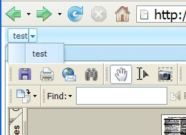
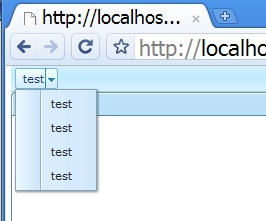

# Overview

`zk.useStackup` is a JavaScript variable to indicate how to handle the
so-called *stackup* and *autohide* techniques. It is used to resolve the
z-index issue when a page contains, say, a PDF iframe.

For example, the following codes will cause the menupopup obscured by
the iframe.

```xml
<zk>
<menubar >
    <menu label="test">
    <menupopup>
    <menuitem label="test"/>
    <menuitem label="test"/>
    </menupopup>
    </menu>
</menubar>
<window title="iframe/pdf" border="normal" width="500px" sizable="true">
    <iframe style="background-color:transparent" src="/test2/B1896797.pdf" />
</window>
</zk>
```

For better performance, neither stackup nor autohide is applied by
default, so the menupopup is obscured by the iframe as shown below.



# Usage

To resolve this, you could specify `'auto'`[^1] to `zk.useStackup` as
follows.

```xml
<?script content="zk.useStackup='auto'"?>
<zk>
<menubar >
...
</zk>
```

In addition, you have to specify `true` to the `autohide` property of
the `iframe` component as following.

```xml
<iframe style="background-color:transparent" src="/test2/B1896797.pdf" 
autohide="true"/>
```

Notice that no all `iframe` will cause the obscure issue. For example,
it is OK if `iframe` contains another HTML page. Thus, specify it only
if necessary (for better performance). Here is the correct result.


> ------------------------------------------------------------------------
>
> <references/>

## The stackup and autohide techniques

The stackup technique resolves the obscure issue by placing a
transparent iframe under the widget (`menupopup` in this example) that
should appear on top. Unfortunately, this technique can not be applied
to all browsers. Thus, there is another technique called autohide.

The autohide technique resolves the obscure issue by hiding the iframe
that obscures the widget on top. In other words, the iframe is not
visible when the menupopup is shown up (on top of the iframe).



# All Possible Values

## auto

`[Since 5.0]`

This is the most common value that can be assigned to `zk.useStackup`.
If it is assigned, the stackup technique is applied to Internet Explorer
and Firefox, while the `autohide` technique is applied to Safari, Chrome
and Opera.

## auto/gecko

Firefox has a problem to show a PDF iframe if two or more iframes are
overlapped. In other words, we have to apply the `autohide` technique
instead of the `stackup` technique. For example,

```xml
<?script content="zk.useStackup = 'auto/gecko';"?>
<zk>
<window title="iframe/pdf" border="normal" width="500px" mode="overlapped">
    <iframe style="background-color:transparent" src="/test2/B1896797.pdf"
     autohide="true"/>
</window>
<window title="iframe/pdf" border="normal" width="500px" mode="overlapped">
    <iframe style="background-color:transparent" src="/test2/B1896797.pdf"
     autohide="true"/>
</window>
</zk>
```

> ### shadow and stackup
>
> When the stackup technique is enabled, a stackup is created for each
> shadow (of an overlapped window) such that the window appears on top
> of the others. You can turn off the stackup for an individual window
> by disabling the shadow property (`shadow="false"`).
>
> For example, if a page has only one overlapped iframe that might
> contain PDF, you can still use the stackup (instead of autohide, which
> is slower) by specifying `shadow` as `fasle`, and `zk.useStackup` as
> `'auto'` (instead of `'auto/gecko'`).

## true

Always use the stackup technique.

## false

Never use the stackup technique.


[^1]: Available since ZK 5.0. For prior version, specify `true` instead.
