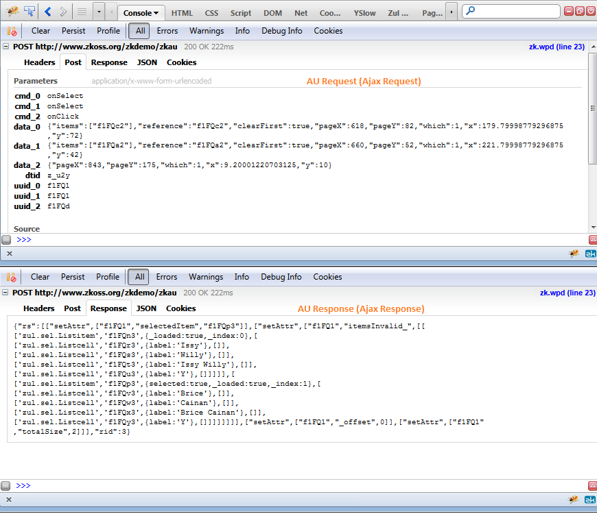

This section describes the communication between the server and the
clients. The request sent from the client to the server is called the
[AU requests]({{site.baseurl}}/zk_client_side_ref/au_requests),
while the response from the server to the client is called the [AU responses]({{site.baseurl}}/zk_client_side_ref/au_responses).
For browsers, they are actually based on Ajax.

