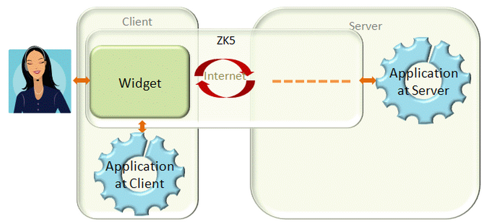

There are two kind of UI objects: components and widget. A component is
a Java object running at the server, representing an UI object that an
application can manipulate. A component has all the behavior that an UI
object should have, except it doesn't have the visual part. For example,
the following code snippet creates a window and a textbox.

```java
Window w = new Window();
w.setTitle();
w.appendChild(new Textbox());
w.setPage(page); //assuming page is the current page
```

On the other hand, a widget is a JavaScript object running at the
client, representing an UI object to interact with the user. To interact
with the user, a widget has a visual appearance and handle events
happening at the client.


A component and a widget work hand-in-hand to deliver UI to an user and
to notify the application about a user's activity, such as clicking and
dragging. For example, when an application invokes
[org.zkoss.zul.Button#setLabel(java.lang.String)](https://www.zkoss.org/javadoc/latest/zk/org/zkoss/zul/Button.html#setLabel(java.lang.String))
to change the label of a button component, the
[zul.wgt.Button#setLabel(_global_.String)](https://www.zkoss.org/javadoc/latest/jsdoc/classes/zul.wgt.Button.html#setLabel(_global_.String))
of corresponding button widget (aka., peer widget) will be invoked at
the client to change the visual appearance, as shown right. When the
user clicks the button widget, the onClick event will be sent back to
the server and notify the application.


Thought not required, a widget is usually implemented with most
functions of a component. That means developers can control them
directly at the client, as shown left. It improves the responsiveness
and reduces the network traffics. Of course, it also increases the
development cost. For example, an application might hide or change the
order of columns of a grid at the client, while the application running
at the server handle the reloading of the whole content of the grid.



Furthermore, a developer can create a widget at the client, and the
widget will not have any peer component at the server as shown right.
For example,

```javascript
//JavaScript
var w = new zk.wgt.Button();
w.setLabel('OK');
wnd.appendChild(w); //assume wnd is another widget
```

# Component and Page

The peer widget of a component is created automatically, when it is
attached to a page. On the other hand, if a component is not attached,
the client won't know its existence.

<table>
<tbody>
<tr class="odd">
<td></td>
<td><p>Server</p></td>
<td><p>Client</p></td>
<td><p>Description</p></td>
</tr>
<tr class="even">
<td><p>1</p></td>
<td><div class="sourceCode" id="cb1"><pre
class="sourceCode java"><code class="sourceCode java"><span id="cb1-1"><a href="#cb1-1" aria-hidden="true" tabindex="-1"></a><span class="bu">Window</span> w <span class="op">=</span> <span class="kw">new</span> <span class="bu">Window</span><span class="op">();</span></span>
<span id="cb1-2"><a href="#cb1-2" aria-hidden="true" tabindex="-1"></a>w<span class="op">.</span><span class="fu">setTitle</span><span class="op">(</span><span class="st">&quot;Hello Window&quot;</span><span class="op">);</span></span></code></pre></div></td>
<td><p><i>nothing</i></p></td>
<td><p>A Window component is instantiated but it doesn't have the peer
widget. Furthermore, it will be garbage-collected if there is no
reference to it</p></td>
</tr>
<tr class="odd">
<td><p>2</p></td>
<td><div class="sourceCode" id="cb2"><pre
class="sourceCode java"><code class="sourceCode java"><span id="cb2-1"><a href="#cb2-1" aria-hidden="true" tabindex="-1"></a>w<span class="op">.</span><span class="fu">setPage</span><span class="op">(</span>page<span class="op">);</span></span></code></pre></div></td>
<td><p>Auto invoked by ZK Client Engine</p>
<div class="sourceCode" id="cb3"><pre
class="sourceCode javascript"><code class="sourceCode javascript"><span id="cb3-1"><a href="#cb3-1" aria-hidden="true" tabindex="-1"></a><span class="kw">var</span> pw <span class="op">=</span> <span class="kw">new</span> zul<span class="op">.</span><span class="at">wnd</span><span class="op">.</span><span class="fu">Window</span>(uuid)<span class="op">;</span></span>
<span id="cb3-2"><a href="#cb3-2" aria-hidden="true" tabindex="-1"></a>pw<span class="op">.</span><span class="fu">setTitle</span>(<span class="st">&#39;Hello World&#39;</span>)<span class="op">;</span></span>
<span id="cb3-3"><a href="#cb3-3" aria-hidden="true" tabindex="-1"></a>pw<span class="op">.</span><span class="fu">replaceHTML</span>(uuid)<span class="op">;</span></span></code></pre></div></td>
<td><p>Attach the component to the specified page, and a peer widget
will be created automatically at the client later (after processing the
<a href="{{site.baseurl}}/zk_client_side_ref/communication/au_requests"
title="wikilink">AU Requests</a>).</p></td>
</tr>
<tr class="even">
<td><p>3</p></td>
<td><div class="sourceCode" id="cb4"><pre
class="sourceCode java"><code class="sourceCode java"><span id="cb4-1"><a href="#cb4-1" aria-hidden="true" tabindex="-1"></a>w<span class="op">.</span><span class="fu">setTitle</span><span class="op">(</span><span class="st">&quot;Hi ZK&quot;</span><span class="op">);</span></span></code></pre></div></td>
<td><p>Auto invoked by ZK Client Engine</p>
<div class="sourceCode" id="cb5"><pre
class="sourceCode javascript"><code class="sourceCode javascript"><span id="cb5-1"><a href="#cb5-1" aria-hidden="true" tabindex="-1"></a>pw<span class="op">.</span><span class="fu">setTitle</span>(<span class="st">&#39;Hi ZK&#39;</span>)<span class="op">;</span></span></code></pre></div></td>
<td><p>Once a component is attached to a page, any following
modification will be sent to the client and invoke the corresponding
method of the peer widget.</p></td>
</tr>
</tbody>
</table>

- Notes:
  - There are two ways to attach a component to page. First, call the
    setPage method to make it as a root component of the page. Second,
    make a component as a child of another component that is attached to
    a page. For example, with `w.appendChild(new Label("Hi"));`, the
    label will be attached to a page if `w` is attached.
  - The AU request is a HTTP request, so it is a
    request-process-response protocol. That is, all client invocation
    (auto create a widget and so on) will take place after the
    processing is done and the response is sent back to client.

# Widget and DOM


A widget is an UI object at the client. Like Swing's component, creating
a widget doesn't make it visible to the user. Rather, you have to attach
it to the DOM tree (of the browser).

<table>
<tbody>
<tr class="odd">
<td></td>
<td><p>Client Widget</p></td>
<td><p>Client DOM</p></td>
<td><p>Description</p></td>
</tr>
<tr class="even">
<td><p>1</p></td>
<td><div class="sourceCode" id="cb1"><pre
class="sourceCode javascript"><code class="sourceCode javascript"><span id="cb1-1"><a href="#cb1-1" aria-hidden="true" tabindex="-1"></a><span class="kw">var</span> wp <span class="op">=</span> <span class="kw">new</span> zul<span class="op">.</span><span class="at">wnd</span><span class="op">.</span><span class="fu">Window</span>()<span class="op">;</span></span>
<span id="cb1-2"><a href="#cb1-2" aria-hidden="true" tabindex="-1"></a>wp<span class="op">.</span><span class="fu">setTitle</span>(<span class="st">&#39;Hello World&#39;</span>)<span class="op">;</span></span></code></pre></div>
<p>Invoked by ZK Client Engine or client application</p></td>
<td><p><i>nothing</i></p></td>
<td><p>A window widget is instantiated. If it is called by ZK Client
Engine (due to the invocation at the server), it has a peer component.
If it is called by client application, there is no peer
component.</p></td>
</tr>
<tr class="odd">
<td><p>2</p></td>
<td><div class="sourceCode" id="cb2"><pre
class="sourceCode javascript"><code class="sourceCode javascript"><span id="cb2-1"><a href="#cb2-1" aria-hidden="true" tabindex="-1"></a>wp<span class="op">.</span><span class="fu">replaceHTML</span>(uuid)<span class="op">;</span></span></code></pre></div></td>
<td><p>Create one or a tree of DOM elements (depending on the
implementation of a widget) and replace the specified node.</p></td>
<td><p>Attach a widget to the DOM tree, and the visual appearance is
shown up (unless it is invisible).</p></td>
</tr>
<tr class="even">
<td><p>3</p></td>
<td><div class="sourceCode" id="cb3"><pre
class="sourceCode javascript"><code class="sourceCode javascript"><span id="cb3-1"><a href="#cb3-1" aria-hidden="true" tabindex="-1"></a>wp<span class="op">.</span><span class="fu">setTitle</span>(<span class="st">&#39;Hi ZK&#39;</span>)<span class="op">;</span></span></code></pre></div></td>
<td><p>Update the DOM element(s) created in the previous step</p></td>
<td><p>A modification of the widget will modify the corresponding DOM
elements</p></td>
</tr>
</tbody>
</table>

## Attach a widget to the DOM tree

There are several ways to attach a widget to the DOM tree

1.  Invoke
    [zk.Widget#replaceHTML(zk.Object, zk.Desktop, zk.Skipper)](https://www.zkoss.org/javadoc/latest/jsdoc/classes/zk.Widget.html#replaceHTML(zk.Object, zk.Desktop, zk.Skipper))
    to replace an existent DOM element with the DOM element(s) of the
    widget (aka., the DOM content).
2.  Invoke
    [zk.Widget#appendChild(zk.Widget)](https://www.zkoss.org/javadoc/latest/jsdoc/classes/zk.Widget.html#appendChild(zk.Widget))
    or
    [zk.Widget#insertBefore(zk.Widget, zk.Widget)](https://www.zkoss.org/javadoc/latest/jsdoc/classes/zk.Widget.html#insertBefore(zk.Widget, zk.Widget))
    to make a widget a child of another widget that are already attached
    to the DOM tree.


