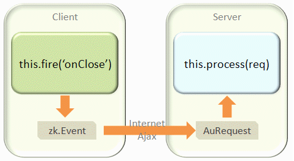

# Process AU Requests at Server



A widget event ([zk.Event](https://www.zkoss.org/javadoc/latest/jsdoc/classes/zk.Event.html)) is
converted to an AU request and then sent to the server. When the event
arrives at the server, it is converted to be an instance of
[org.zkoss.zk.au.AuRequest](https://www.zkoss.org/javadoc/latest/zk/org/zkoss/zk/au/AuRequest.html)), and then pass to the
desktop for serving by invoking
[org.zkoss.zk.ui.sys.DesktopCtrl#service(org.zkoss.zk.au.AuRequest, boolean)](https://www.zkoss.org/javadoc/latest/zk/org/zkoss/zk/ui/sys/DesktopCtrl.html#service(org.zkoss.zk.au.AuRequest, boolean)).
If the request is targeting a component, the component's
[org.zkoss.zk.ui.sys.ComponentCtrl#service(org.zkoss.zk.au.AuRequest, boolean)](https://www.zkoss.org/javadoc/latest/zk/org/zkoss/zk/ui/sys/ComponentCtrl.html#service(org.zkoss.zk.au.AuRequest, boolean))
will then be called to serve it.

## Component State Synchronization

Thus, if you implement a component, you could override
[org.zkoss.zk.ui.sys.ComponentCtrl#service(org.zkoss.zk.au.AuRequest, boolean)](https://www.zkoss.org/javadoc/latest/zk/org/zkoss/zk/ui/sys/ComponentCtrl.html#service(org.zkoss.zk.au.AuRequest, boolean))
to handle it.

Here is an example (from [org.zkoss.zul.Radio](https://www.zkoss.org/javadoc/latest/zk/org/zkoss/zul/Radio.html)):

```java
public void service(org.zkoss.zk.au.AuRequest request, boolean everError) {
    final String cmd = request.getCommand();
    if (cmd.equals(Events.ON_CHECK)) {
        CheckEvent evt = CheckEvent.getCheckEvent(request);
        _checked = evt.isChecked();
        fixSiblings(_checked, true);
        Events.postEvent(evt);
    } else
        super.service(request, everError);
}
```

## Application-level Notification

If the AU request is sent by an application for custom service, you
could implement
[org.zkoss.zk.au.AuService](https://www.zkoss.org/javadoc/latest/zk/org/zkoss/zk/au/AuService.html) to serve
it and then plug it to the targeted component *or* desktop, depending on
your requirement. If the request is targeting a desktop, you can only
intercept it at the desktop-level. If targeting a component, you could
intercept it at either component-level or desktop-level.

Since all requests will be passed through
[org.zkoss.zk.au.AuService](https://www.zkoss.org/javadoc/latest/zk/org/zkoss/zk/au/AuService.html) that you
plug, the performance of the implementation should be good. In addition,
this method should return true if it has been processed to avoid any
further processing.

```java
public class FooAuService implements AuService {
    public boolean service(AuRequest request, boolean everError) {
        final String cmd = request.getCommand();
        if ("onFoo".equals(cmd)) { //assume onFoo a custom request
            //handle it
            return true; //indicate it has been processed
        }
        return false; //not processed at all
    }
}
```

### Intercept at Desktop-level

To plug it to the desktop, you could implement a listener of
[org.zkoss.zk.ui.util.DesktopInit](https://www.zkoss.org/javadoc/latest/zk/org/zkoss/zk/ui/util/DesktopInit.html) to
add it to a desktop by
[org.zkoss.zk.ui.Desktop#addListener(java.lang.Object)](https://www.zkoss.org/javadoc/latest/zk/org/zkoss/zk/ui/Desktop.html#addListener(java.lang.Object)).
Then, specify the listener to `WEB-INF/zk.xml`. For example,

```java
package foo;
public class FooDesktopInit implements DesktopInit {
    public void init(Desktop desktop,  Object request) throws Exception {
        desktop.addListener(new FooAuService()); //assume you have a custom service called FooAuService
    }
}
```

and, in `WEB-INF/zk.xml`

```xml
<listener>
    <listener-class>foo.FooDesktopInit</listener-class>
</listener>
```

### Intercept at Component-level

To plug it to the component, you could invoke
[org.zkoss.zk.ui.Component#setAuService(org.zkoss.zk.au.AuService)](https://www.zkoss.org/javadoc/latest/zk/org/zkoss/zk/ui/Component.html#setAuService(org.zkoss.zk.au.AuService)).

# Client Event Declaration

As described in [the previous section]({{site.baseurl}}/zk_client_side_ref/client_side_firing),
a widget event ([zk.Event](https://www.zkoss.org/javadoc/latest/jsdoc/classes/zk.Event.html)) will be
sent to the server, only if *the server needs it*.

To declare an event that a server *might* need it, you have to invoke
[org.zkoss.zk.ui.AbstractComponent#addClientEvent(java.lang.Class, java.lang.String, int)](https://www.zkoss.org/javadoc/latest/zk/org/zkoss/zk/ui/AbstractComponent.html#addClientEvent(java.lang.Class, java.lang.String, int)).
It is a static method and usually called in a static clause as shown
below.

```java
public class A extends LabelImageElement {
    static {
        addClientEvent(A.class, Events.ON_FOCUS, 0);
        addClientEvent(A.class, Events.ON_BLUR, 0);
    }
//...
}
```

Once declared, an event will be sent to the server if one of the
following conditions is satisfied:

1.  An event listener
    ([org.zkoss.zk.ui.event.EventListener](https://www.zkoss.org/javadoc/latest/zk/org/zkoss/zk/ui/event/EventListener.html))
    has been registered at the server.
2.  The event has been declared as *important* (see below).

## Important Events

Some events that must be sent to the server no matter if an event
listener has been registered for it. Typical examples are events that
are used to synchronize the states back to the server, such as onChange.

These events are called *important events*. You could declare an event
as important by specifying
[org.zkoss.zk.ui.sys.ComponentCtrl#CE_IMPORTANT](https://www.zkoss.org/javadoc/latest/zk/org/zkoss/zk/ui/sys/ComponentCtrl.html#CE_IMPORTANT)
as follows.

```java
static {
    addClientEvent(InputElement.class, Events.ON_CHANGE, CE_IMPORTANT|CE_REPEAT_IGNORE);
}
```

Notice that the important event won't be sent to the server immediately
if it does not have any non-deferrable event listener at the server[^1].

> ------------------------------------------------------------------------
>
> <references/>

## Force Event to Send Back

[org.zkoss.zk.ui.AbstractComponent#addClientEvent(java.lang.Class, java.lang.String, int)](https://www.zkoss.org/javadoc/latest/zk/org/zkoss/zk/ui/AbstractComponent.html#addClientEvent(java.lang.Class, java.lang.String, int))
is usually used by a component developer since the first argument must
be the component's class. For application developers, it is more
straightforward by specifying the `toServer` option in
[zk.Event#opts](https://www.zkoss.org/javadoc/latest/jsdoc/classes/zk.Event.html#opts) when
instantiating an event. For example,

```javascript
zAu.send(new zk.Event(wgt, "onFoo", {foo: 'my data'}, {toServer:true}));
```


[^1]: A deferrable event listener is an event listener that also
    implements
    [org.zkoss.zk.ui.event.Deferrable](https://www.zkoss.org/javadoc/latest/zk/org/zkoss/zk/ui/event/Deferrable.html).
    Please refer to [ZK Developer's Reference: Event Listening]({{site.baseurl}}/zk_dev_ref/event_handling/event_listening)
    for details.
