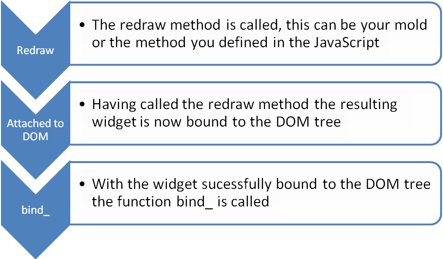

The following diagrams outline when the
<javadoc directory="jsdoc" method="bind_(zk.Desktop, zk.Skipper, _global_.Array)" class="false">zk.Widget</javadoc>
and
<javadoc directory="jsdoc" method="unbind_(zk.Skipper, _global_.Array)" class="false">zk.Widget</javadoc>
methods are called. Firstly let’s take a look at how binding works.

The
<javadoc directory="jsdoc" method="unbind_(zk.Skipper, _global_.Array)" class="false">zk.Widget</javadoc>
function is very similar. Upon detaching the widget from the DOM the
<javadoc directory="jsdoc" method="unbind_(zk.Skipper, _global_.Array)" class="false">zk.Widget</javadoc>
method is called to enable us to perform tasks such as adding and
removing listeners to avoid memory leaks. The diagram below demonstrates
this.

Now that we have had a brief introduction of
<javadoc directory="jsdoc" method="bind_(zk.Desktop, zk.Skipper, _global_.Array)" class="false">zk.Widget</javadoc>
and
<javadoc directory="jsdoc" method="unbind_(zk.Skipper, _global_.Array)" class="false">zk.Widget</javadoc>
let’s see the methods put into action when we bind appropriate listeners
for events.
