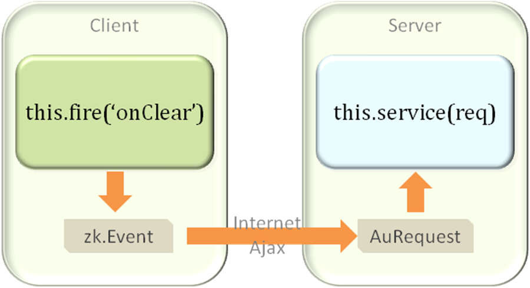

The following diagram outlines how communication works between a ZK
Widget and Component.



<javadoc directory="jsdoc" method="fire(_global_.String, zk.Object, _global_.Map, int)">zk.Widget</javadoc>
fires a client event (an instance of
<javadoc directory="jsdoc">zk.Event</javadoc>), and the client event is
converted to an AU request if all the following conditions are
satisfied.

- The widget is a peer of a component, that is, it was created
  automatically to represent a component. Notice that the Server states
  whether a widget is a peer of a component.
- The event propagation is not stopped (i.e.,
  <javadoc directory="jsdoc" method="fire(_global_.String, zk.Object, _global_.Map, int)">zk.Widget</javadoc>
  and not set.
- The event is listened by a server-side
  <javadoc>org.zkoss.zk.ui.Listener</javadoc>, or it must be an
  important event.

The above image demonstrates that the onClear event is sent to the
server and processed. The code to do is located in the component’s Java
file *SimpleLabel.java* and is as follows.

```java
public void service(org.zkoss.zk.au.AuRequest request, boolean everError) {
        final String cmd = request.getCommand();

        if (cmd.equals(ClearEvent.NAME)) {
            ClearEvent evt = ClearEvent.getClearEvent(request);
            _cleared = evt.getCleared();
            Events.postEvent(evt);
        } else
            super.service(request, everError);
    }
```

Here the ClearEvent is in fact a completely customized event created for
the purposes of this component. The event created using its static
method <mp>getClearEvent</mp> is shown below.

```java
public static final ClearEvent getClearEvent(AuRequest request) {
            final Component comp = request.getComponent();
            final Map data=request.getData();
            
            boolean cleared = AuRequests.getBoolean(data, "cleared");
            return new ClearEvent(request.getCommand(), comp, cleared);
    }
```

The retrieval of the event is easy as the **ClearEvent** extends
**Event**. Its constructor has the following signature **public
ClearEvent(String name, Component target, boolean cleared)**. The only
custom information is the Boolean cleared which is the state we sent
back when the event was fired. As demonstrated in the above code this is
easily acquired using the
<javadoc method="getBoolean(java.util.Map, java.lang.String)">org.zkoss.zk.au.AuRequests</javadoc>.

We have now followed the process of how data is transferred between the
client and the server. Of course when building component we also need to
specify server side listeners to invoke Java code on calling of specific
events. Let’s investigate this.
