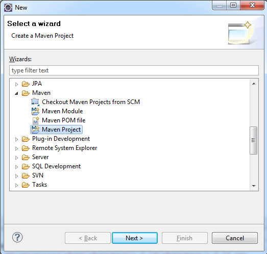
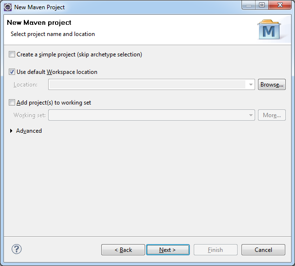
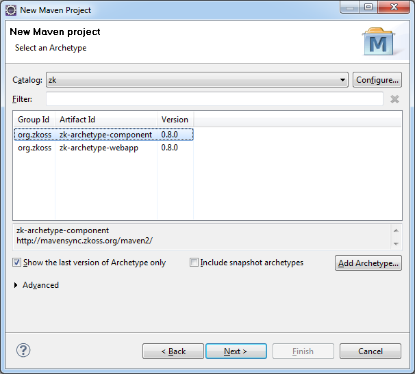
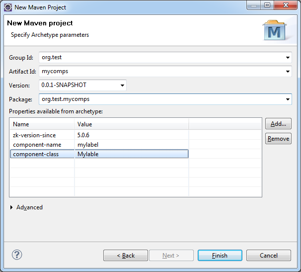
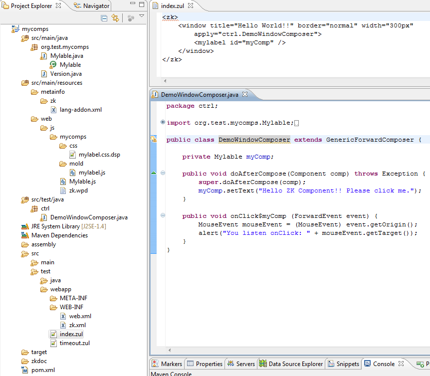
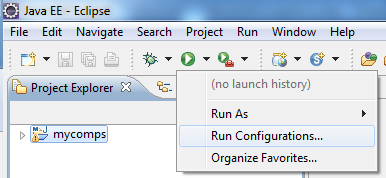
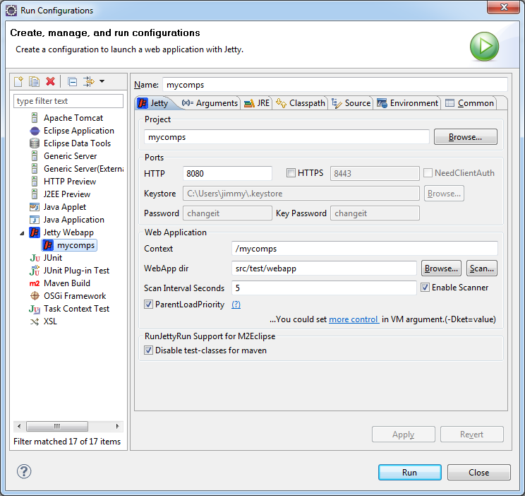
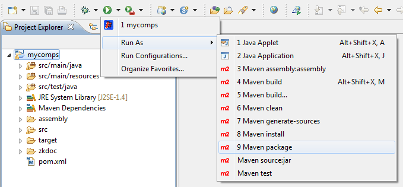
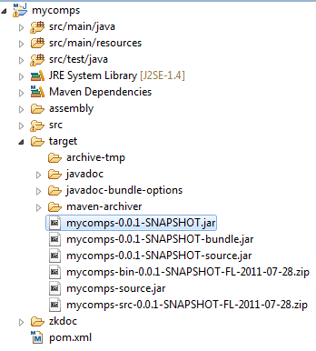
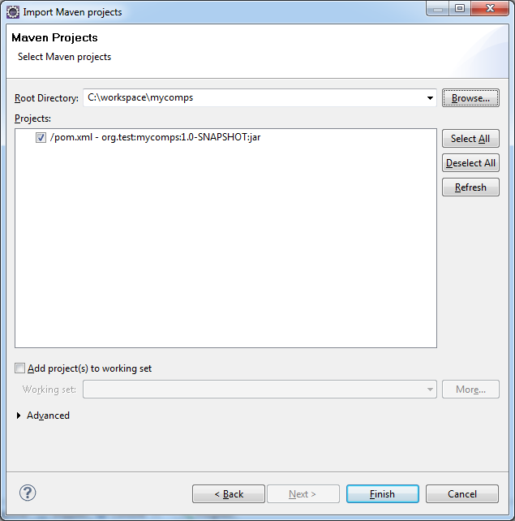

# How to create a ZK Component Maven project

## Create a Maven Project

- **\[File\]** -\> **\[New\]** -\> **\[Other\]** --\> **\[Maven
  Project\]**
    
  
- Make sure *Create a simple project* is unticked in the first screen of
  the New Maven Project wizard and click **Next \>**.
    
  
- From the *Select an Archetype* screen, select **zk**[^1] from the
  catalog dropdown list.
    
  
- Select the *zk-archetype-component* from the list. (At time of writing
  this is at version **0.8.0**).
- Next, fill in details for *group id, artifact id, version* number and
  *package* name.
    
  

  - If property *zk-version-since* or *component class* is
    <font color="red">missing</font>.<ref>

Users who are running this wizard for the first time, zk archetype would
not have been downloaded into m2eclipse yet, and as a result may not
populate the property *zk-version-since* correctly, leading to an error
message as such:

- Unable to create project from archetype
  \[org.zkoss:zk-archetype-component:0.8.0 -\>
  <http://mavensync.zkoss.org/maven2/>\], Archetype
  org.zkoss:zk-archetype-component:0.8.0 is not configured property
  *zk-version-since* is missing.

The simple workaround for this problem is to just try again and the
*zk-version-since* property should appear in the list. (The same apply
to all other properties)

</ref>

- Click **Finish** and the Eclipse status bar should say ' *Creating
  zk-archetype-component* ' and ' *Updating Maven Dependencies* '. If
  this is the user's first time dealing with ZK libraries, Maven will
  download the necessary dependencies to compile and run this example,
  and would be stored in *.m2/repository* in your home directory.
    
  

------------------------------------------------------------------------

<references/>

------------------------------------------------------------------------

## How to run Maven project on Run-Jetty-Run

1.  Go to **Run Configurations**
      

2.  Double click on **Jetty Webapp**
    - It will automatically fill-out **Project** / **Port** /
      **Context** / **WebApp Dir**

      

3.  Click **Run** and start browsing local ZK application at
    <http://127.0.0.1:8080/mycomps/>

## Packing your component

1.  Go to **Run As** \> **Maven package** (or **Maven install**)
      

2.  The project will then be packed into a jar file and a zip file with
    source code.
      


## Use the command line version of Maven to create a project

- For instructions on how to set up maven, please refer to
  [Maven](http://maven.apache.org/guides/getting-started/maven-in-five-minutes.html).
- Go to the folder in Eclipse workspace, then run the following command:
- Calling *archetype:generate
  -DarchetypeCatalog=<http://mavensync.zkoss.org/maven2/>* the plugin
  will first ask to choose the archetype from the zk catalog - just
  enter the number of the archetype.
- It will then ask the user to enter the values for *groupId*, the
  *artifactId* and the *version* of the project to create and the base
  package for the sources.
- It then asks for confirmation of the configuration and performs the
  creation of the project.
- In the following example, component archetype (number 1) is selected
  and *groupId* is set to **org.test**, *artifactId* to **mycomps**,
  *version* to **1.0-SNAPSHOT** and *package* to **org.test.mycomps**.

```text
$ mvn archetype:generate -DarchetypeCatalog=http://mavensync.zkoss.org/maven2/
[INFO] Scanning for projects...
[INFO] Searching repository for plugin with prefix: 'archetype'.
[INFO] ------------------------------------------------------------------------
[INFO] Building Maven Default Project
[INFO]    task-segment: [archetype:generate] (aggregator-style)
[INFO] ------------------------------------------------------------------------
[INFO] Preparing archetype:generate
[INFO] No goals needed for project - skipping
[INFO] [archetype:generate {execution: default-cli}]
[INFO] Generating project in Interactive mode
[INFO] No archetype defined. Using maven-archetype-quickstart (org.apache.maven.archetypes:maven-archetype-quickstart:1.0)
Choose archetype:
1: http://mavensync.zkoss.org/maven2/ -> zk-archetype-component (zk-archetype-component)
2: http://mavensync.zkoss.org/maven2/ -> zk-archetype-webapp (zk-archetype-webapp)
Choose a number: : 1
Downloading: http://mavensync.zkoss.org/maven2//org/zkoss/zk-archetype-component/0.8.0/zk-archetype-component-0.8.0.jar
20K downloaded  (zk-archetype-component-0.8.0.jar)
Downloading: http://mavensync.zkoss.org/maven2//org/zkoss/zk-archetype-component/0.8.0/zk-archetype-component-0.8.0.pom
1K downloaded  (zk-archetype-component-0.8.0.pom)
Define value for property 'groupId': : org.test
Define value for property 'artifactId': : mycomps
Define value for property 'version': 1.0-SNAPSHOT:
Define value for property 'package': org.test: org.test.mycomps
Define value for property 'component-class': : Mylabel
Define value for property 'component-name': : mylabel
[INFO] Using property: zk-version-since = 5.0.6
Confirm properties configuration:
groupId: org.test
artifactId: mycomps
version: 1.0-SNAPSHOT
package: org.test.mycomps
component-class: Mylabel
component-name: mylabel
zk-version-since: 5.0.6
Y:
[INFO] ------------------------------------------------------------------------
[INFO] BUILD SUCCESSFUL
[INFO] ------------------------------------------------------------------------
[INFO] Total time: 34 seconds
[INFO] Finished at: Thu Jul 28 16:27:55 CST 2011
[INFO] Final Memory: 13M/150M
[INFO] ------------------------------------------------------------------------
```

## Import Maven project into Eclipse

- **\[File\]** -\> **\[Import\]** -\> **\[Maven\]** --\> **\[Existing
  Maven Projects\]**
    
  
- After this, the user should now get a new project in the Package
  explorer.
    
  

[^1]: To add a ZK archetype catalog, click **Configure** then refer to [ Create and Run Your First ZK Application with Eclipse and Maven]({{site.baseurl}}/zk_installation_guide/create_and_run_your_first_zk_application_with_eclipse_and_maven)
    for the complete instruction.
