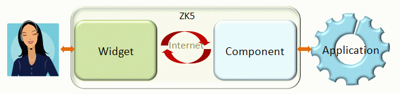
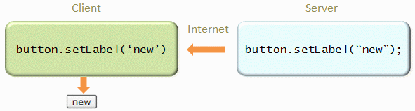
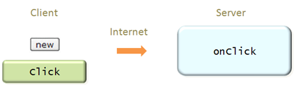

A component and a widget work hand in hand to deliver a rich UI
experience to a user. The widget traps the user activity and sends an
appropriate request to the component. The component then interacts with
the developer’s application which would respond appropriately telling
when the widget should update. This interaction is demonstrated in the
following diagram.

For example, when an application invokes the setLabel method to change
the label of a button component, the setLabel method of corresponding
button widget (aka., peer widget) will be invoked at the client to
change the visual appearance (as shown below).

When the user clicks the button widget, the onClick event will be sent
back to the server and notify the application (as demonstrated below).

In addition to manipulate a component at the server, it is also possible
to control a widget at the client. For example, an application may hide
or change the order of grid columns at the client, while the application
running at the server handles the reloading of the grid’s content. This
technique is called Server+client fusion. It can be used to improve
responsiveness and reduce network traffic.
