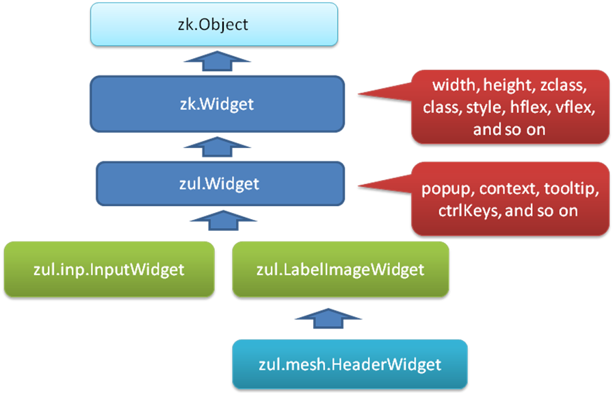

The widget class must extend from
[zk.Widget](https://www.zkoss.org/javadoc/latest/jsdoc/classes/zk.Widget.html) or one of its derived
classes. There are several skeletal implementations available. The
skeletal implementations are shown in the image below.

For the purposes of this tutorial, we will use
[zk.Widget](https://www.zkoss.org/javadoc/latest/jsdoc/classes/zk.Widget.html). Before we proceed, we
need to decide the name of the widget class. Let’s assume
<mp>com.foo.SimpleLabel</mp>.
