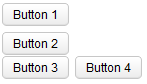

# Box

- Demonstration: [Box](http://www.zkoss.org/zkdemo/layout/box)
- Java API: <javadoc>org.zkoss.zul.Box</javadoc>
- JavaScript API: <javadoc directory="jsdoc">zul.box.Box</javadoc>
- Style Guide: [
  Box](ZK_Style_Guide/XUL_Component_Specification/Box)

# Employment/Purpose

The box model of XUL is used to divide a portion of the display into a
series of boxes. Components inside a box will orient themselves
horizontally or vertically. By combining a series of boxes and
separators, you can control the layout of the visual presentation.

A box can lay out its children in one of two orientations, either
horizontally or vertically. A horizontal box lines up its components
horizontally and a vertical box orients its components vertically. You
can think of a box as one row or one column from an HTML table.

A box is the generic component that can be used for horizontal and
vertical layouts. However, it is generally more convenient by the use of
[hbox](ZK_Component_Reference/Layouts/Hbox) and
[vbox](ZK_Component_Reference/Layouts/Vbox) directly.

Notice that [hbox](ZK_Component_Reference/Layouts/Hbox) and
[vbox](ZK_Component_Reference/Layouts/Vbox) are designed to
provide more sophisticated layout, such as splitter, alignment and
packing. If you need only the layout feature, it is suggest to use [
Hlayout](ZK_Component_Reference/Layouts/Hlayout) and [
Vlayout](ZK_Component_Reference/Layouts/Vlayout) instead,
since the performance is much better (due to the use of HTML DIV instead
of TABLE).

# Example



``` xml
 <zk>
     <box orient="vertical">
         <button label="Button 1"/>
         <button label="Button 2"/>
     </box>
     <box  orient="horizontal">
         <button label="Button 3"/>
         <button label="Button 4"/>
     </box>
 </zk>
```

# Properties

## Spacing

You can control the spacing among children of the `box` control. For
example, the following example puts `5em` at both the upper margin and
the lower margin. Notice: the total space between two input fields is
`10em`.

``` xml
<vbox spacing="5em">
    <textbox/>
    <datebox/>
</vbox>
```

Another example illustrated an interesting layout by the use of zero
spacing.

<figure>

<figcaption>100000000000009300000077C9A14E08.png</figcaption>
</figure>

``` xml
<window title="Box Layout Demo" border="normal">
    <hbox spacing="0">
        <window border="normal">0</window>
        <vbox spacing="0">
            <hbox spacing="0">
                <window border="normal">1</window>
                <window border="normal">2</window>
                <vbox spacing="0">
                    <window border="normal">3</window>
                    <window border="normal">4</window>
                </vbox>
            </hbox>
            <hbox spacing="0">
                <vbox spacing="0">
                    <window border="normal">5</window>
                    <window border="normal">6</window>
                </vbox>
                <window border="normal">7</window>
                <window border="normal">8</window>
                <window border="normal">9</window>
            </hbox>
        </vbox>
    </hbox>
</window>
```

## Heights and Widths



You can control the width for each cell inside a `hbox` with `widths`
attribute as follows (don't specify on each cell):

``` xml
    <hbox  height="100px" widths="10%,20%,30%,40%" pack="stretch">
        <label value="10%"/>
        <label value="20%"/>
        <label value="30%"/>
        <label value="40%"/>
    </hbox>
    <vbox  height="500px" heights="10%,20%,30%,40%" pack="stretch">
        <label value="10%"/>
        <label value="20%"/>
        <label value="30%"/>
        <label value="40%"/>
    </vbox>
```

The value is a comma-separated list of widths. If any value is missed,
no width is generated for the corresponding cell and the real width is
up to the browser.

Similarly, you can specify the height of each cell inside a `vbox` using
the `heights` attribute. These two properties are the same since the
orientation of a box can be horizontal or vertical depending on the
`orient` property.

## Align and Pack

<figure>

<figcaption>ZKComRef_Vbox_Simple_Example_align_pack.PNG</figcaption>
</figure>

``` xml
<zk xmlns:n="http://www.zkoss.org/2005/zk/native">
    <zscript><![CDATA[
        Map map = new LinkedHashMap();
        String[] packs = new String[]{"", "start", "center", "end"};
        String[] aligns = new String[]{"", "stretch", "start", "center", "end"};
        
        for (int i = 0; i < aligns.length; i++) {
            String align = aligns[i];
            List list = new ArrayList();
            for (int j = 0; j < packs.length; j++) {
                list.add(packs[j]);
            }
            map.put(align, list);
        }
        
    ]]></zscript>
    <tablelayout columns="6">
        <tablechildren >
            <panel border="normal" height="150px" width="100px" 
                forEach='"pack / align", "", "start", "center", "end"'>
                <panelchildren>
                    <n:h3>${each}</n:h3>
                </panelchildren>    
            </panel>
        </tablechildren>
        <tablechildren forEach="${map}">
            <variables key="${each.key}"/> 
            <panel border="normal" height="150px" width="100px">
                <panelchildren>
                    <n:h3>${key}</n:h3>
                </panelchildren>    
            </panel>
            <panel border="normal" height="150px" width="100px" forEach="${each.value}" >
                <panelchildren>
                    <box align="${key}" pack="${each}" height="90%" >
                        <button label="1" />
                        <button label="2" />
                        <button label="3" />
                    </box>
                </panelchildren>    
            </panel>
        </tablechildren>
    </tablelayout>
</zk>
```



# Cell Component

In ZK5, we have introduced a new component named Cell which can be
embedded into a Grid or Box (Hbox and Vbox) to fully control the layout
and the style. You can now use the rowspan or the colspan property to
layout your Grid, for example a content cell can now cross over multiple
rows. The code below demonstrates how to do this:

``` xml
<box>
    <cell sclass="years">
        ...
    </cell>
</box>
```



# Limitation

Box component is consisted by Table element. Therefore, when put Input
element like Textbox, Combobox inside Box component, specify width and
height to Box component will be ignored when browser try to render table
element.

For example,

``` xml
<hbox height="200px" width="200px" style="border: 1px solid red">
    <textbox hflex="1" value="1" />
    <textbox hflex="1" value="1" />
</hbox>
```

You will see the Box width exceed 200px. Also check the
[sample](http://jsfiddle.net/A5g9q/) with pure HTML in jsfiddle.

# Supported Events

<table>
<thead>
<tr class="header">
<th><center>
<p>Name</p>
</center></th>
<th><center>
<p>Event Type</p>
</center></th>
</tr>
</thead>
<tbody>
<tr class="odd">
<td><p>None</p></td>
<td><p>None</p></td>
</tr>
</tbody>
</table>

- Inherited Supported Events: [
  XulElement](ZK_Component_Reference/Base_Components/XulElement#Supported_Events)

# Supported Molds

Available molds of a component are defined in lang.xml embedded in
zul.jar.

<table>
<thead>
<tr class="header">
<th><center>
<p>Name</p>
</center></th>
<th><center>
<p>Snapshot</p>
</center></th>
</tr>
</thead>
<tbody>
<tr class="odd">
<td><center>
<p>horizontal</p>
</center></td>
<td></td>
</tr>
<tr class="even">
<td><center>
<p>vertical</p>
</center></td>
<td></td>
</tr>
</tbody>
</table>

# Supported Children

`*ALL`

# Use Cases

| Version | Description | Example Location |
|---------|-------------|------------------|
|         |             |                  |

# Version History


| Version | Date         | Content                                                     |
|---------|--------------|-------------------------------------------------------------|
| 5.0.4   | August, 2010 | Add a sizedByContent method for splitter to resize smoothly |


