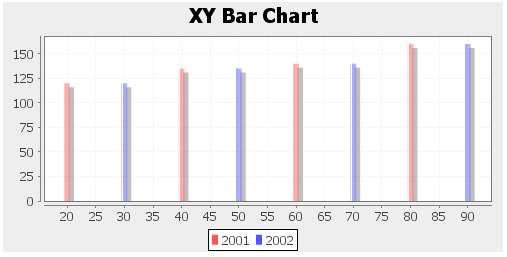

# Chart

- Demonstration: [Chart](http://www.zkoss.org/zkdemo/chart/pie_chart)
- Java API: <javadoc>org.zkoss.zul.Chart</javadoc>
- JavaScript API: <javadoc directory="jsdoc">zul.wgt.Chart</javadoc>
- Style Guide: N/A



# Employment/Purpose

A `chart` is used to show a set of data as a graph. It helps users to
judge things with a snapshot. To use a chart component , developers must
prepare a `ChartModel` and a `ChartEngine`. Developers also set proper
chart type, and the threeD (3D) attribute to draw a proper chart. The
model and type must match each other, or the result is unpredictable.
The 3D chart is not supported on all chart types.

# Example

## Pie Chart


``` xml
<chart id="mychart" title="Pie Chart Demo" width="550" height="400"
    type="pie" threeD="true" fgAlpha="128">
    <attribute name="onClick"><![CDATA[
        Area area = event.getAreaComponent();
        if (area != null)
            alert(""+area.getAttribute("entity")+":"+area.getTooltiptext());
    ]]></attribute>
    <zscript><![CDATA[
        PieModel model = new SimplePieModel();
        model.setValue("C/C++", new Double(21.2));
        model.setValue("VB", new Double(10.2));
        model.setValue("Java", new Double(40.4));
        model.setValue("PHP", new Double(28.2));
        mychart.setModel(model);
    ]]></zscript>
</chart>
```

## Pie Chart 3D


``` xml
<chart id="piechart3d" title="Pie Chart 3D" width="500" height="250"
        type="pie" threeD="true" fgAlpha="128">
    <zscript><![CDATA[
        PieModel piemodel = new SimplePieModel();
        piemodel.setValue("C/C++", new Double(12.5));
        piemodel.setValue("Java", new Double(50.2));
        piemodel.setValue("VB", new Double(20.5));
        piemodel.setValue("PHP", new Double(15.5));
        piechart3d.setModel(piemodel);
    ]]></zscript>
</chart>
```

## Ring Chart


``` xml
<chart id="ringchart" title="Ring Chart" width="500" height="250"
        type="ring" threeD="false" fgAlpha="128">
    <zscript><![CDATA[
        PieModel piemodel = new SimplePieModel();
        piemodel.setValue("C/C++", new Double(12.5));
        piemodel.setValue("Java", new Double(50.2));
        piemodel.setValue("VB", new Double(20.5));
        piemodel.setValue("PHP", new Double(15.5));
        ringchart.setModel(piemodel);
    ]]></zscript>
</chart>
```

## Bar Chart


``` xml
<chart id="barchart" title="Bar Chart" width="500" height="250"
        type="bar" threeD="false" fgAlpha="128">
    <zscript><![CDATA[
        CategoryModel catmodel = new SimpleCategoryModel();
        catmodel.setValue("2001", "Q1", new Integer(20));
        catmodel.setValue("2001", "Q2", new Integer(35));
        catmodel.setValue("2001", "Q3", new Integer(40));
        catmodel.setValue("2001", "Q4", new Integer(55));
        catmodel.setValue("2002", "Q1", new Integer(40));
        catmodel.setValue("2002", "Q2", new Integer(60));
        catmodel.setValue("2002", "Q3", new Integer(70));
        catmodel.setValue("2002", "Q4", new Integer(90));
        barchart.setModel(catmodel);
    ]]></zscript>
</chart>
```

## Bar Chart 3D


``` xml
<chart id="barchart3d" title="Bar Chart 3D" width="500" height="250"
        type="bar" threeD="true" fgAlpha="128">
    <zscript><![CDATA[
        CategoryModel catmodel = new SimpleCategoryModel();
        catmodel.setValue("2001", "Q1", new Integer(20));
        catmodel.setValue("2001", "Q2", new Integer(35));
        catmodel.setValue("2001", "Q3", new Integer(40));
        catmodel.setValue("2001", "Q4", new Integer(55));
        catmodel.setValue("2002", "Q1", new Integer(40));
        catmodel.setValue("2002", "Q2", new Integer(60));
        catmodel.setValue("2002", "Q3", new Integer(70));
        catmodel.setValue("2002", "Q4", new Integer(90));
        barchart3d.setModel(catmodel);
    ]]></zscript>
</chart>
```

## Stacked Bar


``` xml
<chart id="sbarchart" title="Stacked Bar" width="500" height="250"
        type="stacked_bar" threeD="false" fgAlpha="128">
    <zscript><![CDATA[
        CategoryModel catmodel = new SimpleCategoryModel();
        catmodel.setValue("2001", "Q1", new Integer(20));
        catmodel.setValue("2001", "Q2", new Integer(35));
        catmodel.setValue("2001", "Q3", new Integer(40));
        catmodel.setValue("2001", "Q4", new Integer(55));
        catmodel.setValue("2002", "Q1", new Integer(40));
        catmodel.setValue("2002", "Q2", new Integer(60));
        catmodel.setValue("2002", "Q3", new Integer(70));
        catmodel.setValue("2002", "Q4", new Integer(90));
        sbarchart.setModel(catmodel);
    ]]></zscript>
</chart>
```

## Stacked Bar 3D


``` xml
<chart id="sbarchart3d" title="Stacked Bar 3D" width="500"
        height="250" type="stacked_bar" threeD="true" fgAlpha="128">
    <zscript><![CDATA[
        CategoryModel catmodel = new SimpleCategoryModel();
        catmodel.setValue("2001", "Q1", new Integer(20));
        catmodel.setValue("2001", "Q2", new Integer(35));
        catmodel.setValue("2001", "Q3", new Integer(40));
        catmodel.setValue("2001", "Q4", new Integer(55));
        catmodel.setValue("2002", "Q1", new Integer(40));
        catmodel.setValue("2002", "Q2", new Integer(60));
        catmodel.setValue("2002", "Q3", new Integer(70));
        catmodel.setValue("2002", "Q4", new Integer(90));
        sbarchart3d.setModel(catmodel);
    ]]></zscript>
</chart>
```

## Line Chart


``` xml
<chart id="linechart" title="Line Chart" width="500" height="250"
        type="line" threeD="false" fgAlpha="128">
    <zscript><![CDATA[
        CategoryModel catmodel = new SimpleCategoryModel();
        catmodel.setValue("2001", "Q1", new Integer(20));
        catmodel.setValue("2001", "Q2", new Integer(35));
        catmodel.setValue("2001", "Q3", new Integer(40));
        catmodel.setValue("2001", "Q4", new Integer(55));
        catmodel.setValue("2002", "Q1", new Integer(40));
        catmodel.setValue("2002", "Q2", new Integer(60));
        catmodel.setValue("2002", "Q3", new Integer(70));
        catmodel.setValue("2002", "Q4", new Integer(90));
        linechart.setModel(catmodel);
    ]]></zscript>
</chart>
```

## Line Chart 3D


``` xml
<chart id="linechart3d" title="Line Chart 3D" width="500"
        height="250" type="line" threeD="true" fgAlpha="128">
    <zscript><![CDATA[
        CategoryModel catmodel = new SimpleCategoryModel();
        catmodel.setValue("2001", "Q1", new Integer(20));
        catmodel.setValue("2001", "Q2", new Integer(35));
        catmodel.setValue("2001", "Q3", new Integer(40));
        catmodel.setValue("2001", "Q4", new Integer(55));
        catmodel.setValue("2002", "Q1", new Integer(40));
        catmodel.setValue("2002", "Q2", new Integer(60));
        catmodel.setValue("2002", "Q3", new Integer(70));
        catmodel.setValue("2002", "Q4", new Integer(90));
        linechart3d.setModel(catmodel);
    ]]></zscript>
</chart>
```

## Area Chart


``` xml
<chart id="areachart" title="Area Chart" width="500" height="250"
        type="area" threeD="false" fgAlpha="128">
    <zscript><![CDATA[
        CategoryModel catmodel = new SimpleCategoryModel();
        catmodel.setValue("2001", "Q1", new Integer(20));
        catmodel.setValue("2001", "Q2", new Integer(35));
        catmodel.setValue("2001", "Q3", new Integer(40));
        catmodel.setValue("2001", "Q4", new Integer(55));
        catmodel.setValue("2002", "Q1", new Integer(40));
        catmodel.setValue("2002", "Q2", new Integer(60));
        catmodel.setValue("2002", "Q3", new Integer(70));
        catmodel.setValue("2002", "Q4", new Integer(90));
        areachart.setModel(catmodel);
    ]]></zscript>
</chart>
```

## Stacked Area Chart


``` xml
<chart id="sareachart" title="Stacked Area Chart" width="500"
        height="250" type="stacked_area" threeD="false" fgAlpha="128">
    <zscript><![CDATA[
        CategoryModel catmodel = new SimpleCategoryModel();
        catmodel.setValue("2001", "Q1", new Integer(20));
        catmodel.setValue("2001", "Q2", new Integer(35));
        catmodel.setValue("2001", "Q3", new Integer(40));
        catmodel.setValue("2001", "Q4", new Integer(55));
        catmodel.setValue("2002", "Q1", new Integer(40));
        catmodel.setValue("2002", "Q2", new Integer(60));
        catmodel.setValue("2002", "Q3", new Integer(70));
        catmodel.setValue("2002", "Q4", new Integer(90));
        sareachart.setModel(catmodel);
    ]]></zscript>
</chart>
```

## Waterfall Chart


``` xml
<chart id="waterfall" title="Waterfall Chart" width="500"
        height="250" type="waterfall" threeD="false" fgAlpha="128">
    <zscript><![CDATA[
        CategoryModel catmodel = new SimpleCategoryModel();
        catmodel.setValue("2001", "Q1", new Integer(20));
        catmodel.setValue("2001", "Q2", new Integer(35));
        catmodel.setValue("2001", "Q3", new Integer(40));
        catmodel.setValue("2001", "Q4", new Integer(55));
        catmodel.setValue("2002", "Q1", new Integer(40));
        catmodel.setValue("2002", "Q2", new Integer(60));
        catmodel.setValue("2002", "Q3", new Integer(70));
        catmodel.setValue("2002", "Q4", new Integer(90));
        waterfall.setModel(catmodel);
    ]]></zscript>
</chart>
```

## Polar Chart


``` xml
<chart id="polar" title="Polar Chart" width="500" height="250"
        type="polar" threeD="false" fgAlpha="128">
    <zscript><![CDATA[
        XYModel xymodel = new SimpleXYModel();
        xymodel.addValue("2001", new Integer(20), new Integer(120));
        xymodel.addValue("2001", new Integer(40), new Integer(135));
        xymodel.addValue("2001", new Integer(60), new Integer(140));
        xymodel.addValue("2001", new Integer(80), new Integer(160));
        
        xymodel.addValue("2002", new Integer(30), new Integer(120));
        xymodel.addValue("2002", new Integer(50), new Integer(135));
        xymodel.addValue("2002", new Integer(70), new Integer(140));
        xymodel.addValue("2002", new Integer(90), new Integer(160));
        polar.setModel(xymodel);
    ]]></zscript>
</chart>
```

## Scatter Chart


``` xml
<chart id="scatter" title="Scatter Chart" width="500" height="250"
        type="scatter" threeD="false" fgAlpha="128">
    <zscript><![CDATA[
        XYModel xymodel = new SimpleXYModel();
        xymodel.addValue("2001", new Integer(20), new Integer(120));
        xymodel.addValue("2001", new Integer(40), new Integer(135));
        xymodel.addValue("2001", new Integer(60), new Integer(140));
        xymodel.addValue("2001", new Integer(80), new Integer(160));
        
        xymodel.addValue("2002", new Integer(30), new Integer(120));
        xymodel.addValue("2002", new Integer(50), new Integer(135));
        xymodel.addValue("2002", new Integer(70), new Integer(140));
        xymodel.addValue("2002", new Integer(90), new Integer(160));
        scatter.setModel(xymodel);
    ]]></zscript>
</chart>
```

## Time Series Chart


``` xml
<chart id="timeseries" title="Time Series Chart" width="500"
        height="250" type="time_series" threeD="false" fgAlpha="128">
    <zscript><![CDATA[
        XYModel xymodel = new SimpleXYModel();
        xymodel.addValue("2001", new Integer(20), new Integer(120));
        xymodel.addValue("2001", new Integer(40), new Integer(135));
        xymodel.addValue("2001", new Integer(60), new Integer(140));
        xymodel.addValue("2001", new Integer(80), new Integer(160));
        
        xymodel.addValue("2002", new Integer(30), new Integer(120));
        xymodel.addValue("2002", new Integer(50), new Integer(135));
        xymodel.addValue("2002", new Integer(70), new Integer(140));
        xymodel.addValue("2002", new Integer(90), new Integer(160));
        timeseries.setModel(xymodel);
    ]]></zscript>
</chart>
```

## XY Area Chart


``` xml
<chart id="xyarea" title="XY Area Chart" width="500" height="250"
        type="area" threeD="false" fgAlpha="128">
    <zscript><![CDATA[
        XYModel xymodel = new SimpleXYModel();
        xymodel.addValue("2001", new Integer(20), new Integer(120));
        xymodel.addValue("2001", new Integer(40), new Integer(135));
        xymodel.addValue("2001", new Integer(60), new Integer(140));
        xymodel.addValue("2001", new Integer(80), new Integer(160));
        
        xymodel.addValue("2002", new Integer(30), new Integer(120));
        xymodel.addValue("2002", new Integer(50), new Integer(135));
        xymodel.addValue("2002", new Integer(70), new Integer(140));
        xymodel.addValue("2002", new Integer(90), new Integer(160));
        xyarea.setModel(xymodel);
    ]]></zscript>
</chart>
```

## XY Line Chart


``` xml
<chart id="xyline" title="XY Line Chart" width="500" height="250"
        type="line" threeD="false" fgAlpha="128">
    <zscript><![CDATA[
        XYModel xymodel = new SimpleXYModel();
        xymodel.addValue("2001", new Integer(20), new Integer(120));
        xymodel.addValue("2001", new Integer(40), new Integer(135));
        xymodel.addValue("2001", new Integer(60), new Integer(140));
        xymodel.addValue("2001", new Integer(80), new Integer(160));
        
        xymodel.addValue("2002", new Integer(30), new Integer(120));
        xymodel.addValue("2002", new Integer(50), new Integer(135));
        xymodel.addValue("2002", new Integer(70), new Integer(140));
        xymodel.addValue("2002", new Integer(90), new Integer(160));
        xyline.setModel(xymodel);
    ]]></zscript>
</chart>
```

## Step Area Chart


``` xml
<chart id="steparea" title="Step Area Chart" width="500"
        height="250" type="step_area" threeD="false" fgAlpha="128">
    <zscript><![CDATA[
        XYModel xymodel = new SimpleXYModel();
        xymodel.addValue("2001", new Integer(20), new Integer(120));
        xymodel.addValue("2001", new Integer(40), new Integer(135));
        xymodel.addValue("2001", new Integer(60), new Integer(140));
        xymodel.addValue("2001", new Integer(80), new Integer(160));
        
        xymodel.addValue("2002", new Integer(30), new Integer(120));
        xymodel.addValue("2002", new Integer(50), new Integer(135));
        xymodel.addValue("2002", new Integer(70), new Integer(140));
        xymodel.addValue("2002", new Integer(90), new Integer(160));
        steparea.setModel(xymodel);
    ]]></zscript>
</chart>
```

## Step Chart


``` xml
<chart id="step" title="Step Chart" width="500" height="250"
        type="step" threeD="false" fgAlpha="128">
    <zscript><![CDATA[
         public Date time(int year, int month, int day, int hour, int minute, int second) {
            final java.util.Calendar calendar = java.util.Calendar.getInstance(TimeZone.getTimeZone("GMT"));
            calendar.set(year, month-1, day, hour, minute, second);
            final Date result = calendar.getTime();
            return result;
        }
        XYModel datemodel = new SimpleXYModel();
        datemodel.addValue("2001", new Long(time(2001, 5, 2, 1, 10, 15).getTime()), new Integer(120));
        datemodel.addValue("2001", new Long(time(2001, 5, 2, 2, 10, 15).getTime()), new Integer(135));
        datemodel.addValue("2001", new Long(time(2001, 5, 2, 3, 10, 15).getTime()), new Integer(140));
        datemodel.addValue("2001", new Long(time(2001, 5, 2, 4, 10, 15).getTime()), new Integer(160));
        
        datemodel.addValue("2002", new Long(time(2001, 5, 2, 1, 10, 20).getTime()), new Integer(125));
        datemodel.addValue("2002", new Long(time(2001, 5, 2, 2, 10, 20).getTime()), new Integer(130));
        datemodel.addValue("2002", new Long(time(2001, 5, 2, 3, 10, 20).getTime()), new Integer(120));
        datemodel.addValue("2002", new Long(time(2001, 5, 2, 4, 10, 20).getTime()), new Integer(180));
        step.setModel(datemodel);
    ]]></zscript>
</chart>
```

## XY Stacked Area Chart


``` xml
<chart id="xystackedarea" title="XY Stacked Area Chart" width="500"
        height="250" type="stacked_area" threeD="false" fgAlpha="128">
    <zscript><![CDATA[
        XYModel xymodel = new SimpleXYModel();
        xymodel.addValue("2001", new Integer(20), new Integer(120));
        xymodel.addValue("2001", new Integer(40), new Integer(135));
        xymodel.addValue("2001", new Integer(60), new Integer(140));
        xymodel.addValue("2001", new Integer(80), new Integer(160));
        
        xymodel.addValue("2002", new Integer(30), new Integer(120));
        xymodel.addValue("2002", new Integer(50), new Integer(135));
        xymodel.addValue("2002", new Integer(70), new Integer(140));
        xymodel.addValue("2002", new Integer(90), new Integer(160));
        xystackedarea.setModel(xymodel);
    ]]></zscript>
</chart>
```

## XY Bar Chart



``` xml
<chart id="xybar" title="XY Bar Chart" width="500" height="250"
        type="bar" threeD="false" fgAlpha="128">
    <zscript><![CDATA[
        XYModel xymodel = new SimpleXYModel();
        xymodel.addValue("2001", new Integer(20), new Integer(120));
        xymodel.addValue("2001", new Integer(40), new Integer(135));
        xymodel.addValue("2001", new Integer(60), new Integer(140));
        xymodel.addValue("2001", new Integer(80), new Integer(160));
        
        xymodel.addValue("2002", new Integer(30), new Integer(120));
        xymodel.addValue("2002", new Integer(50), new Integer(135));
        xymodel.addValue("2002", new Integer(70), new Integer(140));
        xymodel.addValue("2002", new Integer(90), new Integer(160));
        xybar.setModel(xymodel);
    ]]></zscript>
</chart>
```

## Histogram Chart


``` xml
<chart id="histogram" title="Histogram Chart" width="500"
        height="250" type="histogram" threeD="false" fgAlpha="128">
    <zscript><![CDATA[
        XYModel xymodel = new SimpleXYModel();
        xymodel.addValue("2001", new Integer(20), new Integer(120));
        xymodel.addValue("2001", new Integer(40), new Integer(135));
        xymodel.addValue("2001", new Integer(60), new Integer(140));
        xymodel.addValue("2001", new Integer(80), new Integer(160));
        
        xymodel.addValue("2002", new Integer(30), new Integer(120));
        xymodel.addValue("2002", new Integer(50), new Integer(135));
        xymodel.addValue("2002", new Integer(70), new Integer(140));
        xymodel.addValue("2002", new Integer(90), new Integer(160));
        histogram.setModel(xymodel);
    ]]></zscript>
</chart>
```

## Candlestick Chart


``` xml
<chart id="candlestick" title="Candlestick Chart" width="500"
        height="250" type="candlestick" threeD="false" fgAlpha="128">
    <zscript><![CDATA[
        HiLoModel hilomodel = new SimpleHiLoModel();
        long d = System.currentTimeMillis();
        hilomodel.addValue(new Date(d),  new Double(45.5),  new Double(54.2), new Double(19.9), new Double(42.8), new Double(20));
        hilomodel.addValue(new Date(d+1000),  new Double(46.5),  new Double(55.2),  new Double(43.8), new Double(50.9),   new Double(32));
        hilomodel.addValue(new Date(d+2000),  new Double(47.5),  new Double(56.2),  new Double(44.8), new Double(51.9),   new Double(33));
        hilomodel.addValue(new Date(d+3000),  new Double(48.5),  new Double(57.2),  new Double(45.8), new Double(52.9),   new Double(34));
        hilomodel.addValue(new Date(d+4000),  new Double(49.5),  new Double(58.2),  new Double(46.8), new Double(53.9),   new Double(35));
        hilomodel.addValue(new Date(d+5000),  new Double(50.5),  new Double(59.2),  new Double(47.8), new Double(54.9),   new Double(36));
        hilomodel.addValue(new Date(d+6000),  new Double(51.5),  new Double(60.2),  new Double(48.8), new Double(55.9),   new Double(37));
        hilomodel.addValue(new Date(d+7000),  new Double(52.5),  new Double(61.2),  new Double(49.8), new Double(56.9),   new Double(38));
        hilomodel.addValue(new Date(d+8000),  new Double(53.5),  new Double(62.2),  new Double(50.8), new Double(57.9),   new Double(39));
        hilomodel.addValue(new Date(d+9000),  new Double(54.5),  new Double(63.2),  new Double(51.8), new Double(58.9),   new Double(40));
        hilomodel.addValue(new Date(d+10000),  new Double(55.5),  new Double(64.2),  new Double(52.8), new Double(59.9),   new Double(41));
        hilomodel.addValue(new Date(d+11000),  new Double(56.5),  new Double(65.2),  new Double(53.8), new Double(60.9),   new Double(42));
        hilomodel.addValue(new Date(d+12000),  new Double(57.5),  new Double(66.2),  new Double(54.8), new Double(61.9),   new Double(43));
        hilomodel.addValue(new Date(d+13000),  new Double(58.5),  new Double(67.2),  new Double(55.8), new Double(62.9),   new Double(44));
        hilomodel.addValue(new Date(d+14000),  new Double(59.5),  new Double(68.2),  new Double(56.8), new Double(63.9),   new Double(45));
        hilomodel.addValue(new Date(d+15000),  new Double(60.5),  new Double(69.2),  new Double(57.8), new Double(64.9),   new Double(46));
        hilomodel.addValue(new Date(d+16000),  new Double(61.5),  new Double(70.2),  new Double(58.8), new Double(65.9),   new Double(47));
        hilomodel.addValue(new Date(d+17000),  new Double(62.5),  new Double(71.2),  new Double(59.8), new Double(66.9),   new Double(48));
        hilomodel.addValue(new Date(d+18000),  new Double(63.5),  new Double(72.2),  new Double(60.8), new Double(67.9),   new Double(49));
        candlestick.setModel(hilomodel);
    ]]></zscript>
</chart>
```

## High Low Chart


``` xml
<chart id="highlow" title="High Low Chart" width="500" height="250"
        type="highlow" threeD="false" fgAlpha="128" dateFormat="yyyy/MM/dd">
    <zscript><![CDATA[
        HiLoModel hilomodel = new SimpleHiLoModel();
        long d = System.currentTimeMillis();
        hilomodel.addValue(new Date(d),  new Double(45.5),  new Double(54.2), new Double(19.9), new Double(42.8), new Double(20));
        hilomodel.addValue(new Date(d+1000),  new Double(46.5),  new Double(55.2),  new Double(43.8), new Double(50.9),   new Double(32));
        hilomodel.addValue(new Date(d+2000),  new Double(47.5),  new Double(56.2),  new Double(44.8), new Double(51.9),   new Double(33));
        hilomodel.addValue(new Date(d+3000),  new Double(48.5),  new Double(57.2),  new Double(45.8), new Double(52.9),   new Double(34));
        hilomodel.addValue(new Date(d+4000),  new Double(49.5),  new Double(58.2),  new Double(46.8), new Double(53.9),   new Double(35));
        hilomodel.addValue(new Date(d+5000),  new Double(50.5),  new Double(59.2),  new Double(47.8), new Double(54.9),   new Double(36));
        hilomodel.addValue(new Date(d+6000),  new Double(51.5),  new Double(60.2),  new Double(48.8), new Double(55.9),   new Double(37));
        hilomodel.addValue(new Date(d+7000),  new Double(52.5),  new Double(61.2),  new Double(49.8), new Double(56.9),   new Double(38));
        hilomodel.addValue(new Date(d+8000),  new Double(53.5),  new Double(62.2),  new Double(50.8), new Double(57.9),   new Double(39));
        hilomodel.addValue(new Date(d+9000),  new Double(54.5),  new Double(63.2),  new Double(51.8), new Double(58.9),   new Double(40));
        hilomodel.addValue(new Date(d+10000),  new Double(55.5),  new Double(64.2),  new Double(52.8), new Double(59.9),   new Double(41));
        hilomodel.addValue(new Date(d+11000),  new Double(56.5),  new Double(65.2),  new Double(53.8), new Double(60.9),   new Double(42));
        hilomodel.addValue(new Date(d+12000),  new Double(57.5),  new Double(66.2),  new Double(54.8), new Double(61.9),   new Double(43));
        hilomodel.addValue(new Date(d+13000),  new Double(58.5),  new Double(67.2),  new Double(55.8), new Double(62.9),   new Double(44));
        hilomodel.addValue(new Date(d+14000),  new Double(59.5),  new Double(68.2),  new Double(56.8), new Double(63.9),   new Double(45));
        hilomodel.addValue(new Date(d+15000),  new Double(60.5),  new Double(69.2),  new Double(57.8), new Double(64.9),   new Double(46));
        hilomodel.addValue(new Date(d+16000),  new Double(61.5),  new Double(70.2),  new Double(58.8), new Double(65.9),   new Double(47));
        hilomodel.addValue(new Date(d+17000),  new Double(62.5),  new Double(71.2),  new Double(59.8), new Double(66.9),   new Double(48));
        hilomodel.addValue(new Date(d+18000),  new Double(63.5),  new Double(72.2),  new Double(60.8), new Double(67.9),   new Double(49));
        highlow.setModel(hilomodel);
    ]]></zscript>
</chart>
```

## Bubble Chart


``` xml
<chart id="bubble" title="Bubble Chart" width="500" height="250"
        type="bubble" threeD="false" fgAlpha="128">
    <zscript><![CDATA[  
        XYZModel xyzmodel = new SimpleXYZModel();
        xyzmodel.addValue("2001", new Integer(20), new Integer(120), new Integer(8));
        xyzmodel.addValue("2001", new Integer(40), new Integer(135), new Integer(10));
        xyzmodel.addValue("2001", new Integer(60), new Integer(140), new Integer(6));
        xyzmodel.addValue("2001", new Integer(80), new Integer(160), new Integer(12));
        
        xyzmodel.addValue("2002", new Integer(30), new Integer(120), new Integer(4));
        xyzmodel.addValue("2002", new Integer(50), new Integer(135), new Integer(5));
        xyzmodel.addValue("2002", new Integer(70), new Integer(140), new Integer(3));
        xyzmodel.addValue("2002", new Integer(90), new Integer(160), new Integer(6));
        bubble.setModel(xyzmodel);
    ]]></zscript>
</chart>
```

## Horizontal Bubble Chart


``` xml
<chart id="hbubble" title="Horizontal Bubble Chart" width="500"
        height="250" type="bubble" threeD="false" fgAlpha="128" orient="horizontal">
    <zscript><![CDATA[  
        XYZModel xyzmodel = new SimpleXYZModel();
        xyzmodel.addValue("2001", new Integer(20), new Integer(120), new Integer(8));
        xyzmodel.addValue("2001", new Integer(40), new Integer(135), new Integer(10));
        xyzmodel.addValue("2001", new Integer(60), new Integer(140), new Integer(6));
        xyzmodel.addValue("2001", new Integer(80), new Integer(160), new Integer(12));
        
        xyzmodel.addValue("2002", new Integer(30), new Integer(120), new Integer(4));
        xyzmodel.addValue("2002", new Integer(50), new Integer(135), new Integer(5));
        xyzmodel.addValue("2002", new Integer(70), new Integer(140), new Integer(3));
        xyzmodel.addValue("2002", new Integer(90), new Integer(160), new Integer(6));
        hbubble.setModel(xyzmodel);
    ]]></zscript>
</chart>
```

## Wafer Map Chart


``` xml
<chart id="wafermap" title="Wafer Map Chart" width="500"
        height="400" type="wafermap" threeD="false" fgAlpha="128">
    <zscript><![CDATA[  
        final int xdim = 30;
        final int ydim = 20;
        final Random random = new Random();
        WaferMapModel wafermodel = new WaferMapModel(xdim, ydim);
        for (int x = 0; x < xdim; x++) {
            for (int y = 0; y < ydim; y++) {
                wafermodel.addValue(random.nextInt(5), x, y);
            }
        }
        wafermap.setModel(wafermodel);
    ]]></zscript>
</chart>
```

## Gantt Chart


``` xml
<chart id="gantt" title="Gantt Chart" width="700" height="400"
        type="gantt" threeD="false" fgAlpha="128" dateFormat="yyyy/MM/dd" >
    <zscript><![CDATA[  
        import org.zkoss.zul.GanttModel.GanttTask;
        
        public Date date(int year, int month, int day) {
            final java.util.Calendar calendar = java.util.Calendar.getInstance();
            calendar.set(year, month-1, day);
            final Date result = calendar.getTime();
            return result;
        }
        //series, task (task description, start, end, complete percentage)
        GanttModel ganttmodel = new GanttModel();
        ganttmodel.addValue("Scheduled", new GanttTask("Write Proposal", date(2008,4,1), date(2008,4,5), 0.0));
        ganttmodel.addValue("Scheduled", new GanttTask("Obtain Approval", date(2008,4,9), date(2008,4,9), 0.0));
        ganttmodel.addValue("Scheduled", new GanttTask("Requirements Analysis", date(2008,4,10), date(2008,5,5), 0.0));
        ganttmodel.addValue("Scheduled", new GanttTask("Design Phase", date(2008,5,6), date(2008,5,30), 0.0));
        ganttmodel.addValue("Scheduled", new GanttTask("Design Signoff", date(2008,6,2), date(2008,6,2), 0.0));
        ganttmodel.addValue("Scheduled", new GanttTask("Alpha Implementation", date(2008,6,3), date(2008,7,31), 0.0));
        ganttmodel.addValue("Scheduled", new GanttTask("Design Review", date(2008,8,1), date(2008,8,8), 0.0));
        ganttmodel.addValue("Scheduled", new GanttTask("Revised Design Signoff", date(2008,8,10), date(2008,8,10), 0.0));
        ganttmodel.addValue("Scheduled", new GanttTask("Beta Implementation", date(2008,8,12), date(2008,9,12), 0.0));
        ganttmodel.addValue("Scheduled", new GanttTask("Testing", date(2008,9,13), date(2008,10,31), 0.0));
        ganttmodel.addValue("Scheduled", new GanttTask("Final Implementation", date(2008,11,1), date(2008,11,15), 0.0));
        ganttmodel.addValue("Scheduled", new GanttTask("Signoff", date(2008,11,28), date(2008,11,30), 0.0));
        
        ganttmodel.addValue("Actual", new GanttTask("Write Proposal", date(2008,4,1), date(2008,4,3), 0.0));
        ganttmodel.addValue("Actual", new GanttTask("Obtain Approval", date(2008,4,9), date(2008,4,9), 0.0));
        ganttmodel.addValue("Actual", new GanttTask("Requirements Analysis", date(2008,4,10), date(2008,5,15), 0.0));
        ganttmodel.addValue("Actual", new GanttTask("Design Phase", date(2008,5,15), date(2008,6,17), 0.0));
        ganttmodel.addValue("Actual", new GanttTask("Design Signoff", date(2008,6,30), date(2008,6,30), 0.0));
        ganttmodel.addValue("Actual", new GanttTask("Alpha Implementation", date(2008,7,1), date(2008,9,12), 0.0));
        ganttmodel.addValue("Actual", new GanttTask("Design Review", date(2008,9,12), date(2008,9,22), 0.0));
        ganttmodel.addValue("Actual", new GanttTask("Revised Design Signoff", date(2008,9,25), date(2008,9,27), 0.0));
        ganttmodel.addValue("Actual", new GanttTask("Beta Implementation", date(2008,8,12), date(2008,9,12), 0.0));
        ganttmodel.addValue("Actual", new GanttTask("Testing", date(2008,10,31), date(2008,11,17), 0.0));
        ganttmodel.addValue("Actual", new GanttTask("Final Implementation", date(2008,11,18), date(2008,12,5), 0.0));
        ganttmodel.addValue("Actual", new GanttTask("Signoff", date(2008,12,10), date(2008,12,11), 0.0));
        gantt.setModel(ganttmodel);
    ]]></zscript>
</chart>
```

## Wind Chart


``` xml
<chart id="wind" title="Wind Plot" width="700" height="400"
        type="wind" threeD="false" fgAlpha="128" dateFormat="yyyy/MM/dd" >
    <zscript><![CDATA[
        
        public Date date(int year, int month, int day) {
            final java.util.Calendar calendar = java.util.Calendar.getInstance();
            calendar.set(year, month-1, day);
            final Date result = calendar.getTime();
            return result;
        }
        XYZModel windmodel = new SimpleXYZModel();
        //series, date, direction (0-12), force(0-12)
        windmodel.addValue("Wind!", new Long(date(2008, 1, 3).getTime()), new Double(0d), new Double(10.0));
        windmodel.addValue("Wind!", new Long(date(2008, 1, 4).getTime()), new Double(1d), new Double(8.5));
        windmodel.addValue("Wind!", new Long(date(2008, 1, 5).getTime()), new Double(2.0), new Double(10.0));
        windmodel.addValue("Wind!", new Long(date(2008, 1, 6).getTime()), new Double(3.0), new Double(10.0));
        windmodel.addValue("Wind!", new Long(date(2008, 1, 7).getTime()), new Double(4.0), new Double(7.0));
        windmodel.addValue("Wind!", new Long(date(2008, 1, 8).getTime()), new Double(5.0), new Double(10.0));
        windmodel.addValue("Wind!", new Long(date(2008, 1, 9).getTime()), new Double(6.0), new Double(8.0));
        windmodel.addValue("Wind!", new Long(date(2008, 1, 10).getTime()), new Double(7.0), new Double(11.0));
        windmodel.addValue("Wind!", new Long(date(2008, 1, 11).getTime()), new Double(8.0), new Double(10.0));
        windmodel.addValue("Wind!", new Long(date(2008, 1, 12).getTime()), new Double(9.0), new Double(11.0));
        windmodel.addValue("Wind!", new Long(date(2008, 1, 13).getTime()), new Double(10.0), new Double(3.0));
        windmodel.addValue("Wind!", new Long(date(2008, 1, 14).getTime()), new Double(11.0), new Double(9.0));
        windmodel.addValue("Wind!", new Long(date(2008, 1, 15).getTime()), new Double(12.0), new Double(11.0));
        windmodel.addValue("Wind!", new Long(date(2008, 1, 16).getTime()), new Double(0.0), new Double(0.0));
        wind.setModel(windmodel);
    ]]></zscript>
</chart>
```

## Dial Chart


``` xml
<window onOK="doOK()" width="350px">
    <chart id="dial" title="Dial Plot" width="300" height="300" type="dial" threeD="false" fgAlpha="128">
    <zscript><![CDATA[
        
        import org.zkoss.zul.DialModel;
        import org.zkoss.zul.DialModelScale;
    
        int val= 40;
    
        DialModel dialmodel = new DialModel();
        DialModelScale scale = dialmodel.newScale(0.0, 100.0, -120.0, -300.0, 10.0, 4);//scale's configuration data
        scale.setText("Temperature");
        scale.newRange(80, 100, "#FF0000", 0.83, 0.89);
        scale.newRange(60, 80, "#FFC426", 0.83, 0.89);
        scale.setValue(val);
    
        doOK() {
            val = dbx.getValue();
            if (val > 100) {
                val = 100;
            } else if (val < 0) {
                val = 0;
            }
            dbx.value = val;
            slx.curpos = val;
            scale.setValue(val);
            if (val > 80) {
                scale.setNeedleColor(scale.getRange(0).getRangeColor());
            } else if (val > 60) {
                scale.setNeedleColor(scale.getRange(1).getRangeColor());
            } else {
                scale.setNeedleColor(dialmodel.getFrameFgColor());
            }
        }
        dial.setModel(dialmodel);
        ]]></zscript>
    </chart>
    <hbox>
        <slider id="slx" curpos="${val}" onScroll="dbx.value=self.curpos; doOK()"/>
        <intbox id="dbx" value="${val}" onChange="doOK()"/>
    </hbox>
</window>
```

# Properties

## Type and Model

<table>
<thead>
<tr class="header">
<th><center>
<p>Type</p>
</center></th>
<th><center>
<p>Model</p>
</center></th>
<th><center>
<p>3D</p>
</center></th>
</tr>
</thead>
<tbody>
<tr class="odd">
<td><center>
<p><code>pie</code></p>
</center></td>
<td><p><code>PieModel</code></p></td>
<td><center>
<p><code>o</code></p>
</center></td>
</tr>
<tr class="even">
<td><center>
<p><code>ring</code></p>
</center></td>
<td><p><code>PieModel</code></p></td>
<td><center>
<p><code>x</code></p>
</center></td>
</tr>
<tr class="odd">
<td><center>
<p><code>bar</code></p>
</center></td>
<td><p><code>CategoryModel</code>or<code>XYModel</code></p></td>
<td><center>
<p><code>o</code></p>
</center></td>
</tr>
<tr class="even">
<td><center>
<p><code>line</code></p>
</center></td>
<td><p><code>CategoryModel</code>or<code>XYModel</code></p></td>
<td><center>
<p><code>o</code></p>
</center></td>
</tr>
<tr class="odd">
<td><center>
<p><code>area</code></p>
</center></td>
<td><p><code>CategoryModel</code>or<code>XYModel</code></p></td>
<td><center>
<p><code>x</code></p>
</center></td>
</tr>
<tr class="even">
<td><center>
<p><code>stacked_bar</code></p>
</center></td>
<td><p><code>CategoryModel</code></p></td>
<td><center>
<p><code>o</code></p>
</center></td>
</tr>
<tr class="odd">
<td><center>
<p><code>stacked_area</code></p>
</center></td>
<td><p><code>CategoryModel</code>or<code>XYModel</code></p></td>
<td><center>
<p><code>x</code></p>
</center></td>
</tr>
<tr class="even">
<td><center>
<p><code>waterfall</code></p>
</center></td>
<td><p><code>CategoryModel</code></p></td>
<td><center>
<p><code>x</code></p>
</center></td>
</tr>
<tr class="odd">
<td><center>
<p><code>polar</code></p>
</center></td>
<td><p><code>XYModel</code></p></td>
<td><center>
<p>x</p>
</center></td>
</tr>
<tr class="even">
<td><center>
<p><code>scatter</code></p>
</center></td>
<td><p><code>XYModel</code></p></td>
<td><center>
<p>x</p>
</center></td>
</tr>
<tr class="odd">
<td><center>
<p><code>time_series</code></p>
</center></td>
<td><p><code>XYModel</code></p></td>
<td><center>
<p>x</p>
</center></td>
</tr>
<tr class="even">
<td><center>
<p><code>polar</code></p>
</center></td>
<td><p><code>XYModel</code></p></td>
<td><center>
<p>x</p>
</center></td>
</tr>
<tr class="odd">
<td><center>
<p><code>step_area</code></p>
</center></td>
<td><p><code>XYModel</code></p></td>
<td><center>
<p>x</p>
</center></td>
</tr>
<tr class="even">
<td><center>
<p><code>step</code></p>
</center></td>
<td><p><code>XYModel</code></p></td>
<td><center>
<p>x</p>
</center></td>
</tr>
<tr class="odd">
<td><center>
<p><code>histogram</code></p>
</center></td>
<td><p><code>XYModel</code></p></td>
<td><center>
<p>x</p>
</center></td>
</tr>
<tr class="even">
<td><center>
<p><code>bubble</code></p>
</center></td>
<td><p><code>XYModel</code></p></td>
<td><center>
<p>x</p>
</center></td>
</tr>
<tr class="odd">
<td><center>
<p><code>wind</code></p>
</center></td>
<td><p><code>XYModel</code></p></td>
<td><center>
<p>x</p>
</center></td>
</tr>
<tr class="even">
<td><center>
<p><code>candlestick</code></p>
</center></td>
<td><p><code>HiLoModel</code></p></td>
<td><center>
<p>x</p>
</center></td>
</tr>
<tr class="odd">
<td><center>
<p><code>highlow</code></p>
</center></td>
<td><p><code>HiLoModel</code></p></td>
<td><center>
<p>x</p>
</center></td>
</tr>
<tr class="even">
<td><center>
<p><code>wafermap</code></p>
</center></td>
<td><p><code>WaferMapModel</code></p></td>
<td><center>
<p>x</p>
</center></td>
</tr>
<tr class="odd">
<td><center>
<p><code>gantt</code></p>
</center></td>
<td><p><code>GanttModel</code></p></td>
<td><center>
<p>x</p>
</center></td>
</tr>
<tr class="even">
<td><center>
<p><code>dial</code></p>
</center></td>
<td><p><code>DialModel</code></p></td>
<td><center>
<p>x</p>
</center></td>
</tr>
</tbody>
</table>

# Clicked Area: Series, Legend

In an onClick listener, you can call
<javadoc method="getX()">org.zkoss.zk.ui.event.MouseEvent</javadoc> and
<javadoc method="getY()">org.zkoss.zk.ui.event.MouseEvent</javadoc> to
get coordinates.

Call
<javadoc method="getAreaComponent()">org.zkoss.zk.ui.event.MouseEvent</javadoc>
to retrieve the area component (<javadoc>org.zkoss.zul.Area</javadoc>)
which users click on.

There are several attributes you can get from the clicked Area:

- `series`: series name
- `category`: category name, e.g. GanttTask's description
- `entity`: could be `DATA` or `LEGEND`
- `percent`: percentage of complete of a gantt task
- `start`: start value of a gannt task
- `end`: end value of a gannt task

``` java
    
    @Listen("onClick = #gantt")
    public  void drilldown(MouseEvent event) {
        final Area area = (Area)event.getAreaComponent();
        if (area != null)
            Messagebox.show(area.getAttribute("category")+": "+area.getTooltiptext());
    }
```

# Charts Support Setting the Font

We can now specify what font we want a chart to use. This is useful when
employing a foreign language within your chart. The example demonstrates
setting a font and using it with a foreign language, in this case
Chinese.


``` xml
    <zscript>
        import java.awt.Font;
        String fontname = "Dialog";
        Font tfont = new Font(fontname, Font.BOLD, 16); //for title
        Font lfont = new Font(fontname, Font.PLAIN, 10); //for legend
        Font lbfont = new Font(fontname, Font.PLAIN, 12); //for label


        CategoryModel catmodel = new SimpleCategoryModel();
        catmodel.setValue("2001", "第一季", new Integer(20));
        catmodel.setValue("2001", "第二季", new Integer(35));
        catmodel.setValue("2001", "第三季", new Integer(40));
        catmodel.setValue("2001", "第四季", new Integer(55));
        catmodel.setValue("2002", "第一季", new Integer(40));
        catmodel.setValue("2002", "第二季", new Integer(60));
        catmodel.setValue("2002", "第三季", new Integer(70));
        catmodel.setValue("2002", "第四季", new Integer(90));
    </zscript>

    <chart id="barchart" title="長條圖  Bar Chart" width="500" height="250" type="bar" threeD="false" fgAlpha="128"
    titleFont="${tfont}" legendFont="${lfont}" xAxisFont="${lbfont}" xAxisTickFont="${lbfont}" model="${catmodel}"/>
```

# Customize Chart

You can customize a chart's appearance by providing your own
`ChartEngine`. It can save your effort by extending `JFreeChartEngine`
and override its `prepareJFreeChart()`. Then manipulate the passed
`JFreeChart` to change a chart's rendering. You also need to find
related API in [JFreeChart
JavaDoc](http://javadox.com/org.jfree/jfreechart/1.0.19/overview-summary.html).

``` xml
<chart engine="foo.MyJfreeChartEngine"/>
```

# Supported Events

- Inherited Supported Events: [
  Imagemap](ZK_Component_Reference/Essential_Components/Imagemap#Supported_Events)

# Supported Children

`*NONE`

# Use Cases

| Version | Description                                  | Example Location                                                                               |
|---------|----------------------------------------------|------------------------------------------------------------------------------------------------|
| 5.0     | Make a Chart fill 100% width in parent panel | [<http://www.zkoss.org/forum/listComment/10761>](http://www.zkoss.org/forum/listComment/10761) |
| 5.0     | Dual axis in Chart                           | [<http://www.zkoss.org/forum/listComment/8752>](http://www.zkoss.org/forum/listComment/8752)   |

# Troubleshooting

## Linux

Chart depends on Java Swing that might not work under some version of
JVM. For the information to make it work under Linux, please refer to
[ZK Installation Guide:
Linux](ZK_Installation_Guide/Setting_up_OS/Linux).

# Version History


<table>
<thead>
<tr class="header">
<th><p>Version</p></th>
<th><p>Date</p></th>
<th><p>Content</p></th>
</tr>
</thead>
<tbody>
<tr class="odd">
<td><p>5.0.4</p></td>
<td><p>August 2010</p></td>
<td><p>MouseEvent introduced a new method,
<javadoc method="getAreaComponent()">org.zkoss.zk.ui.event.MouseEvent</javadoc>,
which simplifies the retrieval of the area component.</p>
<div class="sourceCode" id="cb1"><pre
class="sourceCode java"><code class="sourceCode java"><span id="cb1-1"><a href="#cb1-1" aria-hidden="true" tabindex="-1"></a><span class="bu">Area</span> area <span class="op">=</span> <span class="op">(</span><span class="bu">Area</span><span class="op">)</span>event<span class="op">.</span><span class="fu">getAreaComponent</span><span class="op">();</span> <span class="co">//must be Area or null when used with chart</span></span>
<span id="cb1-2"><a href="#cb1-2" aria-hidden="true" tabindex="-1"></a><span class="cf">if</span> <span class="op">(</span>area <span class="op">!=</span> <span class="kw">null</span><span class="op">)</span></span>
<span id="cb1-3"><a href="#cb1-3" aria-hidden="true" tabindex="-1"></a>  <span class="kw">...</span></span></code></pre></div></td>
</tr>
<tr class="even">
<td><p>5.0.3</p></td>
<td><p>June 2010</p></td>
<td><p>The area sent with the click event becomes UUID of the area
component. Thus, use
<code>desktop.getComponentByUuid(event.getArea())</code>. To write a
program compatible with any version of ZK:</p>
<div class="sourceCode" id="cb2"><pre
class="sourceCode java"><code class="sourceCode java"><span id="cb2-1"><a href="#cb2-1" aria-hidden="true" tabindex="-1"></a><span class="bu">String</span> areaid <span class="op">=</span> event<span class="op">.</span><span class="fu">getArea</span><span class="op">();</span></span>
<span id="cb2-2"><a href="#cb2-2" aria-hidden="true" tabindex="-1"></a><span class="cf">if</span> <span class="op">(</span>areaid <span class="op">!=</span> <span class="kw">null</span><span class="op">)</span> <span class="op">{</span></span>
<span id="cb2-3"><a href="#cb2-3" aria-hidden="true" tabindex="-1"></a>  <span class="bu">Area</span> area <span class="op">=</span> desktop<span class="op">.</span><span class="fu">getComponentByUuidIfAny</span><span class="op">(</span>areaid<span class="op">);</span></span>
<span id="cb2-4"><a href="#cb2-4" aria-hidden="true" tabindex="-1"></a>  <span class="cf">if</span> <span class="op">(</span>area <span class="op">==</span> <span class="kw">null</span><span class="op">)</span></span>
<span id="cb2-5"><a href="#cb2-5" aria-hidden="true" tabindex="-1"></a>    area <span class="op">=</span> chart<span class="op">.</span><span class="fu">getFellow</span><span class="op">(</span>areaid<span class="op">);</span> <span class="co">//fall back to older version</span></span>
<span id="cb2-6"><a href="#cb2-6" aria-hidden="true" tabindex="-1"></a><span class="kw">...</span></span></code></pre></div></td>
</tr>
</tbody>
</table>


