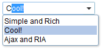

# Comboitem

- Demonstration: [Combobox](http://www.zkoss.org/zkdemo/combobox)
- Java API: <javadoc>org.zkoss.zul.Comboitem</javadoc>
- JavaScript API: <javadoc directory="jsdoc">zul.inp.Comboitem</javadoc>
- Style Guide: [
  Comboitem](ZK_Style_Guide/XUL_Component_Specification/Comboitem)

# Employment/Purpose

An item of a combo box.

# Example



``` xml
 <combobox>
     <comboitem label="Simple and Rich"/>
     <comboitem label="Cool!"/>
     <comboitem label="Ajax and RIA"/>
 </combobox>
```

# Supported Events

<table>
<thead>
<tr class="header">
<th><center>
<p>Name</p>
</center></th>
<th><center>
<p>Event Type</p>
</center></th>
</tr>
</thead>
<tbody>
<tr class="odd">
<td><p>None</p></td>
<td><p>None</p></td>
</tr>
</tbody>
</table>

- Inherited Supported Events: [
  LabelImageElement](ZK_Component_Reference/Base_Components/LabelImageElement#Supported_Events)

# Supported Children

`*NONE`

# Use Cases

| Version | Description | Example Location |
|---------|-------------|------------------|
|         |             |                  |

# Version History


| Version | Date | Content |
|---------|------|---------|
|         |      |         |


