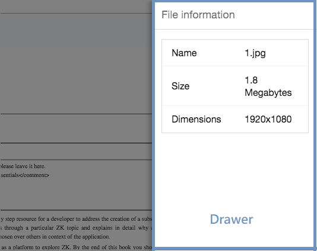
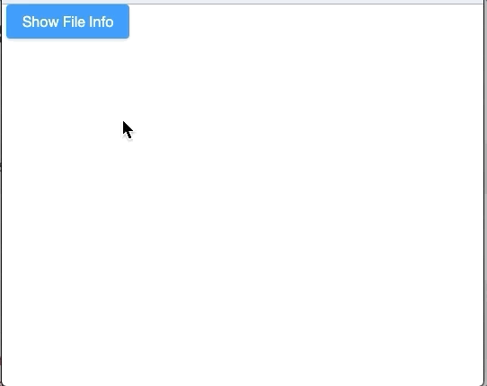
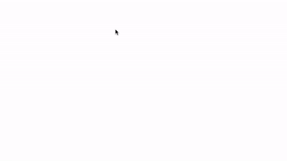

# Drawer

- Demonstration: [Introduce a new ZK Addon:
  Drawer](https://blog.zkoss.org/2019/04/17/introduce-a-new-zk-addon-drawer/)
- Java API: <javadoc>org.zkoss.zkmax.zul.Drawer</javadoc>
- JavaScript API: <javadoc directory="jsdoc">zkmax.wgt.Drawer</javadoc>

 

# Employment/Purpose

A `Drawer` is a component that acts as a panel but sticks to the
boundary of a web page. With this, you can make the page cleaner and put
details into the Drawer for a better user experience.

# Example

In this example we dock a drawer on the right side and put detailed file
information into the drawer.




``` xml
<button label="Show File Info" onClick="fi.open()"/>
<drawer id="fi" title="File information">
  <grid>
    <rows>
      <row>
        <label value="Name"/>
        1.jpg
      </row>
      <row>
        <label value="Size"/>
        1.8 Megabytes
      </row>
      <row>
        <label value="Dimensions"/>
        1920x1080
      </row>
    </rows>
  </grid>
</drawer>
```

# Open / Close the Drawer

Both `visible` attribute and `open/close` methods allow you to open or
close the Drawer.

# Change Animation Speed

This component respects the `data-animationspeed` attribute, please see
[
Data-AnimationSpeed](ZUML_Reference/ZUML/Namespaces/Client_Attribute/Data-AnimationSpeed)

# Properties

## Autodrop



When enabled, the drawer will be opened automatically when the mouse
cursor is near the page edge.

This feature is not yet supported on mobile devices.

## Closable

Sets whether it is closeable by a user (displays the close button). If
enabled, there is a button for users to close the drawer.

Note that even if `closable` is false, users can still click outside the
drawer to close it.

## Mask

Sets whether it is masked when the drawer is opened. By default, there
is a translucent dark gray full-screen mask.

Note that even if `mask` is false, users can still click outside the
drawer to close it.

## Position



Sets the position of the drawer. Valid values are `left`, `right`, `top`
and `bottom`.

## Title

Sets the title of this drawer. `null` means no title.

# Supported Events

<table>
<thead>
<tr class="header">
<th><center>
<p>Name</p>
</center></th>
<th><center>
<p>Event Type</p>
</center></th>
</tr>
</thead>
<tbody>
<tr class="odd">
<td><center>
<p><code>onOpen</code></p>
</center></td>
<td><p><strong>Event:</strong>
<javadoc>org.zkoss.zk.ui.event.OpenEvent</javadoc></p>
<p>Denotes that the user has opened or closed a component.</p>
<p>Note: unlike <code>onClose</code>, this event is only a notification.
The client sends this event after opening or closing the
component.</p></td>
</tr>
</tbody>
</table>

- Inherited Supported Events: [
  XulElement](ZK_Component_Reference/Base_Components/XulElement#Supported_Events)

# Supported Children

`*ALL`

# Use Cases

| Version | Description | Example Location |
|---------|-------------|------------------|
|         |             |                  |

# Version History


| Version | Date           | Content                                                                         |
|---------|----------------|---------------------------------------------------------------------------------|
| 9.0.0   | September 2019 | [ZK-4365](https://tracker.zkoss.org/browse/ZK-4365): Provide a drawer component |


