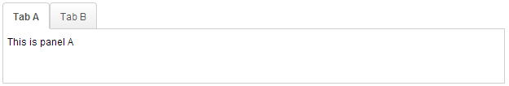
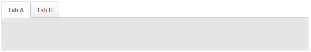

# Dropupload

- Demonstration: N/A
- Java API: <javadoc>org.zkoss.zkmax.zul.Dropupload</javadoc>
- JavaScript API:
  <javadoc directory="jsdoc">zkmax.wgt.Dropupload</javadoc>
- Style Guide: N/A



# Employment/Purpose

`Dropupload` leverages HTML 5 technology to handle file uploading where
users can simply drag and drop the file(s) they want to upload into
`Dropupload` and the uploading process will start automatically. The
behaviour and operation of this `Dropupload` component is similar to
ZK's [**file upload
button**](http://books.zkoss.org/wiki/ZK_Component_Reference/Essential_Components/Button#File_Upload)
but with better user experience and performance.

# Example

Following is a typical example of its implementation, it will always
show component and limit the upload file size.

``` xml
    <dropupload maxsize="5120" detection="none" onUpload="doSomething(event)">
        <attribute name="content"><![CDATA[
            <b>Drop Here</b><br/>
            size < 5MB
        ]]></attribute>
    </dropupload>
```

Another example, it will detect the drag action:

``` xml
<zk>
    <vlayout>
        <image id="img" />
        Upload your hot shot:
        <dropupload maxsize="-1" content="content" detection="browser" onUpload="img.setContent(event.media)" />
    </vlayout>
</zk>
```

**Drop area** 

**File dragged over area** 

**Image uploaded and displayed**


# Maxsize

The `maxsize` attribute is used for limiting the file size of a single
file in which users are allowed to upload. Users are allowed to drag in
two or more files at once but each of them has to be smaller than the
size set by `Maxsize`. If one of the files is larger than the size set
by `Maxsize`, an error message will occur and nothing will be uploaded.

For example, in the case of the previous sample code, you can upload
multiple files, say, four files that are smaller than 5120KB at once but
if one of them exceeds 5120KB, then an exception will occur and none of
the four files will be uploaded to the server.

The unit of `MaxsizeM` attribute is in KB. If it is not assigned a
value, it will use the value of **Configuration.getMaxUploadSize()**
automatically while a negative value would mean that the file size is
set as unlimited.

# Detection

This attribute will define what users see when they drag and drop files
into the application i.e. how the `Dropupload` component and its content
will appear according to their action.

There are four valid values of `detection` :

- `none` : Ignore users' drag action, always show `Dropupload` and its
  content.
- `browser` (default setting) : `Dropupload` is not visible in the
  application initially but shows up along with the content when users
  drag files into the browser.
- `self` : `Dropupload` is visible in the application initially but the
  content only appears when users drag files into the component.
- id of another component : Behaviour of this value is almost identical
  to `self`, except that the trigger area is inside the component of the
  appointed id.

The `content` value can be any HTML string and remember to surround the
content value by `CDATA` block .

**Note** : A `Dropupload` with `detection="browser"` cannot be used with
another `Dropupload` component that has a different `detection` value;
users won't be able to drag a file into the component successfully.

# Anchor

 This attribute allows the dropupload
component to anchor to another component and overlay that component when
the user drag & drops files to the browser. Much like how Gmail works
when dropping attachments to emails.

## Example




``` xml
<zk>
    <div height="100px"></div>
    <tabbox height="100px">
        <tabs>
            <tab id="A" label="Tab A" />
            <tab id="B" label="Tab B" />
        </tabs>
        <tabpanels id="tps">
            <tabpanel>This is panel A</tabpanel>
            <tabpanel>This is panel B</tabpanel>
        </tabpanels>
    </tabbox>
    <dropupload anchor="${tps}"></dropupload>
</zk>
```

# Accept

 This attribute specifies [the MIME
types](https://developer.mozilla.org/en-US/docs/Web/HTTP/Basics_of_HTTP/MIME_types)
that the server accepts. Similar to [the maxsize
attribute](#Maxsize), if one of the files does not match the
acceptable file types, nothing will be uploaded. For example, the
following example only accepts audio and .png files:

``` xml
    <dropupload accept="audio/*, .png"/>
```

# MaxFileCount

Default: `-1`

Set the maximum number of files a user can upload at once, -1 means no
limit. When the number of upload files exceeds the max file count,
nothing will be uploaded and `onMaxFileCountExceed` event will be fired,
developers can listen to that event and get the number of uploaded files
by calling `event.getData()`.

For example (MVVM pattern):

``` xml
  <dropupload onMaxFileCountExceed="@command('maxFileCountExceed', filesCount=event.data)" />
```

``` java
  @Command
  public void maxFileCountExceed(@BindingParam("filesCount") Integer filesCount) {
    Messagebox.show(filesCount + " files exceed the number of upload files limitation.");
  }
```

# Do not Convert File

By default, ZK will convert upload file to image, audio and text file if
possible. Developer can use `native="true"` to demand ZK don't convert
file.

# Customized File Viewer

Similar to [**file upload
button**](http://books.zkoss.org/wiki/ZK_Component_Reference/Essential_Components/Button#File_Upload),
the default file viewer will show the uploading progress via a pop-up
bar as illustrated below.

<figure>

<figcaption>DefaultFileUploadVeiwer.JPG</figcaption>
</figure>

Alternatively, developers can also design customized File Viewer by
implementing a JavaScript class to handle the display screen when
uploading files. Below is an example of a customized file viewer where
the progress bar is shown at the bottom of the browser.

<figure>

<figcaption>CustomizedFileUploadVeiwer.JPG</figcaption>
</figure>

``` javascript
foo.MyFileViewer = zk.$extends(zk.Object, {
    updated: null,
    $init: function (uplder,  file) {
        this._uplder = uplder;
        var id = uplder.id,
            uri = zk.ajaxURI('/web/zk/img/progress2.gif', {au:true}),
            html = '<div id="' + id + '" class="viewer"><image class="float-left" src="' + uri + '"/>'
            + '<div class="float-left">FileName: ' + file.name
            + ' <a id="' + id + '-cancel">Cancel</a></div><div class="float-right">'
            + msgzk.FILE_SIZE + ': <span id="' + id + '-sent">0</span> of '
            + '<span id="' + id + '-total">0</span></div><div class="clear"></div></div>';
                
        jq(uplder.getWidget().getPage()).append(html);
            
        this.viewer = jq('#'+ id)[0];
        jq('#' + id + '-cancel').click(function() {
            uplder.cancel();
        });
    },
    update: function (sent, total) {
        jq('#'+ this._uplder.id + '-sent').html(Math.round(sent/1000) + msgzk.KBYTES);
        if (!this.updated) {
            this.updated = true;
            jq('#'+ this._uplder.id + '-total').html(Math.round(total/1024)+msgzk.KBYTES);
        }
    },
    destroy: function () {
        jq(this.viewer).remove();
    }
});
```

In the code snippet above, you can see that there are three functions -
*\$init*, *update*, and *destroy*.

1.  **\$init(uplder, file)**: When the user selects a file from the file
    chooser, this function will be invoked.
    - *uplder*: [An uploader object](#Uploader)
    - *file*: The file user uploads. It is a
      [File](http://www.w3.org/TR/FileAPI/) object.
2.  **update(send, total)**: After the uploading engine receives the
    size that has already been uploaded, this function will be invoked.
    - *sent*: An integer of the uploaded size.
    - *total*: An integer of the total uploaded size.
3.  **destroy()**: After the file has been uploaded or if the uploading
    has been canceled or if the uploading has caused an error, this
    function will be invoked.

After customizing your JavaScript class which in this case is
`foo.MyFileViewer`, assign it to `Dropupload` using the `viewerClass`
attribute as demonstrated below:

``` xml
<dropupload viewClass="foo.MyFileViewer" content="custom viewer" detection="none" />
```

### Uploader

Below is a summarised description table of the *Uploader* when passed a
selected file from the user.

| Method    | Usage                                          |
|-----------|------------------------------------------------|
| getWidget | Indicate which component the widget belongs to |
| cancel    | Stops the uploading process.                   |

## Transforming the original File Viewer

Customized File Viewers written in the past can also be applied to
`Dropupload` with only some slight changes :

- Originally, the second parameter of `$init()` is `filenm` (type:
  String). To apply it to the new `Dropupload` component, change the
  second parameter to `file` (type: File) object and add another line of
  `filenm = file.name` to solve the issue.

``` javascript
 
//before 
$init: function (uplder,  filenm) {
    //routine
}

//after
$init: function (uplder, file) {
    var filenm = file.name;
    //routine
}
```

- The first parameter of `update()`, `send` would originally pass an
  integer value ranging from 0 to 100, representing the percentage of
  the uploading process whereas now it will pass the value of the
  already uploaded size of data in Bytes.

# Customize Upload Size Exceeding Message

Please refer to
[ZK_Component_Reference/Essential_Components/Button#Customize_Upload_Size_Exceeding_Message](ZK_Component_Reference/Essential_Components/Button#Customize_Upload_Size_Exceeding_Message)

# Event For Completed Uploads

After the upload is finished, the uploaded files can be retrieved from
the companion event, which is an instance of
<javadoc>org.zkoss.zk.ui.event.UploadEvent</javadoc>. For example,

``` xml
<zscript><![CDATA[
public void showFileName(org.zkoss.zk.ui.event.UploadEvent event){
    org.zkoss.util.media.Media[] medias = event.getMedias();
    StringBuffer sb = new StringBuffer();
    for (org.zkoss.util.media.Media m : medias) {
        sb.append(m.getName()+"\n");
    }
    Messagebox.show(sb.toString());
}
]]></zscript>
<dropupload detection="none" onUpload="showFileName(event)" />
```

# Browser Support

As `Dropupload` leverages HTML5 technology, some browsers don't support
it. Currently, it works normally on Firefox (v.13), Chrome (v.19) and
Safari (v.5.1.x), but doesn't function in IE 9, Opera v.11.x, and
Microsoft Edge.

Moreover, the `detection` setting cannot be displayed on some older
machines.

# Supported Events

<table>
<thead>
<tr class="header">
<th><center>
<p>Name</p>
</center></th>
<th><center>
<p>Event Type</p>
</center></th>
</tr>
</thead>
<tbody>
<tr class="odd">
<td><center>
<p><code>onUpload</code></p>
</center></td>
<td><p><strong>Event:</strong>
<javadoc>org.zkoss.zk.ui.event.UploadEvent</javadoc> This event will be
triggered once a user has uploaded a file.</p></td>
</tr>
<tr class="even">
<td><center>
<p><code>onMaxFileCountExceed</code></p>
</center></td>
<td><p><strong>Event:</strong>
<javadoc>org.zkoss.zk.ui.event.Event</javadoc> This event will be
triggered when number of upload files exceed the maxFileCount.</p></td>
</tr>
</tbody>
</table>

- Inherited Supported Events: [
  LabelImageElement](ZK_Component_Reference/Base_Components/LabelImageElement#Supported_Events)

# Supported Children

`*NONE`

# Use Cases

| Version | Description | Example Location |
|---------|-------------|------------------|
|         |             |                  |

# Version History


| Version | Date            | Content                                                                        |
|---------|-----------------|--------------------------------------------------------------------------------|
| 6.5.0   | June, 2012      | <javadoc>org.zkoss.zkmax.zul.Dropupload</javadoc> was introduced.              |
| 7.0.2   | March, 2014     | [ZK-2207](http://tracker.zkoss.org/browse/ZK-2207): Dropupload supports anchor |
| 10.0.0  | September, 2023 | [ZK-4969](http://tracker.zkoss.org/browse/ZK-4969): Dropupload supports accept |


