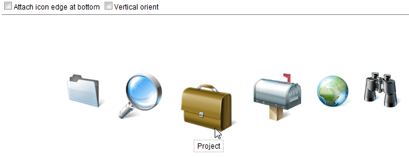

# Fisheyebar

- Demonstration:
  [Fisheyebar](http://www.zkoss.org/zkdemo/menu/fisheye_menu)
- Java API: <javadoc>org.zkoss.zkex.zul.Fisheyebar</javadoc>
- JavaScript API:
  <javadoc directory="jsdoc">zkex.menu.Fisheyebar</javadoc>
- Style Guide: [
  Fisheyebar](ZK_Style_Guide/XUL_Component_Specification/Fisheyebar)
- [Available in ZK PE and EE
  only](http://www.zkoss.org/product/edition.dsp)

# Employment/Purpose

A fisheye bar is a bar of fisheye that is a menu similar to the fish eye
menu on the Mac OS.

# Example



``` xml
<zk>
    <div height="450px">
        <checkbox label="Attach icon edge at bottom"
            onCheck='fsb.attachEdge=self.checked?"bottom":"top"' />
        <checkbox label="Vertical orient"
            onCheck='fsb.orient=self.checked?"vertical":"horizontal"' />
        <separator bar="true" />
        <fisheyebar id="fsb" style="position:absolute;margin:80px 150px;"
            attachEdge="top" itemWidth="80" itemHeight="80" itemMaxHeight="160" itemMaxWidth="160">
            <fisheye image="/img/Centigrade-Widget-Icons/FolderABlue-128x128.png" label="Folder"
                onClick="alert(self.label)" />
            <fisheye image="/img/Centigrade-Widget-Icons/ReadingGlass-128x128.png" label="Reading Glasses"
                onClick="alert(self.label)" />
            <fisheye image="/img/Centigrade-Widget-Icons/Briefcase-128x128.png" label="Project"
                onClick="alert(self.label)" />
            <fisheye image="/img/Centigrade-Widget-Icons/MailboxFlag-128x128.png"
                label="Email" onClick="alert(self.label)" />
            <fisheye image="/img/Centigrade-Widget-Icons/Globe-128x128.png"
                label="Globe" onClick="alert(self.label)" />
            <fisheye image="/img/Centigrade-Widget-Icons/Spyglass-128x128.png" label="Spyglass"
                onClick="alert(self.label)" />
        </fisheyebar>
    </div>
</zk>
```

# Supported Events

<table>
<thead>
<tr class="header">
<th><center>
<p>Name</p>
</center></th>
<th><center>
<p>Event Type</p>
</center></th>
</tr>
</thead>
<tbody>
<tr class="odd">
<td><p>None</p></td>
<td><p>None</p></td>
</tr>
</tbody>
</table>

- Inherited Supported Events: [
  XulElement](ZK_Component_Reference/Base_Components/XulElement#Supported_Events)

# Supported Children

`*`[` Fisheye`](ZK_Component_Reference/Essential_Components/Fisheye)

# Use Cases

| Version | Description | Example Location |
|---------|-------------|------------------|
|         |             |                  |

# Version History


| Version | Date | Content |
|---------|------|---------|
|         |      |         |


