 

# Fusionchart

- Demonstration:
- Java API: <javadoc>org.zkoss.zkmax.zul.Fusionchart</javadoc>
- JavaScript API:
  <javadoc directory="jsdoc">zkmax.fusionchartz.Fusionchart</javadoc>
- Style Guide: N/A
- 
- ZK Fushionchart has now entered maintenance mode as of Q2, 2014 as the
  3rd party library that it's based on - Fusioncharts free, has moved
  out of flash and stopped supporting it.

# Employment/Purpose

The Fusionchart which integrates the [FusionCharts
Free](http://www.fusioncharts.com/free/) with ZK. The technology makes
use of Flash to draw charts and enables the user to customize the style
of charts such as bar or line colors.

Fusionchart separates the presentation layer from the data, providing
the users with a API to supply data in a clean MVC based manner. In
addition to updating the data dynamically, it provides a pleasant user
experience as the visual display is updated immediately.

# Common Attributes

<table>
<thead>
<tr class="header">
<th><center>
<p>Name</p>
</center></th>
<th><center>
<p>Description</p>
</center></th>
</tr>
</thead>
<tbody>
<tr class="odd">
<td><p>title</p></td>
<td><p>Title of chart</p></td>
</tr>
<tr class="even">
<td><p>threeD</p></td>
<td><p>Set true to show three dimensional graph(Note: Some types may not
support 3D)</p></td>
</tr>
<tr class="odd">
<td><p>type</p></td>
<td><p>Type of chart</p></td>
</tr>
<tr class="even">
<td><p>fgAlpha</p></td>
<td><p>Foreground alpha</p></td>
</tr>
<tr class="odd">
<td><p>model</p></td>
<td><p>Model of chart</p></td>
</tr>
</tbody>
</table>

# Supported Model

<table>
<thead>
<tr class="header">
<th><center>
<p>Type</p>
</center></th>
<th><center>
<p>Model</p>
</center></th>
<th><center>
<p>3D</p>
</center></th>
</tr>
</thead>
<tbody>
<tr class="odd">
<td><p>bar</p></td>
<td><p>CategoryModel</p></td>
<td><p>*</p></td>
</tr>
<tr class="even">
<td><p>line</p></td>
<td><p>CategoryModel, XYModel</p></td>
<td><p>X</p></td>
</tr>
<tr class="odd">
<td><p>pie</p></td>
<td><p>PieModel, SingleValueCategoryModel</p></td>
<td><p>O</p></td>
</tr>
<tr class="even">
<td><p>funnel</p></td>
<td><p>SingleValueCategoryModel</p></td>
<td><p>X</p></td>
</tr>
<tr class="odd">
<td><p>combination</p></td>
<td><p>CategoryModel</p></td>
<td><p>O</p></td>
</tr>
<tr class="even">
<td><p>stacked_bar</p></td>
<td><p>CategoryModel</p></td>
<td><p>O</p></td>
</tr>
<tr class="odd">
<td><p>area</p></td>
<td><p>CategoryModel</p></td>
<td><p>X</p></td>
</tr>
<tr class="even">
<td><p>gantt</p></td>
<td><p>GanttModel</p></td>
<td><p>X</p></td>
</tr>
</tbody>
</table>

**Note:** 3D bar chart of Fusionchart does not support horizontal
orientation now. If you want to use horizontal 3D bar chart, please use
Chart component.

# Example

## Bar Chart

### 2D Bar Chart

#### Vertical Bar Chart

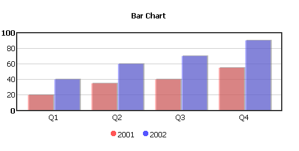

``` xml
<zk>
    <div  apply="demo.BarchartComposer">
        <fusionchart id="mychart" title="Bar Chart" type="bar" width="500" height="250" />
    </div>
</zk>
```

``` java
public class BarchartComposer extends SelectorComposer<Div> {
    
    @Wire
    private Fusionchart mychart;

    public void doAfterCompose(Div comp) throws Exception {
        super.doAfterCompose(comp);

        CategoryModel catmodel = new SimpleCategoryModel();
        catmodel.setValue("2001", "Q1", new Integer(20));
        catmodel.setValue("2001", "Q2", new Integer(35));
        catmodel.setValue("2001", "Q3", new Integer(40));
        catmodel.setValue("2001", "Q4", new Integer(55));
        catmodel.setValue("2002", "Q1", new Integer(40));
        catmodel.setValue("2002", "Q2", new Integer(60));
        catmodel.setValue("2002", "Q3", new Integer(70));
        catmodel.setValue("2002", "Q4", new Integer(90));
        
        mychart.setModel(catmodel);
    }
}
```

#### Horizontal Bar Chart

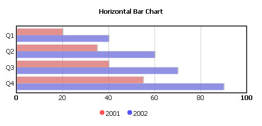

``` xml
<zk>
    <div  apply="demo.BarchartComposer">
        <fusionchart id="mychart" title="Horizontal Bar Chart" type="bar" orient="horizontal" width="500" height="250" />
    </div>
</zk>
```

``` java
public class BarchartComposer extends SelectorComposer<Div> {
    
    @Wire
    private Fusionchart mychart;

    public void doAfterCompose(Div comp) throws Exception {
        super.doAfterCompose(comp);

        CategoryModel catmodel = new SimpleCategoryModel();
        catmodel.setValue("2001", "Q1", new Integer(20));
        catmodel.setValue("2001", "Q2", new Integer(35));
        catmodel.setValue("2001", "Q3", new Integer(40));
        catmodel.setValue("2001", "Q4", new Integer(55));
        catmodel.setValue("2002", "Q1", new Integer(40));
        catmodel.setValue("2002", "Q2", new Integer(60));
        catmodel.setValue("2002", "Q3", new Integer(70));
        catmodel.setValue("2002", "Q4", new Integer(90));
        
        mychart.setModel(catmodel);
    }
}
```

### 3D Vertical Bar Chart

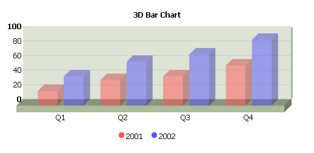

``` xml
<zk>
    <div  apply="demo.BarchartComposer">
        <fusionchart id="mychart" title="3D Bar Chart" type="bar" threeD="true" width="500" height="250" />
    </div>
</zk>
```

``` java
public class BarchartComposer extends SelectorComposer<Div> {
    
    @Wire
    private Fusionchart mychart;

    public void doAfterCompose(Div comp) throws Exception {
        super.doAfterCompose(comp);

        CategoryModel catmodel = new SimpleCategoryModel();
        catmodel.setValue("2001", "Q1", new Integer(20));
        catmodel.setValue("2001", "Q2", new Integer(35));
        catmodel.setValue("2001", "Q3", new Integer(40));
        catmodel.setValue("2001", "Q4", new Integer(55));
        catmodel.setValue("2002", "Q1", new Integer(40));
        catmodel.setValue("2002", "Q2", new Integer(60));
        catmodel.setValue("2002", "Q3", new Integer(70));
        catmodel.setValue("2002", "Q4", new Integer(90));
        
        mychart.setModel(catmodel);
    }
}
```

### Bar Chart Configurations

You could set the color of all categories in the CategoryChartConfig,
here's a sample code for setting first one and second one to different
color .

``` java
    CategoryChartConfig config = new CategoryChartConfig();
        config.setAnimation(false);  //You could turn off the animation ,which default is enabled.

    SeriesPropertiesMap seriesPropertiesMap = config.getSeriesPropertiesMap();
    // Use the index to config the chart 
    // The color value is required to be HEX code without # due to the restriction of Fuscionchart core. 
    seriesPropertiesMap.createSeriesProperties(0).addProperty("color","AFD8F8");  
    seriesPropertiesMap.createSeriesProperties(1).addProperty("color","FF8000");

// ==== Or  another way , use category name instead of index ==== //
//  seriesPropertiesMap.createSeriesProperties("2001").addProperty("color","AFD8F8");
//  seriesPropertiesMap.createSeriesProperties("2002").addProperty("color","FF8000");         
    fusionchart.setChartConfig(config);
```

The color is changed after we set the config ,here's the demo image.
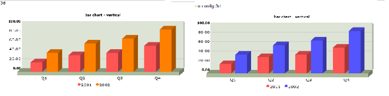

## Line Chart

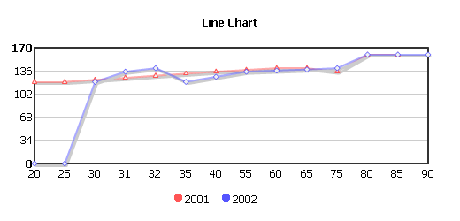

``` xml
<zk>
    <div  apply="demo.LinechartComposer">
        <fusionchart id="mychart" title="Line Chart" type="line" width="500" height="250" />
    </div>
</zk>
```

``` java
public class LinechartComposer extends SelectorComposer<Div> {

    @Wire
    private Fusionchart mychart;

    public void doAfterCompose(Div comp) throws Exception {
        super.doAfterCompose(comp);

        XYModel xymodel = new SimpleXYModel();
        xymodel.addValue("2001", new Integer(20), new Integer(120));
        xymodel.addValue("2001", new Integer(25), new Integer(120));
        xymodel.addValue("2001", new Integer(30), new Integer(125));
        xymodel.addValue("2001", new Integer(31), new Integer(130));
        xymodel.addValue("2001", new Integer(32), new Integer(132));
        xymodel.addValue("2001", new Integer(35), new Integer(133));
        xymodel.addValue("2001", new Integer(40), new Integer(135));
        xymodel.addValue("2001", new Integer(55), new Integer(136));
        xymodel.addValue("2001", new Integer(60), new Integer(137));
        xymodel.addValue("2001", new Integer(65), new Integer(138));
        xymodel.addValue("2001", new Integer(75), new Integer(135));
        xymodel.addValue("2001", new Integer(80), new Integer(160));
        xymodel.addValue("2001", new Integer(85), new Integer(160));
        
        xymodel.addValue("2002", new Integer(20), new Integer(0));
        xymodel.addValue("2002", new Integer(25), new Integer(0));
        xymodel.addValue("2002", new Integer(30), new Integer(120));
        xymodel.addValue("2002", new Integer(31), new Integer(135));
        xymodel.addValue("2002", new Integer(32), new Integer(140));
        xymodel.addValue("2002", new Integer(35), new Integer(120));
        xymodel.addValue("2002", new Integer(40), new Integer(135));
        xymodel.addValue("2002", new Integer(55), new Integer(135));
        xymodel.addValue("2002", new Integer(60), new Integer(140));
        xymodel.addValue("2002", new Integer(65), new Integer(140));
        xymodel.addValue("2002", new Integer(75), new Integer(140));
        xymodel.addValue("2002", new Integer(80), new Integer(160));
        xymodel.addValue("2002", new Integer(85), new Integer(160));
        xymodel.addValue("2002", new Integer(90), new Integer(160));

        mychart.setModel(xymodel);
    }
}
```

#### Line Chart Configurations

``` java
        CategoryChartConfig config = new CategoryChartConfig();
        config.setAnimation(false);  //You could turn off the animation ,which default is enabled.
        config.getChartProperties().addProperty("rotateNames", "1"); 

        SeriesPropertiesMap seriesPropertiesMap = config.getSeriesPropertiesMap();

               //Create Seriess Properties by index , you could use  category name , too
               //ex. seriesPropertiesMap.createSeriesProperties("2001") 
        seriesPropertiesMap.createSeriesProperties(0) 
                .addProperty("color", "AFD8F8") ;    //change color 
        seriesPropertiesMap.createSeriesProperties(1)
                .addProperty("anchorBorderColor", "FF8000") //change series color
                .addProperty("lineThickness", "5"); //Change line weight
        fusionchart.setChartConfig(config);
```

## Pie Chart

### 2D Pie Chart

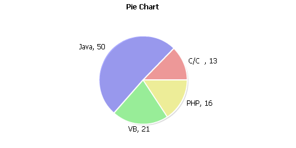

``` xml
<zk>
    <div  apply="demo.PiechartComposer">
        <fusionchart id="mychart" title="2D Pie Chart" type="pie" width="500" height="250" />
    </div>
</zk>
```

``` java
public class PiechartComposer extends SelectorComposer<Div> {

    @Wire
    private Fusionchart mychart;

    @Override
    public void doAfterCompose(Div comp) throws Exception {
        super.doAfterCompose(comp);

        PieModel piemodel = new SimplePieModel();
        piemodel.setValue("C/C++", new Double(12.5));
        piemodel.setValue("Java", new Double(50.2));
        piemodel.setValue("VB", new Double(20.5));
        piemodel.setValue("PHP", new Double(15.5));
        
        mychart.setModel(piemodel);
    }
}
```

### 3D Pie Chart

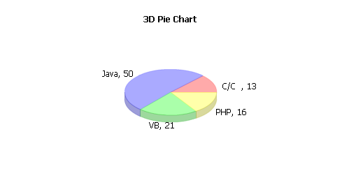

``` xml
<zk>
    <div  apply="demo.PiechartComposer">
        <fusionchart id="mychart" title="3D Pie Chart" type="pie" threeD="true" width="500" height="250" />
    </div>
</zk>
```

``` java
public class PiechartComposer extends SelectorComposer<Div> {

    @Wire
    private Fusionchart mychart;

    @Override
    public void doAfterCompose(Div comp) throws Exception {
        super.doAfterCompose(comp);

        PieModel piemodel = new SimplePieModel();
        piemodel.setValue("C/C++", new Double(12.5));
        piemodel.setValue("Java", new Double(50.2));
        piemodel.setValue("VB", new Double(20.5));
        piemodel.setValue("PHP", new Double(15.5));
        
        mychart.setModel(piemodel);
    }
}
```

## Funnel Chart

``


``` xml
<zk>
    <div  apply="demo.FunnelchartComposer ">
        <fusionchart id="mychart" width="550" height="400" type="funnel" />
    </div>
</zk>
```

``` java
public class FunnelchartComposer extends SelectorComposer<Div> {

    @Wire
    private Fusionchart mychart;

    @Override
    public void doAfterCompose(Div comp) throws Exception {
        super.doAfterCompose(comp);

        SingleValueCategoryModel model = new SimpleSingleValueCategoryModel();
        model.setValue("Step 1", new Double(21.2));
        model.setValue("Step 2", new Double(10.2));
        model.setValue("Step 3", new Double(40.4));
        model.setValue("Step 4", new Double(28.2));
        model.setValue("Step 5", new Double(21.2));
        model.setValue("Step 6", new Double(10.2));
        model.setValue("Step 7", new Double(40.4));
        model.setValue("Step 8", new Double(28.2));
        
        mychart.setModel(model);
    }
}
```

## Combination Chart

### 2D Combination Chart

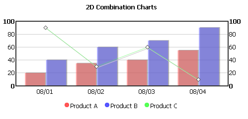

``` xml
<zk>
    <div  apply="demo.CombinationchartComposer">
        <fusionchart id="mychart" title="2D Combination Charts" type="combination" width="500" height="250" />
    </div>
</zk>
```

``` java
public class CombinationchartComposer extends SelectorComposer<Div> {

    @Wire
    private Fusionchart mychart;

    @Override
    public void doAfterCompose(Div comp) throws Exception {
        super.doAfterCompose(comp);

        CategoryModel catmodel = new SimpleCategoryModel();
        catmodel.setValue("Product A", "08/01", new Integer(20));
        catmodel.setValue("Product A", "08/02", new Integer(35));
        catmodel.setValue("Product A", "08/03", new Integer(40));
        catmodel.setValue("Product A", "08/04", new Integer(55));
        catmodel.setValue("Product B", "08/01", new Integer(40));
        catmodel.setValue("Product B", "08/02", new Integer(60));
        catmodel.setValue("Product B", "08/03", new Integer(70));
        catmodel.setValue("Product B", "08/04", new Integer(90));
        catmodel.setValue("Product C", "08/01", new Integer(90));
        catmodel.setValue("Product C", "08/02", new Integer(30));
        catmodel.setValue("Product C", "08/03", new Integer(60));
        catmodel.setValue("Product C", "08/04", new Integer(10));
        
        CategoryChartConfig config = new CategoryChartConfig();
        SeriesPropertiesMap sPropertiesMap = config.getSeriesPropertiesMap();
        
        sPropertiesMap.createSeriesProperties("Product A").addProperty("parentYAxis", "P");
        sPropertiesMap.createSeriesProperties("Product B").addProperty("parentYAxis", "S");
        sPropertiesMap.createSeriesProperties("Product C").addProperty("parentYAxis", "S");
        
        mychart.setChartConfig(config);
        mychart.setModel(catmodel);
    }
}
```

### 3D Combination Chart

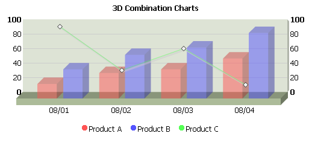

``` xml
<zk>
    <div  apply="demo.CombinationchartComposer">
        <fusionchart id="mychart" title="3D Combination Charts" type="combination" threeD="true" width="500" height="250" />
    </div>
</zk>
```

``` java
public class CombinationchartComposer extends SelectorComposer<Div> {

    @Wire
    private Fusionchart mychart;

    @Override
    public void doAfterCompose(Div comp) throws Exception {
        super.doAfterCompose(comp);

        CategoryModel catmodel = new SimpleCategoryModel();
        catmodel.setValue("Product A", "08/01", new Integer(20));
        catmodel.setValue("Product A", "08/02", new Integer(35));
        catmodel.setValue("Product A", "08/03", new Integer(40));
        catmodel.setValue("Product A", "08/04", new Integer(55));
        catmodel.setValue("Product B", "08/01", new Integer(40));
        catmodel.setValue("Product B", "08/02", new Integer(60));
        catmodel.setValue("Product B", "08/03", new Integer(70));
        catmodel.setValue("Product B", "08/04", new Integer(90));
        catmodel.setValue("Product C", "08/01", new Integer(90));
        catmodel.setValue("Product C", "08/02", new Integer(30));
        catmodel.setValue("Product C", "08/03", new Integer(60));
        catmodel.setValue("Product C", "08/04", new Integer(10));
        
        CategoryChartConfig config = new CategoryChartConfig();
        SeriesPropertiesMap sPropertiesMap = config.getSeriesPropertiesMap();
        
        sPropertiesMap.createSeriesProperties("Product A").addProperty("parentYAxis", "P");
        sPropertiesMap.createSeriesProperties("Product B").addProperty("parentYAxis", "S");
        sPropertiesMap.createSeriesProperties("Product C").addProperty("parentYAxis", "S");
        
        mychart.setChartConfig(config);
        mychart.setModel(catmodel);
    }
}
```

## Stacked Chart

### 2D Stacked Chart

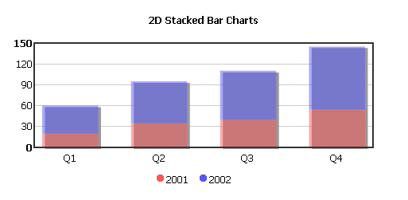

``` xml
<zk>
    <div  apply="demo.StackedchartComposer">
        <fusionchart id="mychart" title="2D Stacked Charts" type="stacked_bar" width="500" height="250" />
    </div>
</zk>
```

``` java
public class StackedchartComposer extends SelectorComposer<Div> {

    @Wire
    private Fusionchart mychart;
    
    @Override
    public void doAfterCompose(Div comp) throws Exception {
        super.doAfterCompose(comp);

        CategoryModel catmodel = new SimpleCategoryModel();
        catmodel.setValue("2001", "Q1", new Integer(20));
        catmodel.setValue("2001", "Q2", new Integer(35));
        catmodel.setValue("2001", "Q3", new Integer(40));
        catmodel.setValue("2001", "Q4", new Integer(55));
        catmodel.setValue("2002", "Q1", new Integer(40));
        catmodel.setValue("2002", "Q2", new Integer(60));
        catmodel.setValue("2002", "Q3", new Integer(70));
        catmodel.setValue("2002", "Q4", new Integer(90));
        
        mychart.setModel(catmodel);
    }
}
```

### 3D Stacked Chart

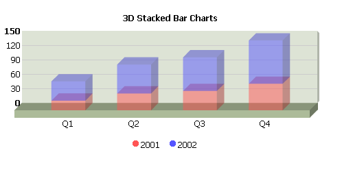

``` xml
<zk>
    <div  apply="demo.StackedchartComposer">
        <fusionchart id="mychart" title="3D Stacked Charts" type="stacked_bar" threeD="true" width="500" height="250" />
    </div>
</zk>
```

``` java
public class StackedchartComposer extends SelectorComposer<Div> {

    @Wire
    private Fusionchart mychart;
    
    @Override
    public void doAfterCompose(Div comp) throws Exception {
        super.doAfterCompose(comp);

        CategoryModel catmodel = new SimpleCategoryModel();
        catmodel.setValue("2001", "Q1", new Integer(20));
        catmodel.setValue("2001", "Q2", new Integer(35));
        catmodel.setValue("2001", "Q3", new Integer(40));
        catmodel.setValue("2001", "Q4", new Integer(55));
        catmodel.setValue("2002", "Q1", new Integer(40));
        catmodel.setValue("2002", "Q2", new Integer(60));
        catmodel.setValue("2002", "Q3", new Integer(70));
        catmodel.setValue("2002", "Q4", new Integer(90));
        
        mychart.setModel(catmodel);
    }
}
```

## Area Chart

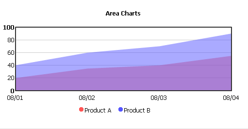

``` xml
<zk>
    <window border="none"  apply="demo.AreachartComposer">
        <fusionchart id="mychart" title="Area Charts" type="area" width="500" height="250" />
    </window>
</zk>
```

``` java
public class AreachartComposer extends SelectorComposer<Div> {
    @Wire
    private Fusionchart mychart;
    
    @Override
    public void doAfterCompose(Div comp) throws Exception {
        super.doAfterCompose(comp);

        CategoryModel catmodel = new SimpleCategoryModel();
        catmodel.setValue("2001", "Q1", new Integer(20));
        catmodel.setValue("2001", "Q2", new Integer(35));
        catmodel.setValue("2001", "Q3", new Integer(40));
        catmodel.setValue("2001", "Q4", new Integer(55));
        catmodel.setValue("2002", "Q1", new Integer(40));
        catmodel.setValue("2002", "Q2", new Integer(60));
        catmodel.setValue("2002", "Q3", new Integer(70));
        catmodel.setValue("2002", "Q4", new Integer(90));
        
        mychart.setModel(catmodel);
    }
}
```

## Gantt Chart

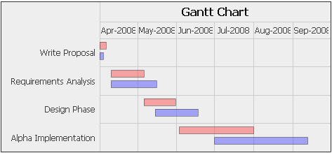

``` xml
<zk>
    <div  apply="demo.GanttchartComposer">
        <fusionchart id="mychart" title="Gantt Chart" type="gantt" width="500" height="250" />
    </div>
</zk>
```

``` java
public class GanttchartComposer extends SelectorComposer<Div> {
    @Wire
    private Fusionchart mychart;

    @Override
    public void doAfterCompose(Div comp) throws Exception {
        super.doAfterCompose(comp);

        GanttModel ganttmodel = new GanttModel();

        String scheduled = "Scheduled";
        String actual = "Actual";

        ganttmodel.addValue(scheduled, new GanttTask("Write Proposal", date(2008, 4, 1), date(2008, 4, 5), 0.0));
        ganttmodel.addValue(scheduled, new GanttTask("Requirements Analysis", date(2008, 4, 10), date(2008, 5, 5), 0.0));
        ganttmodel.addValue(scheduled, new GanttTask("Design Phase", date(2008, 5, 6), date(2008, 5, 30), 0.0));
        ganttmodel.addValue(scheduled, new GanttTask("Alpha Implementation", date(2008, 6, 3), date(2008, 7, 31), 0.0));

        ganttmodel.addValue(actual, new GanttTask("Write Proposal", date(2008, 4, 1), date(2008, 4, 3), 0.0));
        ganttmodel.addValue(actual, new GanttTask("Requirements Analysis", date(2008, 4, 10), date(2008, 5, 15), 0.0));
        ganttmodel.addValue(actual, new GanttTask("Design Phase", date(2008, 5, 15), date(2008, 6, 17), 0.0));
        ganttmodel.addValue(actual, new GanttTask("Alpha Implementation", date(2008, 7, 1), date(2008, 9, 12), 0.0));

        mychart.setModel(ganttmodel);
    }

    @Listen("onClick = #mychart")
    public void show(Event event) {
        Map data = (Map) event.getData();
        Messagebox.show(data.toString());
    }
    
    private Date date(int year, int month, int day) {
        final java.util.Calendar calendar = java.util.Calendar.getInstance();
        calendar.set(year, month - 1, day);
        return calendar.getTime();
    }
}
```

# Event Handling

Fusionchart supports mouse clicking event. You can receive information
from event object, including clicked series, category, and value.

The following sample will show how to get an event object and display
information on a message dialog.

``` java
public class FusionchartComposer extends SelectorComposer<Div> {
    @Wire
    private Fusionchart mychart;
    
    @Override
    public void doAfterCompose(Window comp) throws Exception {
        super.doAfterCompose(comp);
        // omitted...
    }
    
    @Listen("onClick = #mychart")
    public void show(Event event) {
        Map data = (Map) event.getData();
        Messagebox.show(data.toString());
    }
}
```

# Supported Events

<table>
<thead>
<tr class="header">
<th><center>
<p>Name</p>
</center></th>
<th><center>
<p>Event Type</p>
</center></th>
</tr>
</thead>
<tbody>
<tr class="odd">
<td><p>onClick</p></td>
<td><p>Mouse clicking event. You can get information of clicked area
from this event.</p></td>
</tr>
</tbody>
</table>

# Supported Children

`*None`

# Use Cases

| Version | Description | Example Location |
|---------|-------------|------------------|
|         |             |                  |

# Version History


| Version | Date        | Content                             |
|---------|-------------|-------------------------------------|
| 6.0.1   | April. 2012 | add new component                   |
| 6.5.3   | June 2013   | add Fusion Funnel chart integration |
| All     | April 2014  | entering maintenance mode           |


