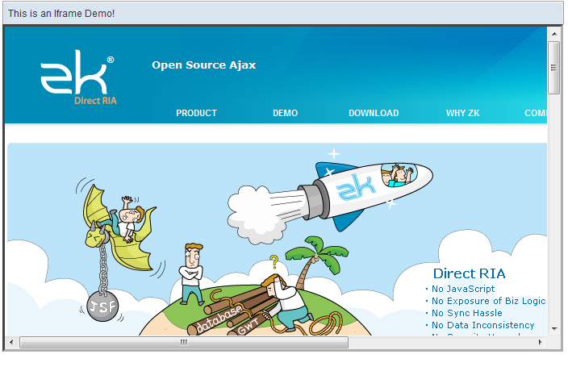

# Iframe

- Demonstration: [Iframe](http://www.zkoss.org/zkdemo/composite/iframe)
- Java API: <javadoc>org.zkoss.zul.Iframe</javadoc>
- JavaScript API: <javadoc directory="jsdoc">zul.utl.Iframe</javadoc>
- Style Guide: N/A

# Employment/Purpose

The `iframe`component uses the HTML IFRAME tag to delegate a portion of
the display to another URL. Though the appearance looks similar to the
`include`component. The concept and meaning of the `iframe`component is
different.

The content included by the `include`component is a fragment of the
whole HTML page.

Because the content is part of the HTML page, the content is part of the
desktop and you could access any components, if any, inside of the
`include`component. The inclusion is done at the server, and the browser
knows nothing about it. It means the URL specified by the `src`property
could be any internal resource.

The content of the `iframe`component is loaded by the browser as a
separate page. Because it is loaded as a separate page, the format of
the content could be different from HTML. For example, you could embed
an PDF file.

The embeddingis done by the browser, when it interprets the HTML page
containing the IFRAME tag. It also implies that the URL must be a
resource that you can access from the browser.

Like the `image`and `audio`components, you could specify the dynamically
generated content. A typical example is you could use JasperReport to
generate a PDF report in a binary array or stream, and then pass the
report to an `iframe`component by wrapping the result with the
`org.zkoss.util.media.AMedia`class.

In the following example, we illustrate that you could embed any content
by use of `iframe`, as long as the client supports its format.

# Example



``` xml
<window id="win" title="This is an Iframe Demo!">
    <iframe style="width:99%; height:400px;border:3px inset;" src="iframe-target-url-here" />
</window>
```

Live iframe demo is available [in the zk
demo](https://www.zkoss.org/zkdemo/composite/iframe).

# The onURIChange Event

When the user navigates the `iframe` component to another URL (or
bookmark), an object of
<javadoc>org.zkoss.zk.ui.event.URIEvent</javadoc> is sent to the
`iframe` component. This event is usually used to bookmark the status of
the `iframe` component, such that the right content can be restored
later.

## Integrate with Other Technologies

The `onURIChange` event won't be sent if the `iframe` component contains
a non-ZK page. For example, it won't be sent if it contains a PDF page.

On the other hand, if you use other technologies to put a ZK page in an
iframe, you can monitor the URL by writing a JavaScript method called
<javadoc directory="jsdoc" method="onIframeURLChange(_global_.String, _global_.String)">\_global\_.\_global\_</javadoc>
as follows.

``` xml
 //Part of your, say, PHP page
 <script type="text/script">
 function onIframeURLChange(uuid, url) {
     do_whatever_you_need_in_the_technology_you_use(uuid, url);
 }
 </script>
```

where `uuid` is the ID of the element that you can retrieve by
`document.getElementById`, and `url`is the new URL that the iframe is
navigated to. Notice that `url` includes the context path, while
<javadoc method="getURI()">org.zkoss.zk.ui.event.URIEvent</javadoc> does
*not*.

# Retrieving Component inside Iframe

When using `iframe`, the page is actually loaded into another browser
window, aka., another desktop if a ZUML document is included.

It is illegal to access components attached to other desktops[^1]. If
you want to retrieve component, you may use
<javadoc>org.zkoss.zul.Include</javadoc> instead of
<javadoc>org.zkoss.zul.Iframe</javadoc>. Or, you could use [Event
Queues](ZK_Developer's_Reference/Event_Handling/Event_Queues)
with the group scope. Of course, you could handle it manually by
deliberately passing the information through session.

> ------------------------------------------------------------------------
>
> <references/>

# Communication among iFrames without Server Push

 

If your application contains multiple desktops due to iframes in a
portal layout it is now possible to communicate between these instances
without the need for server push or timer. It thus minimizes the network
traffic.

Since ZK 5.0.4, the concept of group has been introduced to enable the
use of a group-scope event queue which facilitates easy communication
between the instances. The code below demonstrates some examples:

``` javascript
EventQueue que = EventQueues.lookup("groupTest", EventQueues.GROUP, true);

que.subscribe(new EventListener() {
   public void onEvent(Event evt) {
      o.setValue(o.getValue() + evt.getData() + "\n");
   }
});

void publish() {
   String text = i.getValue();

   if (text.length() > 0) {
      i.setValue("");
      que.publish(new Event("onGroupTest", null, text));
   }
}
```

For more information please take a look at [ZK Developer's Reference:
Event
Queues](ZK_Developer's_Reference/Event_Handling/Event_Queues).

# onload

If you'd like to do something when iframe's content has been loaded, you
could listen to the `onload` event. However, unlike onChange and others,
you could not listen the widget-level event
(<javadoc directory="jsdoc">zk.Event</javadoc> and listened by use of
[Client-side Event
Listening](ZK_Client-side_Reference/General_Control/Event_Listening)),
because the onload event might be fired before the widget has been bound
to DOM.

Rather, you shall use [the client-attribute
namespace](ZUML_Reference/ZUML/Namespaces/Client_Attribute)
to register a DOM-level listener as follows.

``` xml
<iframe src="https://www.google.com"  height="300px"
  xmlns:ca="client/attribute"
  ca:onload="do_whater_you_want()"/>
```

Notice that the registration of onload with the client-attribute
namespace is DOM-level, so the `this` variable references to the DOM
element (rather than the widget).

# Supported Events

<table>
<thead>
<tr class="header">
<th><center>
<p>Name</p>
</center></th>
<th><center>
<p>Event Type</p>
</center></th>
</tr>
</thead>
<tbody>
<tr class="odd">
<td><center>
<p><code>onURIChange</code></p>
</center></td>
<td><p><strong>Event:</strong>
<javadoc>org.zkoss.zk.ui.event.URIEvent</javadoc></p>
<p>Denotes the associated URI (<code>src</code>) has been changed by
user.</p>
<p>Use <code>getURI()</code> to retrieve the URI being changed
to.</p></td>
</tr>
</tbody>
</table>

- Inherited Supported Events: [
  HtmlBasedComponent](ZK_Component_Reference/Base_Components/HtmlBasedComponent#Supported_Events)

# Supported Children

`*NONE`

# Use Cases

| Version      | Description          | Example Location                                                                              |
|--------------|----------------------|-----------------------------------------------------------------------------------------------|
| 3.6 or later | Print Iframe Content | [<http://www.zkoss.org/forum/listComment/6599>](https://www.zkoss.org/forum/listComment/6599) |

# Version History


| Version | Date | Content |
|---------|------|---------|
|         |      |         |


[^1]: For more information please refer to the [Component-based
    UI](ZK_Developer's_Reference/UI_Composing/Component-based_UI)
    section
