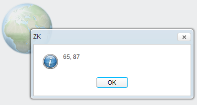

# Imagemap

- Demonstration: N/A
- Java API: <javadoc>org.zkoss.zul.Imagemap</javadoc>
- JavaScript API: <javadoc directory="jsdoc">zul.wgt.Imagemap</javadoc>
- Style Guide: N/A

# Employment/Purpose

A `imagemap` component is a special image. It accepts whatever
properties an `image`component accepts. However, unlike `image`, if a
user clicks on the image, an `onClick` event is sent back to the server
with the coordinates of the mouse position. In contrast, the
`onClick`event sent by `image` doesn't contain the coordinates.

The coordinates of the mouse position are screen pixels counted from the
upper-left corner of the image beginning with (0, 0). It is stored as
instance of `org.zkoss.zk.ui.event .MouseEvent`. Once a controller
receives the `onClick` event, it can get the coordinates of the mouse
position by `getX()` and `getY()`.

Note: Don't try to use CSS background as your image, the image map need
a real image or it won't work.

# Example

``` xml
<imagemap src="/img/sun.jpg" onClick="alert(event.x + &quot;, &quot; +event.y)"/>
```

For example, if a user clicks 208 pixels over and 205 pixels down from
the upper-left corner of the image displayed from the following
statement, then the user gets the result as depicted below.



# Supported Events

<table>
<thead>
<tr class="header">
<th><center>
<p>Name</p>
</center></th>
<th><center>
<p>Event Type</p>
</center></th>
</tr>
</thead>
<tbody>
<tr class="odd">
<td><p>None</p></td>
<td><p>None</p></td>
</tr>
</tbody>
</table>

- Inherited Supported Events: [
  Image](ZK_Component_Reference/Essential_Components/Image#Supported_Events)

# Supported Children

`*`[` Area`](ZK_Component_Reference/Essential_Components/Imagemap/Area)

# Use Cases

| Version | Description                                         | Example Location                                                                             |
|---------|-----------------------------------------------------|----------------------------------------------------------------------------------------------|
| 3.6     | How to get area clicked from Imagemap onClick Event | [<http://www.zkoss.org/forum/listComment/1336>](http://www.zkoss.org/forum/listComment/1336) |
| 3.6     | Imagemap with hyperlink                             | [<http://www.zkoss.org/forum/listComment/3016>](http://www.zkoss.org/forum/listComment/3016) |

# Version History


| Version | Date | Content |
|---------|------|---------|
|         |      |         |


