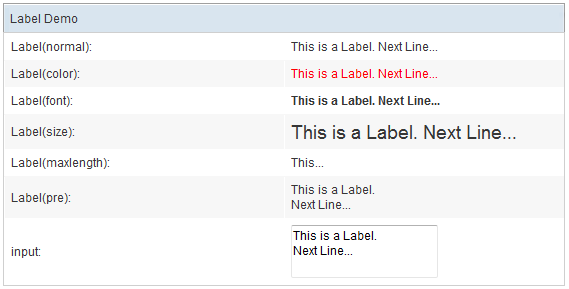

# Label

- Demonstration: [Label](http://www.zkoss.org/zkdemo/input/form_sample)
- Java API: <javadoc>org.zkoss.zul.Label</javadoc>
- JavaScript API: <javadoc directory="jsdoc">zul.wgt.Label</javadoc>
- Style Guide: [
  Label](ZK_Style_Guide/XUL_Component_Specification/Label)

# Employment/Purpose

A label component represents a piece of text. A pure text on the zul
will be automatically converted to a label.

# Example



``` xml
 <window title="Label Demo" >
 <grid>
     <rows>
         <row>Label(normal): <label id="lb1"/></row>
         <row>Label(color): <label id="lb2" style="color:red"/></row>
         <row>Label(font): <label id="lb3" style="font-weight:bold"/></row>
         <row>Label(size): <label id="lb4" style="font-size:14pt"/></row>
         <row>Label(maxlength): <label id="lb5" maxlength="5"/></row>
         <row>Label(pre): <label id="lb6" pre="true"/></row>
         <row>input:
             <textbox id="txt" rows="2"><attribute name="onChange">
                     lb1.value=self.value;
                     lb2.value=self.value;
                     lb3.value=self.value;
                     lb4.value=self.value;
                     lb5.value=self.value;
                     lb6.value=self.value;
             </attribute></textbox>
         </row>
     </rows>
 </grid>
 </window>
```

You can control how a label is displayed with the `style`, `pre` and
`maxlength` Properties.

For example, if you specify `pre` to be `true`, all white spaces, such
as new line, space and tab, are preserved.

A label component represents a piece of text.

<figure>

<figcaption>ZKComRef_Label_Example2.png</figcaption>
</figure>

``` xml
<window border="normal"> 
    Hello World
</window>
```

If you want to add an attribute to a label, it has to be written as
follows:

<figure>

<figcaption>ZKComRef_Label_Example3.png</figcaption>
</figure>

``` xml
<window border="normal">
    <label style="color: red" value="Hello World" />
</window>
```

# Special Character

Since ZUML is XML, not HTML, so it doesn't accept
<strong>`&`</strong>`nbsp;`. However, you can use
<strong>`&`</strong>`#160;` instead. For the whole list, please refer th
[List of XML and HTML character entity
references](https://en.wikipedia.org/wiki/List_of_XML_and_HTML_character_entity_references).

# Properties

## Pre, Hyphen, Maxlength and Multiline



You can control how a label is displayed using the `pre`, `multiline`
and `maxlength` properties. For example, if you specify `pre` to be
true, all white spaces, such as new lines, spaces and tabs, are
preserved.

<table>
<thead>
<tr class="header">
<th><center>
<p>pre</p>
</center></th>
<th><center>
<p>multiline</p>
</center></th>
<th><center>
<p>maxlenth</p>
</center></th>
<th><center>
<p>Description</p>
</center></th>
</tr>
</thead>
<tbody>
<tr class="odd">
<td><center>
<p>true</p>
</center></td>
<td><center>
<p>any</p>
</center></td>
<td><center>
<p>any</p>
</center></td>
<td><p>All white spaces are preserved, including new lines, spaces and
tabs.</p></td>
</tr>
<tr class="even">
<td><center>
<p>false</p>
</center></td>
<td><center>
<p>true</p>
</center></td>
<td><center>
<p>any</p>
</center></td>
<td><p>New lines are preserved.</p></td>
</tr>
<tr class="odd">
<td><center>
<p>false</p>
</center></td>
<td><center>
<p>false</p>
</center></td>
<td><center>
<p>positive</p>
</center></td>
<td><p>The label only show its value up to the length of
"maxlength".</p></td>
</tr>
<tr class="even">
<td><center>
<p>false</p>
</center></td>
<td><center>
<p>false</p>
</center></td>
<td><center>
<p>0</p>
</center></td>
<td><p>The label is displayed regularly.</p></td>
</tr>
</tbody>
</table>

<figure>

<figcaption>ZKComRef_Label_Text_ZK5.png</figcaption>
</figure>

``` xml
<window border="normal" width="300px">
    <vbox id="result">
        <label id="lb1" pre="true"></label>
        <separator bar="true"/>
        <label id="lb2" multiline="false" />
        <separator bar="true"/>
        <label id="lb3" maxlength="10" />
        <zscript><![CDATA[
            lb1.value = "    this   thing   has   spaces.\nnext line.";
            lb2.value = "    this   thing   no   space.\nnext line.";
            lb3.value = "    this is more than 10 chars.";
        ]]></zscript>
    </vbox>
</window>
```

`[For ZK3 users]`

This displaying rule is slightly different in ZK3.

<table>
<thead>
<tr class="header">
<th><center>
<p>hyphen</p>
</center></th>
<th><center>
<p>pre</p>
</center></th>
<th><center>
<p>maxlenth</p>
</center></th>
<th><center>
<p>Description</p>
</center></th>
</tr>
</thead>
<tbody>
<tr class="odd">
<td><center>
<p>false</p>
</center></td>
<td><center>
<p>false</p>
</center></td>
<td><center>
<p>positive</p>
</center></td>
<td><p>Truncated the characters that exceeds the specified
<code>maxlength</code>.</p></td>
</tr>
<tr class="even">
<td><center>
<p>true</p>
</center></td>
<td><center>
<p>any</p>
</center></td>
<td><center>
<p>positive</p>
</center></td>
<td><p>If the length of a line exceeds <code>maxlength</code>, the line
is hyphenated.</p></td>
</tr>
<tr class="odd">
<td><center>
<p>false</p>
</center></td>
<td><center>
<p>true</p>
</center></td>
<td><center>
<p>any</p>
</center></td>
<td><p><code>maxlength</code> is ignored.</p></td>
</tr>
<tr class="even">
<td><center>
<p>any</p>
</center></td>
<td><center>
<p>any</p>
</center></td>
<td><center>
<p>0</p>
</center></td>
<td><p><code>hyphen</code> is ignored.</p></td>
</tr>
</tbody>
</table>

<figure>

<figcaption>ZKComRef_Label_Text_ZK3.png</figcaption>
</figure>

``` xml
 
<window border="normal" width="300px">
    <vbox id="result">
    </vbox>
    <zscript><![CDATA[
        String[] s = {"this is 9", 
                        "this is ten more to show",
                        "this framework", 
                        "performance is everything"};
        for (int j = 0; j < s.length; ++j) {
            Label l = new Label(s[j]);
            l.maxlength = 9;
            l.hyphen = true;
            l.parent = result;
            Separator sep =  new Separator();
            sep.setBar(true);
            sep.parent = result;
        }
    ]]>
    </zscript>
</window>
```

The `multiline` property is similar to the `pre` property, except it
only preserves new lines and white space at the beginning of each line.

# Supported Events

<table>
<thead>
<tr class="header">
<th><center>
<p>Name</p>
</center></th>
<th><center>
<p>Event Type</p>
</center></th>
</tr>
</thead>
<tbody>
<tr class="odd">
<td><p>None</p></td>
<td><p>None</p></td>
</tr>
</tbody>
</table>

- Inherited Supported Events: [
  XulElement](ZK_Component_Reference/Base_Components/XulElement#Supported_Events)

# Supported Children

`*NONE`

# Use Cases

| Version | Description | Example Location |
|---------|-------------|------------------|
|         |             |                  |

# Version History


| Version | Date | Content |
|---------|------|---------|
|         |      |         |


