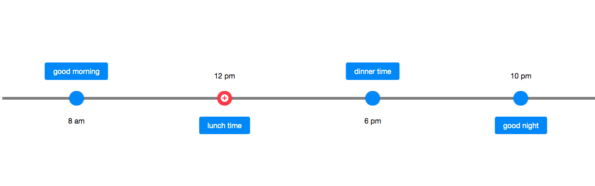

# Linelayout

- Java API: <javadoc>org.zkoss.zkmax.zul.Linelayout </javadoc>
- JavaScript API: <javadoc directory="jsdoc">zkmax.layout.Linelayout
  </javadoc>

``



# Employment/Purpose

`Linelayout` is a component for displaying chronological information in
a flexible and easy way; in addition to static data it also support
ListModel. Linelayout only accept `Lineitem` as its child.

A Linelayout is composed of three parts: first area, line area and last
area. The first and last areas are the containers for the content, and
the line area contains the line and the point.

# Browser Support

- This component is based on [CSS
  Flexbox](https://developer.mozilla.org/en-US/docs/Web/CSS/flex) and is
  compatible with browsers that support CSS Flexbox such as IE11+,
  Chrome and Firefox. Please check browser compatibility before using
  it.

# Example


``` xml
  <zscript>
    ListModel model = new ListModelList(new String[] {
        "2019-Q1",
        "2019-Q2",
        "2019-Q3",
        "2019-Q4"
    });
  </zscript>
  <linelayout model="${model}">
    <template name="model">
      <lineitem>
        <button label="${each}"></button>
      </lineitem>
    </template>
  </linelayout>
```

# Properties

## Orient

Whether the linelayout displays vertically or horizontally. The default
value is "vertical".



``` xml
  <linelayout orient="horizontal" lineStyle="background:rgba(0,0,0,0.5)" >
    <lineitem>
      <label>8 am</label>
      <button>good morning</button>
    </lineitem>
    <lineitem opposite="true" pointIconSclass="z-icon-plus-circle" pointStyle="background: #FF4051">
      <label>12 pm</label>
      <button>lunch time</button>
    </lineitem>
    <lineitem>
      <label>6 pm</label>
      <button>dinner time</button>
    </lineitem>
    <lineitem opposite="true">
      <label>10 pm</label>
      <button>good night</button>
    </lineitem>
  </linelayout>
```

## LineStyle

The CSS inline style for the line.

## FirstScale

The scale of space occupied by the first area. The default value is 1,
you can change the position of the line by adjusting this property. For
example, set firstScale as 1 and lastScale as 3 in a vertical
linelayout, the line will be rendered a quarter away from the left
boundary since the space ratio becomes 1:3..

## LastScale

The scale of space occupied by the last area, the default value is 1.

Please refer to FirstScale.

# Supported Events

<table>
<thead>
<tr class="header">
<th><center>
<p>Name</p>
</center></th>
<th><center>
<p>Event Type</p>
</center></th>
</tr>
</thead>
<tbody>
<tr class="odd">
<td><p>None</p></td>
<td><p>None</p></td>
</tr>
</tbody>
</table>

- Inherited Supported Events: [
  XulElement](ZK_Component_Reference/Base_Components/XulElement#Supported_Events)

# Supported Children

`*`[` Lineitem`](ZK_Component_Reference/Layouts/Linelayout/Lineitem)

# Version History


| Version | Date     | Content                                                                             |
|---------|----------|-------------------------------------------------------------------------------------|
| 9.0.0   | Nov 2019 | [ZK-4377](https://tracker.zkoss.org/browse/ZK-4377): Provide a Linelayout component |


