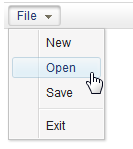

# Menu

- Demonstration: [Menu](http://www.zkoss.org/zkdemo/menu)
- Java API: <javadoc>org.zkoss.zul.Menu</javadoc>
- JavaScript API: <javadoc directory="jsdoc">zul.menu.Menu</javadoc>
- Style Guide: [ Menu in
  Menubar](ZK_Style_Guide/XUL_Component_Specification/Menubar/Menu_in_Menubar),
  [ Menu in
  Menupopup](ZK_Style_Guide/XUL_Component_Specification/Menupopup/Menu_in_Menupopup)

# Employment/Purpose

An element, much like a button, is placed on a menu bar. When the user
clicks the menu element, the child `Menupopup` of the menu will be
displayed. This element is also used to create submenus of `Menupopup`.

# Example



``` xml
<menubar>
 <menu label="File">
     <menupopup>
         <menuitem label="New" onClick="alert(self.label)"/>
         <menuitem label="Open" onClick="alert(self.label)"/>
         <menuitem label="Save" onClick="alert(self.label)"/>
         <menuseparator/>
         <menuitem label="Exit" onClick="alert(self.label)"/>
     </menupopup>
 </menu>
</menubar>
```

# Properties

## onClick

If we take a look at the screenshot of the Menu below both the right
hand side and left hand side have been outlined in red. Clicking the
arrow on the right hand side will show the menu whereas clicking the
main button (the left hand side) will fire the onClick event. The red
outline is used to highlight the clickable areas of the Menu.

<figure>

<figcaption>ZKComRef_Menu_onClick.png</figcaption>
</figure>

The code to register an onClick event is shown below:

``` xml
<menubar>
    <menu label="Topmost" onClick='alert(1);'>
        <menupopup>
            <menuitem label="test"/>
        </menupopup>
    </menu>
</menubar>
```

# Supported Events

<table>
<thead>
<tr class="header">
<th><center>
<p>Name</p>
</center></th>
<th><center>
<p>Event Type</p>
</center></th>
</tr>
</thead>
<tbody>
<tr class="odd">
<td><p>None</p></td>
<td><p>None</p></td>
</tr>
</tbody>
</table>

- Inherited Supported Events: [
  LabelImageElement](ZK_Component_Reference/Base_Components/LabelImageElement#Supported_Events)

# Supported Children

`*`[` Menupopup`](ZK_Component_Reference/Essential_Components/Menu/Menupopup)

# Use Cases

| Version | Description | Example Location |
|---------|-------------|------------------|
|         |             |                  |

# Version History


| Version | Date | Content |
|---------|------|---------|
|         |      |         |


