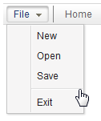

# Menuseparator

- Demonstration: [Menu](http://www.zkoss.org/zkdemo/menu)
- Java API: <javadoc>org.zkoss.zul.Menuseparator</javadoc>
- JavaScript API:
  <javadoc directory="jsdoc">zul.menu.Menuseparator</javadoc>
- Style Guide: [
  Menuseparator](ZK_Style_Guide/XUL_Component_Specification/Menuseparator)

# Employment/Purpose

Used to create a separator between menu items..

# Example



``` xml
<menubar>
 <menu label="File">
     <menupopup>
         <menuitem label="New" onClick="alert(self.label)"/>
         <menuitem label="Open" onClick="alert(self.label)"/>
         <menuitem label="Save" onClick="alert(self.label)"/>
         <menuseparator/>
         <menuitem label="Exit" onClick="alert(self.label)"/>
     </menupopup>
 </menu>
 <menuseparator/>
 <menuitem label="Home"/>
</menubar>
```

# Supported Events

<table>
<thead>
<tr class="header">
<th><center>
<p>Name</p>
</center></th>
<th><center>
<p>Event Type</p>
</center></th>
</tr>
</thead>
<tbody>
<tr class="odd">
<td><p>None</p></td>
<td><p>None</p></td>
</tr>
</tbody>
</table>

- Inherited Supported Events: [
  XulElement](ZK_Component_Reference/Base_Components/XulElement#Supported_Events)

# Supported Children

`*NONE`

# Use Cases

[
Menu](ZK_Component_Reference/Essential_Components/Menu#Use_Cases)

[
Menubar](ZK_Component_Reference/Essential_Components/Menu/Menubar#Use_Cases)

# Version History


| Version | Date | Content |
|---------|------|---------|
|         |      |         |


