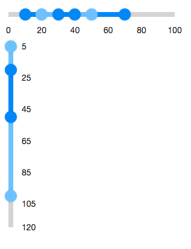

# Multislider

- Demonstration:
- Java API:
  [Multislider](http://www.zkoss.org/javadoc/latest/zk/org/zkoss/zkmax/zul/Multislider.html)
- JavaScript API:
  [Multislider](http://www.zkoss.org/javadoc/latest/jsdoc/zkmax/slider/Multislider.html)

 

# Employment/Purpose

A multislider component represents a slider with multiple ranges. It
includes sliderbuttons, which can be used to let user select a start
value and an end value. A multislider accepts a range of values starting
from 0 to a maximum value you defined. The default maximum value is 100.
You can change the maximum value by setting the max property. Notice
that the value of max property is always larger than the value of min
property.

# Example



``` xml
  <multislider>
    <sliderbuttons startValue="10" endValue="70"/>
    <sliderbuttons startValue="20" endValue="50"/>
    <sliderbuttons startValue="30" endValue="40"/>
  </multislider>
  <multislider min="5" max="120" orient="vertical">
    <sliderbuttons startValue="5" endValue="100"/>
    <sliderbuttons startValue="20" endValue="50"/>
  </multislider>
```

# Properties

## Disabled



If the multislider is disabled, users can not drag the slider buttons.

## Orient



Sets the orientation to either "horizontal" or "vertical" to display the
multislider.

## Marks



Sets the marks information for displaying value marks.

It supports Map\<Integer, String\>. The key is represented as the value
of multislider, and the value is represented as the displayed mark
label. It means that each value mark could be displayed in different
text.

## MarkScale



Sets the marks information for displaying value marks.

By default, the value marks are displayed every 20 starting from the
minimum value. (if min is 0, then it displays "0 20 40 60 ...")

## Max



Defines the max value of the multislider. It can be changed by the max
property.

## Min



Defines the minimal value of the multislider. It can be changed by the
min property.

## Step



By default, the multislider will scroll to the position continuously
when a user drags it. If you prefer to scroll a discrete fixed amount at
each step, you can set the Step property.

## TooltipVisible



The tooltip displays the value of slider buttons in the multislider. If
tooltipvisible is true, the tooltips of the slider buttons will always
be displayed.

# Supported Events

- Inherited Supported Events: [
  Rangeslider](ZK_Component_Reference/Input/Rangeslider#Supported_Events)

# Supported Children

`*`[` Sliderbuttons`](ZK_Component_Reference/Input/Sliderbuttons)


