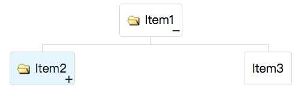

# Orgitem

- Java API: <javadoc>org.zkoss.zkmax.zul.Orgitem </javadoc>
- JavaScript API: <javadoc directory="jsdoc">zkmax.layout.Orgitem
  </javadoc>

``



# Employment/Purpose

`Orgitem`contains a node (`Orgnode),`and an optional Orgchildren.

If the component doesn't contain an `Orgchildren,`it is a leaf node that
doesn't accept any child items.

If it contains an `Orgchildren,`it is a branch node that might contain
other items.

For a branch node, an +/- button will appear at the bottom right of the
node, such that user could open and close the item by clicking on the
+/- button.

# Example



        <organigram width="600px">
            <orgchildren>
                <orgitem image="img/folder.gif" label="Item1">
                    <orgchildren>
                        <orgitem image="img/folder.gif" label="Item2" selected="true" open="false">
                            <orgchildren>
                                <orgitem label="Item4"/>
                            </orgchildren>
                        </orgitem>
                        <orgitem label="Item3"/>
                    </orgchildren>
                </orgitem>
            </orgchildren>
        </organigram>

# Open

Each Orgitem contains the open property which is used to control whether
to display its child items. The default value is true. By setting this
property to false, you are able to control what part of the Organigram
is invisible.

When a user clicks on the +/- button, he opens the Orgitem and makes its
children visible. The onOpen event is then sent to the server to notify
the application.

You can also open or close the Orgitem by calling
<javadoc method="setOpen(java.lang.Boolean)">org.zkoss.zkmax.zul.Orgitem</javadoc>
and get the open state by calling
<javadoc method="isOpen()">org.zkoss.zkmax.zul.Orgitem</javadoc>.

Example:

        <organigram>
            <orgchildren>
                <orgitem label="Item1" open="false" onOpen="createChild()">
                    <orgchildren/>
                </orgitem>
            </orgchildren>
            <zscript><![CDATA[
                void createChild() {
                    if (event.isOpen())
                        new Orgitem("new item").setParent(self.getOrgchildren());
                }
            ]]></zscript>
        </organigram>

# Selected

By default, each Orgitem can be selected by users clicking or by
programing:

<javadoc method="setSelectedItem(org.zkoss.zkmax.zul.Orgitem)">org.zkoss.zkmax.zul.Organigram</javadoc>
or
<javadoc method="setSelected(java.lang.Boolean)">org.zkoss.zkmax.zul.Orgitem</javadoc>

You can get the selected state by calling
<javadoc method="isSelected()">org.zkoss.zkmax.zul.Orgitem</javadoc>

If you don't allow users to select Orgitem, you can write as following:

        <orgitem selectable="false"/>

or

        <orgitem disabled="true"/>

Disabled has more obvious style to prompt users.

# Label and Image

Orgitem provides
<javadoc method="setImage(java.lang.String)">org.zkoss.zkmax.zul.Orgitem</javadoc>
and
<javadoc method="setLabel(java.lang.String)">org.zkoss.zkmax.zul.Orgitem</javadoc>
to simplify the assignment of image and label to an Orgitem. However,
they are actually placed in the node (of the child Orgnode).
Furthermore, if the Orgnode is not created, they will be created
automatically. For example,

``` xml
    <orgitem label="Hello"/>
```

is equivalent to

``` xml
    <orgitem>
        <orgnode label="Hello"/>
    </orgitem>
```

It also means you cannot attach an Orgnode child to the Orgitem, after
setImage or setLabel was invoked. It means, though a bit subtle, the
following will cause an exception:

``` xml
    <orgitem label="Hello"> <!-- Orgnode is created automatically because of setLabel -->
        <orgnode/> <!-- exception since only one Orgnode is allowed per Orgitem -->
    </orgitem>
```

When your Organigram only contains image and text, It is a convenient
way to create Organigram without Orgnode tags, if you want to put other
components in Orgnode, you could write like following:

``` xml
    <zscript><![CDATA[
        Orgchildren orgchildren;
        void newItem(String label) {
            if (orgitem.getOrgchildren() == null) {
                orgchildren = new Orgchildren();
                orgchildren.setParent(orgitem);
            }
            new Orgitem(label).setParent(orgchildren);
        }
    ]]></zscript>
    <organigram>
        <orgchildren>
            <orgitem id="orgitem">
                <orgnode>
                    <textbox onOK="newItem(self.value)"/>
                </orgnode>
            </orgitem>
        </orgchildren>
    </organigram>
```

# Supported Events

<table>
<thead>
<tr class="header">
<th><center>
<p>Name</p>
</center></th>
<th><center>
<p>Event Type</p>
</center></th>
</tr>
</thead>
<tbody>
<tr class="odd">
<td><center>
<p><code>onOpen</code></p>
</center></td>
<td><p><strong>Event:</strong>
<javadoc>org.zkoss.zk.ui.event.OpenEvent</javadoc> Denotes user has
opened or closed a component. It is useful to implement load-on-demand
by listening to the onOpen event, and creating components when the first
time the component is opened.</p></td>
</tr>
</tbody>
</table>

- Inherited Supported Events: [
  XulElement](ZK_Component_Reference/Base_Components/XulElement#Supported_Events)

# Supported Children

`*`[` Orgnode`](ZK_Component_Reference/Layouts/Organigram/Orgnode)`, `[` Orgchildren`](ZK_Component_Reference/Layouts/Organigram/Orgchildren)

# Version History


| Version | Date | Content |
|---------|------|---------|
|         |      |         |


