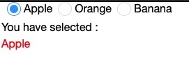
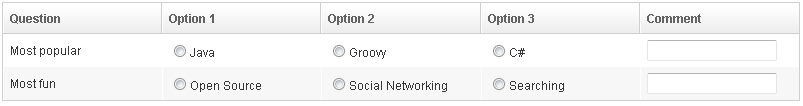
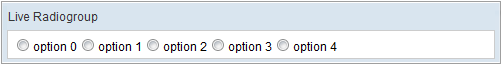

# Radiogroup

- Demonstration:
  [Radiogroup](http://www.zkoss.org/zkdemo/input/radio_button)
- Java API: <javadoc>org.zkoss.zul.Radiogroup</javadoc>
- JavaScript API:
  <javadoc directory="jsdoc">zul.wgt.Radiogroup</javadoc>
- Style Guide: N/A

# Employment/Purpose

Used to group multiple radio buttons. In one radiogroup. Only one radio
button may be selected at a time.

# Example



``` xml
<window title="Radiobox &amp; Radio Demo" width="200px" border="normal">
    <vbox>
        <radiogroup onCheck="fruit.value = self.selectedItem.label">
            <radio label="Apple" />
            <radio label="Orange" />
            <radio label="Banana" />
        </radiogroup>
        You have selected :
        <label id="fruit" style="color:red" />
    </vbox>
</window>
```

**Note:** To support the versatile layout, a radio group accepts any
kind of children , including Radio. On the other hand, the parent of a
radio, if any, must be a radio group.

## Radiogroup as an Ancestor of Radio

ZK groups radio components into the same radio group if they share the
same ancestor, not just direct parent. It allows a more sophisticated
layout. For example,

``` xml
<radiogroup>
  <vlayout>
    <hlayout>
      <radio label="radio 1"/>
      <radio label="radio 2"/>
      <radio label="radio 3"/>
    </hlayout>
    <hlayout>
      <radio label="radio 4"/>
      <radio label="radio 5"/>
      <radio label="radio 6"/>
    </hlayout>
  </vlayout>
</radiogroup>
```

## A Row of a Grid as a Radio Group



Sometimes it is not possible to make the radiogroup component as an
ancestor of all radio components. For example, each row of a grid might
be an independent group. To solve this, you have to assign the
radiogroup component to the radio component explicitly by the use of
<javadoc method="setRadiogroup(java.lang.String)">org.zkoss.zul.Radio</javadoc>
or
<javadoc method="setRadiogroup(org.zkoss.zul.Radiogroup)">org.zkoss.zul.Radio</javadoc>.



``` xml
<zk>
  <radiogroup id="popular"/>
  <radiogroup id="fun"/>
  <grid>
    <columns>
      <column label="Question"/>
      <column label="Option 1"/>
      <column label="Option 2"/>
      <column label="Option 3"/>
      <column label="Comment"/>
    </columns>
    <rows>
      <row>
        Most popular
        <radio label="Java" radiogroup="popular"/>
        <radio label="Groovy" radiogroup="popular"/>
        <radio label="C#" radiogroup="popular"/>
        <textbox/>
      </row>
      <row>
        Most fun
        <radio label="Open Source" radiogroup="fun"/>
        <radio label="Social Networking" radiogroup="fun"/>
        <radio label="Searching" radiogroup="fun"/>
        <textbox/>
      </row>
    </rows>
  </grid>
</zk>
```

# Live Data



Like a listbox, radiogroup supports
[ListModel](https://www.zkoss.org/wiki/ZK_Developer%27s_Reference/MVC/Model/List_Model),
so that developers are able to separate the data from the view. In other
words, developers only need to provide the data by implementing the
<javadoc type="interface">org.zkoss.zul.ListModel</javadoc> interface,
rather than manipulating the radiogroup directly. The benefits are
twofold.

- It is easier to show the same set of data in different views.
- The grid sends the data to the client only if it is visible. It saves
  a lot of network traffic if the amount of data is large.

There are three steps to make use of live data.

1\. Store your data object in a
<javadoc type="interface">org.zkoss.zul.ListModel</javadoc>

  
ZK provides several implementation implementations of `ListModel`, just
choose one upon your needs.

2\. Set the `ListModel` at the `model` attribute.

3\. **(Optional)** Implement the
<javadoc type="interface">org.zkoss.zul.RadioRenderer<T></javadoc>
interface to render each radio and specify it in the `radioRenderer`
attribute

  
\* This is optional. If it is not specified, ZK will render it with the
default renderer.

\* You can implement different renderers for representing the same data
in different views.

In the following example, we prepared a ListModel called `strset`,
assign it to a radigroup using the `model` attribute. Then, the
radigroup will do the rest.



``` xml
    <zscript><![CDATA[
        String[] data = new String[5];
        for(int j=0; j < data.length; ++j) {
            data[j] = "option "+j;
        }
        ListModel strset = new SimpleListModel(data);
        ]]></zscript>
  <radiogroup  model="${strset}" />
```

# Supported Events

<table>
<thead>
<tr class="header">
<th><center>
<p>Name</p>
</center></th>
<th><center>
<p>Event Type</p>
</center></th>
</tr>
</thead>
<tbody>
<tr class="odd">
<td></td>
<td></td>
</tr>
<tr class="even">
<td><center>
<p>onCheck</p>
</center></td>
<td><p><strong>Event:</strong>
<javadoc>org.zkoss.zk.ui.event.CheckEvent</javadoc> Denotes when a radio
under the radiogroup is checked.</p></td>
</tr>
</tbody>
</table>

- Inherited Supported Events: [
  XulElement](ZK_Component_Reference/Base_Components/XulElement#Supported_Events)

# Supported Children

`*ALL`

# Use Cases

| Version | Description                                | Example Location                                                                               |
|---------|--------------------------------------------|------------------------------------------------------------------------------------------------|
| 5.0     | Radiogroup and selection                   | [<http://www.zkoss.org/forum/listComment/12148>](http://www.zkoss.org/forum/listComment/12148) |
| 5.0     | Radiogroup, data binding and TypeConverter | [<http://www.zkoss.org/forum/listComment/7011>](http://www.zkoss.org/forum/listComment/7011)   |
| 6.0.0   | Introduce model to Radiogroup              |                                                                                                |

# Version History


| Version | Date        | Content                                                            |
|---------|-------------|--------------------------------------------------------------------|
| 5.0.4   | August 2010 | Allow a radio component associated with a non-ancestor radiogroup. |


