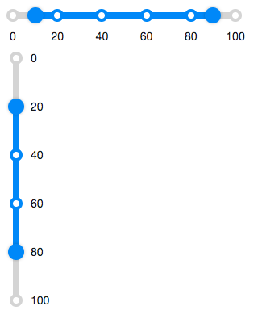

# Rangeslider

- Demonstration:
- Java API:
  [Rangeslider](http://www.zkoss.org/javadoc/latest/zk/org/zkoss/zkex/zul/Rangeslider.html)
- JavaScript API:
  [Rangeslider](http://www.zkoss.org/javadoc/latest/jsdoc/zkex/slider/Rangeslider.html)

 

# Employment/Purpose

A rangeslider component represents a slider with a start and an end
value. A rangeslider accepts a range of value starting from 0 to a
certain maximum value. The default maximum value of rangeslider is 100.
You can change the maximum allowed value by setting the max property.
Notice that the value of max property is always larger than the value of
min property.

# Example



``` xml
  <rangeslider startValue="10" endValue="90"/>

  <rangeslider orient="vertical" startValue="20" endValue="80" markScale="20" />
```

# Properties

## Disabled



If the rangeslider is disabled, then users can not drag the slider
buttons.

## Orient



Sets it either "horizontal" or "vertical" to display rangslider.

## Marks



Sets the marks information map for displaying value marks. In this map,
the key represents the number value of slider, and the value represents
the displayed scale text.

## MarkScale



Sets the marks information for displaying value marks.

By default, the value marks will be displayed every 20 starting from the
minimum value. (if min is 0, then it displays "0 20 40 ...")

If the MarkScale is 0 and there is no Map information in Marks (see
above), the marks will be empty.

<figure>

<figcaption>ZKComRef_RangesliderNoMarks.png</figcaption>
</figure>

## Max



Rangeslider supports maximal position, which can be changed by the max
property.

## Min



Rangeslider supports minimal position, which can be changed by the min
property.

## StartValue, EndValue



Represent the range value of Rangeslider.

## Step



By default, the rangeslider will scroll to the position continuously
when a user drags it. If you prefer to scroll a discrete fixed amount at
each step, you can set the amount of value using the step property.

## TooltipVisible



The tooltip displays the value of a slider button in the rangeslider. If
the tooltipvisible is true, the tooltips of the slider buttons will
always be visible.

# Supported Events

<table>
<thead>
<tr class="header">
<th><center>
<p>Name</p>
</center></th>
<th><center>
<p>Event Type</p>
</center></th>
</tr>
</thead>
<tbody>
<tr class="odd">
<td><center>
<p>onRangeValueChange</p>
</center></td>
<td><p><strong>Event:</strong>
<javadoc>org.zkoss.zkex.zul.event.RangeValueChangeEvent</javadoc>
Denotes the range value of a component has been changed by the
user.</p></td>
</tr>
</tbody>
</table>

- Inherited Supported Events: [
  XulElement](ZK_Component_Reference/Base_Components/XulElement#Supported_Events)

# Supported Children

`*None`


