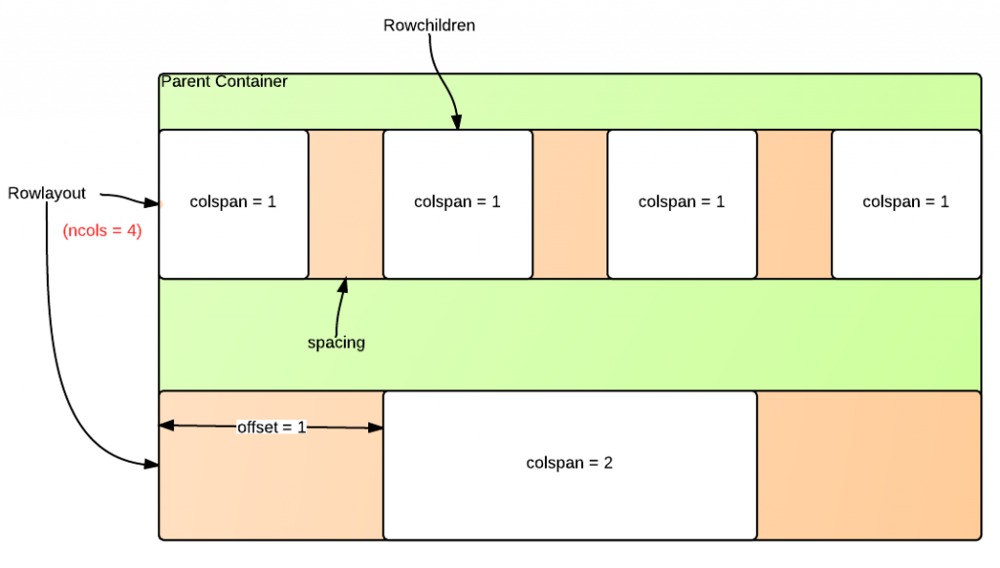

# Rowlayout

- Java API: <javadoc>org.zkoss.zkmax.zul.RowLayout</javadoc>
- JavaScript API:
  <javadoc directory="jsdoc">zkmax.layout.RowLayout</javadoc>
- Style Guide: [
  RowLayout](ZK_Style_Guide/XUL_Component_Specification)
- 

# Employment/Purpose

A `rowlayout` lays out a container which can have multiple columns, it
offers a 12-column grid out of the box. You can simply chooses the
number of columns to occupy for each major content area, and may also
skip columns for extra space without inserting space-inducing elements.

The following diagram illustrates the rowlayout/rowchildren components
and their various configurable parameters.



# Example

Using rowlayout component is simple. First, use rowlayout to divide the
horizontal space of its parent container into a number of columns. You
can also optionally specify the column/spacing ratio. The default number
of columns is 12, and the default column/spacing ratio is 1/3, which
means column is 3 times wider than the spacing between columns. Spacing
could be given as a ratio, a percentage or a floating-point number.

Next, use rowchildren component to place components into an integral
number of these columns. You can also optionally specify how many
columns to skip ahead.

## Equally Divided

``` xml
    <rowlayout ncols="12">
        <forEach begin="1" end="3">
            <rowchildren colspan="4" style="background-color: skyblue">
                1/3
            </rowchildren>
        </forEach>
    </rowlayout>
```

## Position Offset

``` xml
    <rowlayout ncols="12">
        <rowchildren colspan="4" style="background-color: skyblue" offset="2">
            offset 2 columns
        </rowchildren>
    </rowlayout>
```

## Column Spacing

``` xml
    <rowlayout ncols="12" spacing="100%">
        <forEach begin="1" end="3">
            <rowchildren colspan="4" style="background-color: skyblue">
                spacing = 100%
            </rowchildren>
        </forEach>
    </rowlayout>
```

The above examples look like: 

# Supported Events

<table>
<thead>
<tr class="header">
<th><center>
<p>Name</p>
</center></th>
<th><center>
<p>Event Type</p>
</center></th>
</tr>
</thead>
<tbody>
<tr class="odd">
<td><p>None</p></td>
<td><p>None</p></td>
</tr>
</tbody>
</table>

- Inherited Supported Events: [
  XulElement](ZK_Component_Reference/Base_Components/XulElement#Supported_Events)

# Supported Children

`*`[` Rowchildren`](ZK_Component_Reference/Layouts/Rowlayout/Rowchildren)

# Use Cases

| Version | Description | Example Location |
|---------|-------------|------------------|
|         |             |                  |

# Version History


| Version | Date | Content |
|---------|------|---------|
|         |      | \]      |


