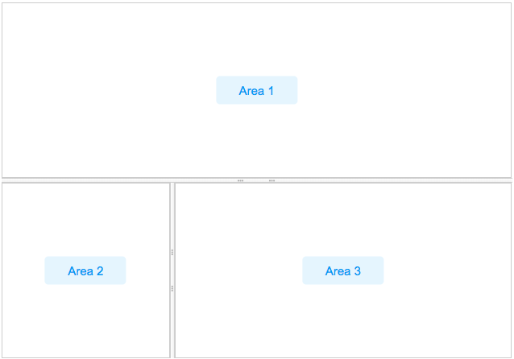

# Splitlayout

- Demonstration:
  [Spltlayout](https://www.zkoss.org/zkdemo/layout/split_layout)
- Java API: <javadoc>org.zkoss.zkmax.zul.Splitlayout</javadoc>
- JavaScript API:
  <javadoc directory="jsdoc">zkmax.layout.Splitlayout</javadoc>
- 

# Employment/Purpose

Splitlayout is a layout container, which is used to divide a component
into two components.

These two components inside Splitlayout, the splitlayouts, are placed
either horizontally or vertically by setting the orientation, and users
can easily resize these two viewports by dragging the splitter bar.
Also, like other ZK layout components, it supports hflex and vflex,
indicating that users can divide the area into three or more spaces by
putting the splitlayouts into the outer Splitlayout.

Comparing to [
Splitter](ZK%20Component%20Reference/Layouts/Splitter), this
component has several advantages:

1.  [ Splitter](ZK%20Component%20Reference/Layouts/Splitter)
    can only be used inside [
    Hbox](ZK%20Component%20Reference/Layouts/Hbox)/[
    Vbox](ZK%20Component%20Reference/Layouts/Vbox).
    Splitlayout has no such limitation.
2.  Hbox/Vbox are both rendered with HTML which is heavy for a browser.
    Splitlayout is rendered with div which is more light-weighted.

# Example



``` xml
    <splitlayout  vflex="1" hflex="1">
        <div sclass="area" hflex="1" vflex="1">
            <label value="Area 1"/>
        </div>
        <splitlayout vflex="1" hflex="1" orient="horizontal" >
            <div sclass="area" vflex="1" hflex="1">
                <label value="Area 2"/>
            </div>
            <div sclass="area" vflex="1"  hflex="2">
                <label value="Area 3"/>
            </div>
        </splitlayout>
    </splitlayout>
```

# Properties and Features

## Orientation

Default: `vertical`

Supported values: (default) “vertical” or “horizontal”.

The property specifies the layout orientation, determining how its two
child containers are displayed in the component.

## Collapse

The collapse property
(<javadoc method="setCollapse(java.lang.String)">org.zkoss.zkmax.zul.Splitlayout</javadoc>)
specifies which side of the splitter is collapsed when its grippy
(button) is clicked. If this property is not specified, the splitter
will not cause a collapse.

Supported value: (default) “none”, “before” or "after". "before" means
that the splitter in splitlayout would collapse to the left/top, and
"after means splitter in splitlayout would collapse to the right/button.

## Open

This method would not be able to work if the "collapse" attribute is not
specified.

### onOpen Event

When a splitlayout is collapsed or opened by a user, the `onOpen` event
(<javadoc>org.zkoss.zk.ui.event.OpenEvent</javadoc>) is sent to the
application.

## Widths and Heights

specify `widths` or `heights` with a list of numbers(in pixel) separated
by a comma to denote the width/height of two areas in splitlayout.
Notice that you should use them while using flex in the children
component.

### Specify Children Size in Proportion

Specify `hflex`/`vflex` on 2 children like:

``` xml
        <splitlayout  vflex="1" >
            <div sclass="area" vflex="2">
                ...
            </div>
            <div sclass="area" vflex="3">
               ...
            </div>
        </splitlayout>
```

## MinWidths and MinHeights

User setMinWidths(String minWidths) and setMinHeights(String minHeights)
to sets the minimum widths/heights in the same format of
setWidths/setHeights. When user drag the splitter, the two areas will
not be smaller than the minWidths/minHeights.

# Supported Events

<table>
<thead>
<tr class="header">
<th><center>
<p>Name</p>
</center></th>
<th><center>
<p>Event Type</p>
</center></th>
</tr>
</thead>
<tbody>
<tr class="odd">
<td><center>
<p><code>onOpen</code></p>
</center></td>
<td><p><strong>Event:</strong>
<javadoc>org.zkoss.zk.ui.event.OpenEvent</javadoc></p>
<p>When a splitter is collapsed or opened by a user, the
<code>onOpen</code> event is sent to the application.</p></td>
</tr>
<tr class="even">
<td><center>
<p><code>onDivisionSize</code></p>
</center></td>
<td><p><strong>Event:</strong>
<javadoc>org.zkoss.zkmax.zul.event.DivisionSizeEvent</javadoc>
Represents an event that indicates two inner size of
splitlayout.</p></td>
</tr>
</tbody>
</table>

- Inherited Supported Events: [
  XulElement](ZK_Component_Reference/Base_Components/XulElement#Supported_Events)

# Supported Children

`*ALL`

# Version History


| Version | Date          | Content             |
|---------|---------------|---------------------|
| 8.5.0   | October, 2017 | new added component |


