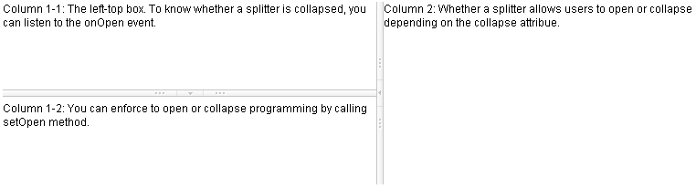
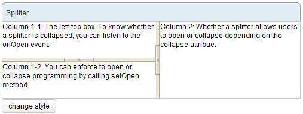

# Splitter

- Demonstration: [Splitter](http://www.zkoss.org/zkdemo/layout/splitter)
- Java API: <javadoc>org.zkoss.zul.Splitter</javadoc>
- JavaScript API: <javadoc directory="jsdoc">zul.box.Splitter</javadoc>
- Style Guide: [
  Splitter](ZK_Style_Guide/XUL_Component_Specification/Splitter)

# Employment/Purpose

(Suggest to use [
Splitlayout](ZK_Component_Reference/Layouts/Splitlayout))

When the splitter is dragged, the sibling components of the splitter are
resized. If `getCollapse()` is true, a grippy is placed inside the
splitter, and one sibling component of the splitter is collapsed when
the grippy is clicked.

This component can only be used inside a [
Box](ZK_Component_Reference/Layouts/Box), [
Vbox](ZK_Component_Reference/Layouts/Vbox), or [
Hbox](ZK_Component_Reference/Layouts/Hbox).

# Example



``` xml
<hbox spacing="0" >
    <vbox height="200px">
        Column 1-1: The left-top box. To know whether a splitter is collapsed,
        you can listen to the onOpen event.
        <splitter collapse="after" />
        Column 1-2: You can enforce to open or collapse programming by calling
        setOpen method.
    </vbox>
    <splitter collapse="before" />
    Column 2: Whether a splitter allows users to open or collapse depending
    on the collapse attribue.
</hbox>
```

# Properties and Features

## Collapse

The collapse property
(<javadoc method="setCollapse(java.lang.String)">org.zkoss.zul.Splitter</javadoc>)
specifies which side of the splitter is collapsed when its grippy
(button) is clicked. If this property is not specified, the splitter
will not cause a collapse (and the grippy/button won't appear).

Allowed values and their meaning are as follows.

<table>
<thead>
<tr class="header">
<th><center>
<p>Value</p>
</center></th>
<th><center>
<p>Description</p>
</center></th>
</tr>
</thead>
<tbody>
<tr class="odd">
<td><p>none</p></td>
<td><p>No collapsing occurs.</p></td>
</tr>
<tr class="even">
<td><p>before</p></td>
<td><p>When the grippy is clicked, the element immediately before the
splitter in the same parent is collapsed so that its width or height is
0.</p></td>
</tr>
<tr class="odd">
<td><p>after</p></td>
<td><p>When the grippy is clicked, the element immediately after the
splitter in the same parent is collapsed so that its width or height is
0.</p></td>
</tr>
</tbody>
</table>

## Open

To know whether a splitter is collapsed, you can check the value of the
`open` property
(<javadoc method="isOpen()">org.zkoss.zul.Splitter</javadoc>). To open
or collapse dynamically, you are able to set the value of the `open`
property
(<javadoc method="setOpen(boolean)">org.zkoss.zul.Splitter</javadoc>).

### onOpen Event

When a splitter is collapsed or opened by a user, the `onOpen` event
(<javadoc>org.zkoss.zk.ui.event.OpenEvent</javadoc>) is sent to the
application.

## OS Styling

If you want to change the styling to be more similar to OS's look as
follows.



You could specify
<javadoc method="setZclass(java.lang.String)">org.zkoss.zk.ui.HtmlBasedComponent</javadoc>
with `z-splitter-os-ver` or `z-splitter-os-hor`, depending on the orient
is vertical or horizontal.

Here is an example that switches the styling between the default and
OS-look:

``` xml
<window>
    <panel title="Splitter" border="normal" width="500px">
        <panelchildren>
            <hbox spacing="0"  height="100%">
                <vbox spacing="0"  heights="60px,60px">
                    Column 1-1: The left-top box. To know whether a splitter
                    is collapsed, you can listen to the onOpen event.
                    <splitter id="s1" collapse="before"/>
                    Column 1-2: You can enforce to open or collapse programming
                    by calling setOpen method.
                </vbox>
                <splitter id="s2" collapse="before"/>
                Column 2: Whether a splitter allows users to open or collapse
                depending on the collapse attribue.
            </hbox>
        </panelchildren>
    </panel>
    <button label="change style">
        <attribute name="onClick">
        if ("z-splitter-ver".equals(s1.getZclass()))
            s1.setZclass("z-splitter-os-ver");
        else
            s1.setZclass("z-splitter-ver");
        if ("z-splitter-hor".equals(s2.getZclass()))
            s2.setZclass("z-splitter-os-hor");
        else
            s2.setZclass("z-splitter-hor");
        </attribute>
    </button>
</window>
```

# Supported Events

<table>
<thead>
<tr class="header">
<th><center>
<p>Name</p>
</center></th>
<th><center>
<p>Event Type</p>
</center></th>
</tr>
</thead>
<tbody>
<tr class="odd">
<td><center>
<p><code>onOpen</code></p>
</center></td>
<td><p><strong>Event:</strong>
<javadoc>org.zkoss.zk.ui.event.OpenEvent</javadoc></p>
<p>When a splitter is collapsed or opened by a user, the
<code>onOpen</code> event is sent to the application.</p></td>
</tr>
</tbody>
</table>

- Inherited Supported Events: [
  XulElement](ZK_Component_Reference/Base_Components/XulElement#Supported_Events)

# Supported Molds

Available molds of a component are defined in lang.xml embedded in
zul.jar.

<table>
<thead>
<tr class="header">
<th><center>
<p>Name</p>
</center></th>
<th><center>
<p>Snapshot</p>
</center></th>
</tr>
</thead>
<tbody>
<tr class="odd">
<td><center>
<p>default</p>
</center></td>
<td></td>
</tr>
<tr class="even">
<td><center>
<p>os</p>
</center></td>
<td></td>
</tr>
</tbody>
</table>

# Supported Children

`*NONE`

# Use Cases

| Version | Description                                 | Example Location                                |
|---------|---------------------------------------------|-------------------------------------------------|
| 5.0     | Used to seperate contents within hbox/vbox. | <http://www.zkoss.org/zksandbox/userguide/#l13> |

# Version History


| Version | Date | Content |
|---------|------|---------|
|         |      |         |


