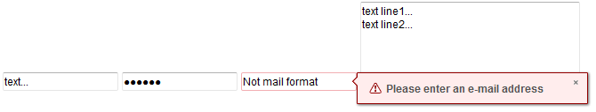
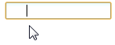

# Textbox

- Demonstration:
  [Textbox](http://www.zkoss.org/zkdemo/input/form_sample)
- Java API: <javadoc>org.zkoss.zul.Textbox</javadoc>
- JavaScript API: <javadoc directory="jsdoc">zul.inp.Textbox</javadoc>
- Style Guide: [
  Textbox](ZK_Style_Guide/XUL_Component_Specification/Textbox)

# Employment/Purpose

A `textbox` is used to let users input textual data.

You could assign `value, type, constraint, rows, cols` to a textbox
using the corresponding properties. When you assign the property `type`
to a string value "password" when `multiline` is false (`multiline` will
be `true` if you set rows larger than 1 or set `multiline` to `true`
directly) then any character in this component will replace by '\*'.

You could also assign a constraint value with a regular expression
string or a default constraint expression (available value is "no
empty"). When user change the value of textbox, it will cause a
validating process to validate the value. If the validation fails, then
a notification will pop up.

# Example



``` xml
<textbox value="text..." />
<textbox value="secret" type="password" />
<textbox constraint="/.+@.+\.[a-z]+/: Please enter an e-mail address" />
<textbox rows="5" cols="40">
    <attribute name="value">
text line1... 
text line2...
    </attribute>
</textbox>
```

To specify multilines value, you can use the attribute element or
`&#x0d;` as shown below

``` xml
<textbox rows="5" cols="40">
    <attribute name="value">
text line1... 
text line2...
    </attribute>
</textbox>
<textbox value="Line 1&#x0d;Line 2" rows="3"/>
```

# Properties

## Tabbable

By specifying a true, the tabbox can insert a long space or format the
content inside textbox conveniently. For example,



``` xml
<textbox tabbable="true"/>
```

## SubmitByEnter



When you specify **true**, pressing Enter will fire onOK event rather
then move to next line, if you want to move to next line, you should
press **Shift + Enter**.

When submitByEnter="false", press Enter will move to next line.

The default is **false**.

``` xml
<textbox submitByEnter="true" onOK=""/>
```

## Type

The `type` attribute can be used with the `textbox` based components and
can be given the value `password`. By setting the type as password the
text that is entered into the box cannot be viewed and is replaced by
stars.

``` xml
Username: <textbox/>
Password: <textbox type="password"/>
```

``

The `type` attribute support HTML 5 defined types `tel`, `email` and
`url`.

``` xml
Phone: <textbox type="tel"/>
Email: <textbox type="email"/>
WebSite: <textbox type="url"/>
```

## Constraint

Please refert to [ZK Component Reference/Base
Components/InputElement#Constraint](ZK_Component_Reference/Base_Components/InputElement#Constraint).

# Inherited Functions

Please refer to [
InputElement](ZK_Component_Reference/Base_Components/InputElement)
for inherited functions, such as in-place edition.

# Supported Events

<table>
<thead>
<tr class="header">
<th><center>
<p>Name</p>
</center></th>
<th><center>
<p>Event Type</p>
</center></th>
</tr>
</thead>
<tbody>
<tr class="odd">
<td><p>None</p></td>
<td><p>None</p></td>
</tr>
</tbody>
</table>

- Inherited Supported Events: [
  InputElement](ZK_Component_Reference/Base_Components/InputElement#Supported_Events)

# Supported Children

`*NONE`

# Browser Limitations

<table>
<thead>
<tr class="header">
<th><p>Browser</p></th>
<th><p>description</p></th>
</tr>
</thead>
<tbody>
<tr class="odd">
<td><p>IE</p></td>
<td><div class="sourceCode" id="cb1"><pre
class="sourceCode xml"><code class="sourceCode xml"><span id="cb1-1"><a href="#cb1-1" aria-hidden="true" tabindex="-1"></a>&lt;<span class="kw">textbox</span><span class="ot"> value=</span><span class="st">&quot;color&quot;</span><span class="ot"> style=</span><span class="st">&quot;color:red !important;&quot;</span><span class="ot"> disabled=</span><span class="st">&quot;true&quot;</span>/&gt;</span></code></pre></div>
<p>There is no way to change the text color in a disabled input in
IE.</p></td>
</tr>
</tbody>
</table>


