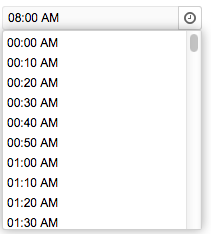

# Timepicker

 

- Java API: <javadoc>org.zkoss.zkmax.zul.Timepicker</javadoc>
- JavaScript API:
  <javadoc directory="jsdoc">zkmax.inp.Timepicker</javadoc>
- Style Guide: [ Timepicker](ZK_Style_Customization_Guide)

# Employment/Purpose

A selection box for holding a time (a java.util.Date Object) , but only
Hour, Minute, and Second are used.

# Example



``` xml
<timepicker/>
```



# Properties

## Format

Use *a* to signify it is *am* or *pm*. The input string follows the
formatting of the
[SimpleDateFormat](http://java.sun.com/j2se/1.5.0/docs/api/java/text/SimpleDateFormat.html).

Below is an example of using *a* within the format.

``` xml
<zk>
    <window title="Test">
        <timepicker format="a hh:mm:ss"/>
    </window>
</zk>
```

 In addition to specifying the format
explicitly, you could specify the styling. There are two different types
of styling: short, and medium (representing the styling of
java.text.DateFormat). For example, you could specify the styling rather
than the real format as follows.

``` xml
<timepicker format="short"/>
<timepicker format="medium"/>
```

Then the real format of the timepicker will be decided at run time
depending the configuration. For more information, please refer to [ZK
Developer's Reference: Date and Time
Formatting](ZK_Developer's_Reference/Internationalization/Date_and_Time_Formatting).

## Minimum Time

By default, the options of timepicker start at 0:00 AM, you could
specify another minimum time by using a java.util.Date Object.

``` xml
<zscript>
    import java.util.Date;
    Date min = new Date();
    min.setTime(0);
</zscript>
<timepicker format="HH:mm a" min="${min}" />
```

## Maximum Time

By default, the options of timepicker end before 12:00 AM, you could
specify another maximum time by using a java.util.Date Object.

``` xml
<zscript>
    import java.util.Date;
    Date max = new Date();
    max.setTime(0);
</zscript>
<timepicker format="HH:mm a" max="${max}" />
```

## Interval

By default, the interval of the options in timepicker is one hour, you
could specify the interval by using an integer (unit: 1 second).

``` xml
<timepicker format="HH:mm a" interval="600" />
```

# Inherited Functions

Please refer to [
FormatInputElement](ZK_Component_Reference/Base_Components/FormatInputElement)
for inherited functions.

# Supported Events

<table>
<thead>
<tr class="header">
<th><center>
<p>Name</p>
</center></th>
<th><center>
<p>Event Type</p>
</center></th>
</tr>
</thead>
<tbody>
<tr class="odd">
<td><p>None</p></td>
<td><p>None</p></td>
</tr>
</tbody>
</table>

- Inherited Supported Events: [
  FormatInputElement](ZK_Component_Reference/Base_Components/FormatInputElement#Supported_Events)

# Supported Children

`*NONE`

# Use Cases

| Version | Description | Example Location |
|---------|-------------|------------------|
|         |             |                  |

# Version History


| Version | Date | Content |
|---------|------|---------|
|         |      |         |


